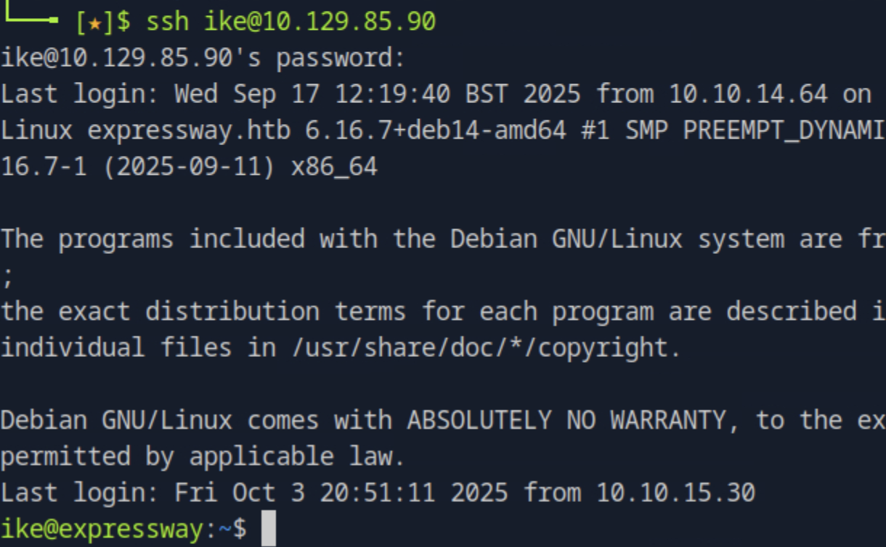

# ExpressWay HackTheBox Walkthrough

This report documents a structured assessment of a target system exposing IPSec VPN services, 
leading to credential compromise, lateral movement via SSH, and privilege escalation to root.  

---

## 1. Initial Reconnaissance

We started with a comprehensive TCP port scan and service enumeration, followed by a vulnerability scan:

```bash
nmap -p- -Pn 10.129.85.90 -v -T5 --min-rate 1000 --max-rtt-timeout 1000ms --max-retries 5 -oN nmap_ports.txt && sleep 5 && nmap -Pn 10.129.85.90 -sC -sV -v -oN nmap_sVsC.txt && sleep 5 && nmap -T5 -Pn 10.129.85.90 -v --script vuln -oN nmap_vuln.txt
```


Additionally, a UDP fast scan was executed to check for VPN-related services:

```bash
nmap -sU -T5 10.129.85.90 -F
```


---

## 2. IPSec VPN Enumeration

We referenced:  
[HackTricks IPSec VPN Pentesting Guide](https://book.hacktricks.wiki/en/network-services-pentesting/ipsec-ike-vpn-pentesting.html)

Probing the IKE VPN service with `ike-scan`:

```bash
sudo ike-scan -M 10.129.85.90
```


Further probing with aggressive mode and fake IDs:

```bash
sudo ike-scan -P -M -A -n fakeID 10.129.85.90
```

  


---

## 3. Credential Extraction & Cracking

We captured a handshake and saved the Pre-Shared Key (PSK) hash to a file.  
It was cracked using a standard wordlist:

```bash
psk-crack -d rockyou.txt hash.txt
```


The cracked credentials were then used to establish SSH access.

---

## 4. SSH Access & User Flag

Using the cracked credentials, we logged into the target as user `ike`:



We successfully retrieved the **user flag**:


---

## 5. Privilege Escalation

Post-exploitation enumeration was performed with `linpeas`.  
Initial attempts did not yield results; however, inspecting the `sudo` version revealed a known vulnerability.  

Reference exploit:  
[CVE-2025-32463 - Sudo Privilege Escalation](https://github.com/kh4sh3i/CVE-2025-32463)


Executing the exploit provided **root privileges**:


---

## 6. Conclusion

This assessment illustrates a realistic VPN attack scenario culminating in full system compromise.  

**Key takeaways:**

- VPN services exposed to the internet are a prime target for attackers.  
- Weak PSK credentials, easily cracked with wordlists, pose a serious risk.  
- Enumeration tools like `ike-scan` quickly identify VPN configurations.  
- Local privilege escalation vulnerabilities (e.g., `sudo` exploits) can convert user-level access into root compromise.  

Organizations should:  
- Enforce strong, complex VPN credentials and rotate PSKs frequently.  
- Limit VPN exposure to trusted IPs where possible.  
- Keep critical binaries such as `sudo` fully patched to prevent escalation.  

---
