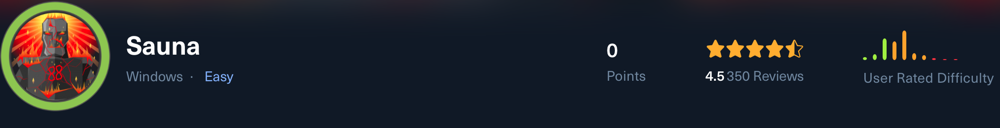
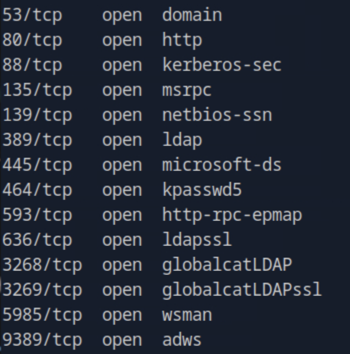
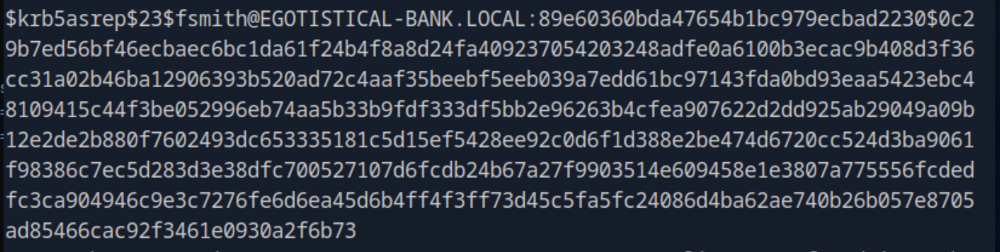
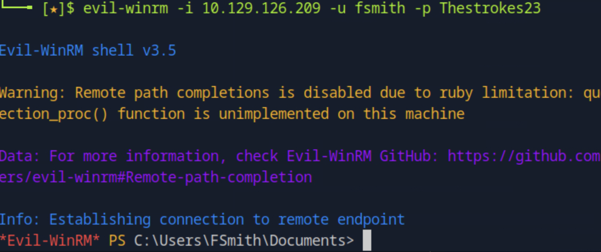
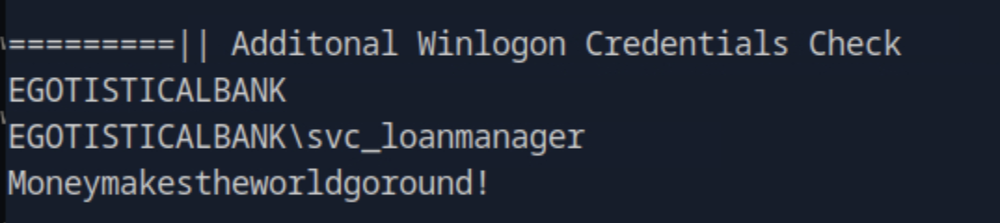
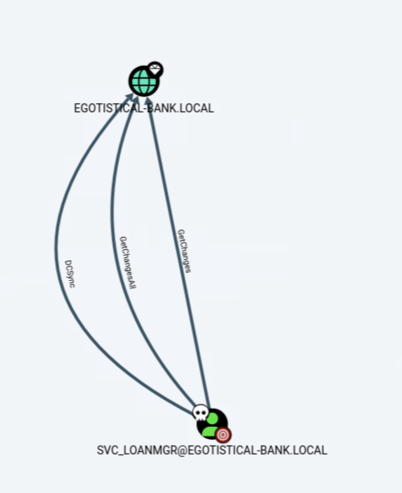
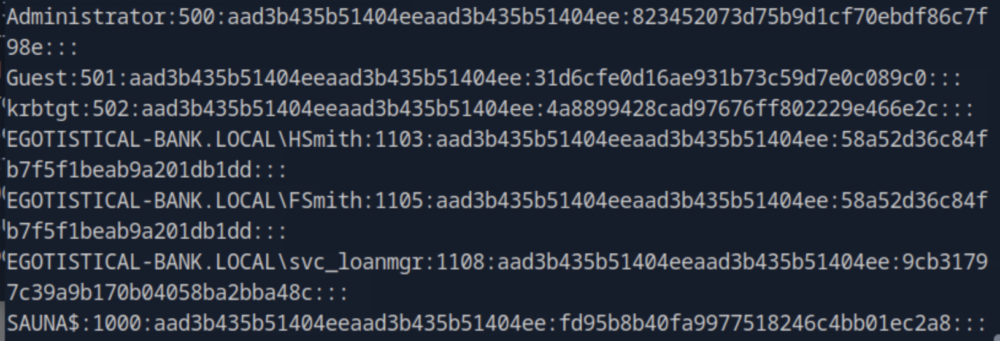
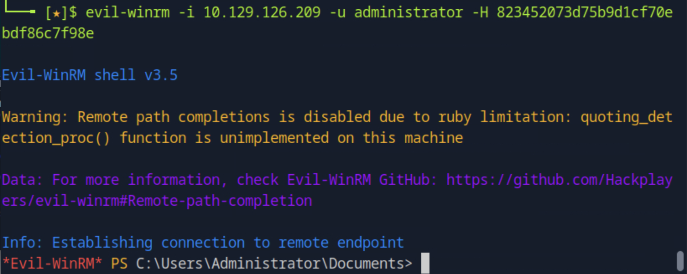

# Sauna - Penetration Testing Walkthrough (Extended Markdown Report)

This report documents the complete exploitation of the **Sauna** target machine (IP: `10.129.126.209`).  
It includes enumeration, Kerberos-based attacks, privilege escalation, and root flag retrieval.  
All images are referenced as relative links to the `images/` directory.

---

## 🧭 Enumeration

We began with a full Nmap scan to identify all open TCP ports and services running on the target host:

```bash
nmap -p- -Pn 10.129.126.209 -v -T5 --min-rate 1000 --max-rtt-timeout 1000ms --max-retries 5 -oN nmap_ports.txt && sleep 5 && nmap -Pn 10.129.126.209 -sC -sV -v -oN nmap_sVsC.txt && sleep 5 && nmap -T5 -Pn 10.129.126.209 -v --script vuln -oN nmap_vuln.txt
```



The scan revealed **Kerberos (88/tcp)**, **LDAP (389/tcp)**, **SMB (445/tcp)**, and **HTTP (80/tcp)** — indicating a typical **Active Directory** environment.  
We noted the hostname references to **EGOTISTICAL-BANK.LOCAL**, confirming a domain controller setup.

---

## 🌐 Web Enumeration & User Discovery

Browsing the website at `http://10.129.126.209/` led us to an *About* page that listed team members under the “Our Team” section:

👉 [http://10.129.126.209/about.html#team](http://10.129.126.209/about.html#team)


We extracted the visible names and stored them in `names.txt` for further use.  
These names were likely employee names in the Active Directory domain.

---

## 👤 Username Generation for AD

To generate potential AD usernames from the discovered names, we used the **AD Username Generator** tool available on GitHub:

🔗 [https://github.com/mohinparamasivam/AD-Username-Generator](https://github.com/mohinparamasivam/AD-Username-Generator)

Command used:

```bash
python3 username-generate.py -u names.txt -o usernames.txt
```

This generated a structured list of usernames in formats such as `fsmith`, `hturner`, etc.

---

## 🧱 Kerberos Enumeration (AS-REP Roast)

Next, we checked whether any user accounts had **pre-authentication disabled**, allowing us to perform an **AS-REP Roast attack** using Impacket’s `GetNPUsers.py`:

```bash
impacket-GetNPUsers EGOTISTICAL-BANK.LOCAL/ -dc-ip 10.129.126.209 -usersfile usernames.txt -outputfile asrep_users
```



We successfully retrieved an AS-REP hash for **fsmith**, meaning that user account did not require pre-authentication.

We then cracked the hash using **John the Ripper**:

```bash
john --wordlist=rockyou.txt hash.txt
```


The password `Thestrokes23` was successfully recovered, providing valid domain credentials.

---

## 💻 Initial Access (Evil-WinRM)

With credentials obtained for **fsmith**, we established a PowerShell session on the target via **Evil-WinRM**:

```bash
evil-winrm -i 10.129.126.209 -u fsmith -p Thestrokes23
```



The shell connected successfully, confirming our foothold as **fsmith**.  
The **user flag** was located on FSmith’s desktop.

---

## ⚙️ Privilege Escalation - Local Enumeration

To identify potential escalation vectors, we ran **WinPEAS**, an automated Windows privilege escalation script:



The enumeration revealed **Winlogon credentials** and multiple service accounts, including **svc_loanmanager**.  
We exported the results and cross-referenced them with **BloodHound** to visualize privilege relationships.

---

## 🧠 Domain Privilege Escalation via DCSync

In BloodHound, the **svc_loanmanager** account was shown to have **DCSync privileges**, allowing replication of password hashes from the domain controller:



We executed a **DCSync attack** using Impacket’s `secretsdump.py`:

```bash
impacket-secretsdump 'EGOTISTICAL-BANK.LOCAL'/'svc_loanmgr':'Moneymakestheworldgoround!'@'10.129.126.209'
```



This successfully dumped the **NTLM hash for Administrator**.

---

## 🧩 Pass-the-Hash Attack and Root Access

We then performed a **pass-the-hash** login with Evil-WinRM using the extracted Administrator hash:

```bash
evil-winrm -i 10.129.126.209 -u administrator -H 823452073d75b9d1cf70ebdf86c7f98e
```



We gained access as **Administrator**.  
The **root flag** was found on the Administrator’s desktop:

```
C:\Users\Administrator\Desktop\root.txt
```

---

## ✅ Conclusion

This engagement illustrates a full compromise of an Active Directory environment via enumeration and Kerberos exploitation.

**Attack Summary:**
1. Enumerated AD services via Nmap.  
2. Extracted usernames from the company’s website.  
3. Performed AS-REP Roast to retrieve and crack a user hash.  
4. Gained foothold as **fsmith** using Evil-WinRM.  
5. Discovered a service account with DCSync rights via BloodHound.  
6. Extracted Administrator hashes using Impacket.  
7. Performed pass-the-hash to obtain full system compromise.

---

## 🧰 Summary of Tools & Exploits Used

| **Tool / Technique** | **Purpose** | **Usage Phase** |
|-----------------------|-------------|-----------------|
| **Nmap** | Port and service discovery | Enumeration |
| **AD Username Generator** | Generate possible usernames for Kerberos enumeration | User Discovery |
| **Impacket - GetNPUsers.py** | Perform AS-REP roasting to obtain hashes | Kerberos Exploitation |
| **John the Ripper** | Crack AS-REP hashes | Credential Recovery |
| **Evil-WinRM** | Remote PowerShell access via valid credentials | Initial Access / Root Access |
| **WinPEAS** | Local enumeration for privilege escalation | Post-Exploitation |
| **BloodHound** | AD relationship mapping and privilege discovery | Domain Analysis |
| **Impacket - secretsdump.py** | DCSync attack to extract domain hashes | Privilege Escalation |
| **Pass-the-Hash (Evil-WinRM)** | Use NTLM hash to authenticate as Administrator | Root Access |

---

**User Flag Path:** `C:\Users\fsmith\Desktop\user.txt`  
**Root Flag Path:** `C:\Users\Administrator\Desktop\root.txt`

---
